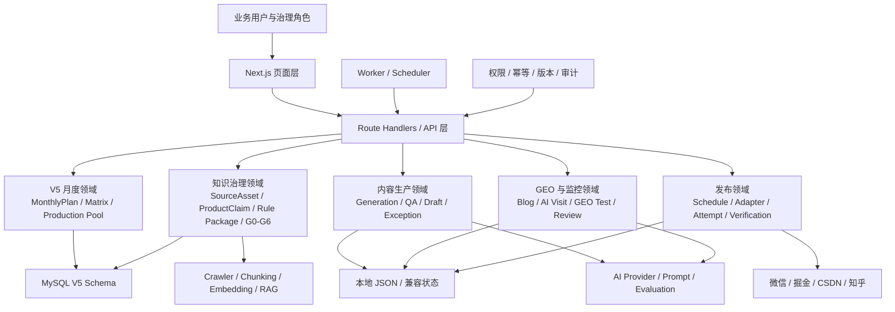
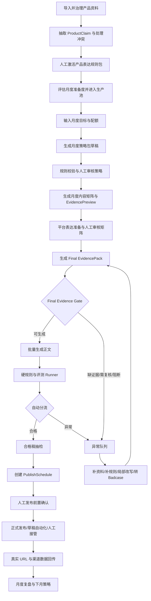
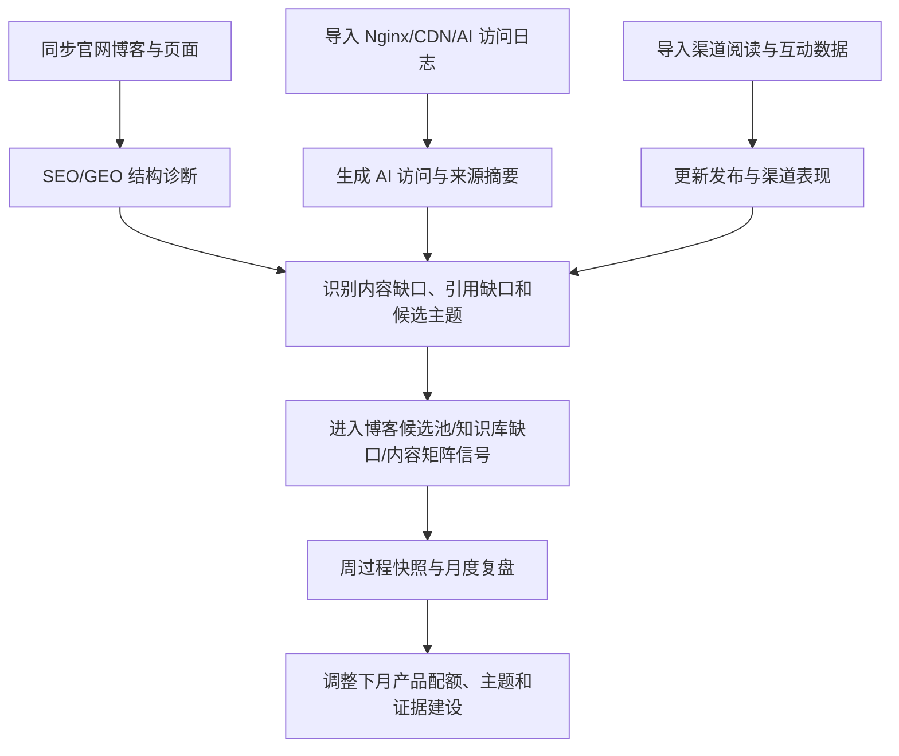
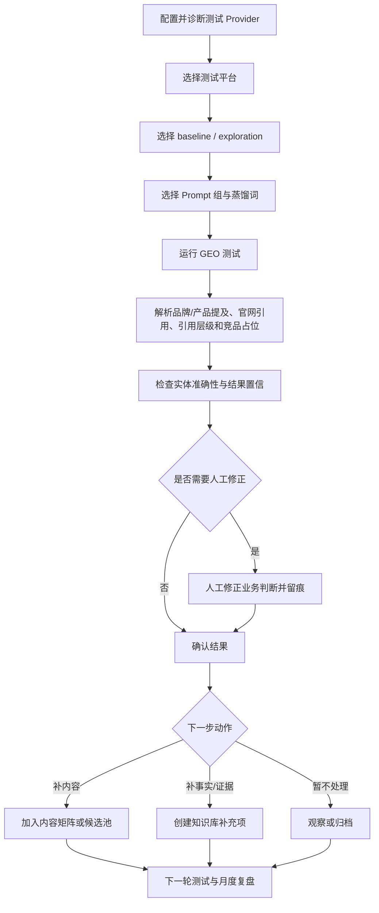

# 基于GEO优化的自动化内容生产工作台

这是一个面向企业内容增长团队的自动化内容生产与 GEO（Generative Engine Optimization）优化工作台。项目以“产品事实可信、内容生产可控、发布结果可追溯、GEO 反馈可回流”为核心，连接产品与知识治理、月度内容规划、批量生成、质量评测、渠道发布、数据回传和月度复盘。

项目不是通用 AI 写作 Demo，也不以“生成一篇文章”为终点。它希望建立一条可长期迭代的内容增长链路：

```text
产品与知识治理
-> 月度目标与内容矩阵
-> Evidence Gate
-> 批量生成与自动质检
-> 异常处理与抽检
-> 发布排程与人工确认
-> URL / 渠道数据回传
-> GEO 监控与主动测试
-> 月度复盘与下月优化
```

## 目录

- [项目介绍](#项目介绍)
- [当前实现状态](#当前实现状态)
- [技术栈](#技术栈)
- [安装与本地启动](#安装与本地启动)
- [生产部署说明](#生产部署说明)
- [团队安全协作准则](#团队安全协作准则)
- [工作台架构](#工作台架构)
- [包含的功能](#包含的功能)
- [能力边界](#能力边界)
- [用户与角色](#用户与角色)
- [用户流程](#用户流程)
- [AI 配置](#ai-配置)
- [数据与状态说明](#数据与状态说明)
- [验证与测试](#验证与测试)
- [GitHub 发布前检查](#github-发布前检查)
- [相关文档](#相关文档)

## 项目介绍

“基于 GEO 优化的自动化内容生产工作台”主要解决以下问题：

1. 选题、产品目标、渠道策略和知识证据彼此脱节。
2. AI 生成内容缺少事实约束、产品表达边界和可追溯证据。
3. 团队逐篇从零审核，月度批量生产成本高且质量不稳定。
4. 平台草稿、正式发布、公开 URL 和发布失败状态容易混淆。
5. 官网、渠道、GEO 测试和 AI 访问数据没有稳定回流到下一轮内容规划。
6. Prompt、规则包、RAG、评测和发布适配器缺少版本、审计与人工控制点。

V5 将“月度内容矩阵”设为计划真源。周视图和当日执行只负责查看或执行已批准矩阵，不再独立决定产品、渠道、标题、主蒸馏词或规则包。

核心设计原则：

- 月度规划优先：先审核月度策略和矩阵，再批量生产。
- 证据先于生成：矩阵项通过 Final Evidence Gate 后才能进入正文生成。
- 人做关键判断：规则包激活、月度策略、月度矩阵、高风险例外和正式发布必须保留人工确认。
- 异常局部隔离：单条内容缺证据或规则越界时，只阻断受影响项目。
- 真实状态优先：缺少外部配置时返回 `pending_config`，不制造假引用、假发布和假成功率。
- 全链路可追溯：正式产物要能追溯到产品事实、证据、矩阵项、版本、工具运行和人工决定。

## 当前实现状态

当前仓库处于 V4 可运行闭环向 V5 月度架构切换的阶段。README 同时描述已经落地的代码和 V5 已确认的目标架构，二者不会混写为“全部已完成”。

| 能力 | 当前状态 | 说明 |
| --- | --- | --- |
| V4 内容生产、质检、回填、GEO 与复盘页面 | 已实现，可本地试运行 | 部分页面仍使用周计划和今日发布术语，后续映射为 V5 派生视图 |
| V5 月度数据底座 | 已实现后端基础 | 已建立 `MonthlyPlan`、策略包版本、矩阵版本、矩阵项、生产准备度、生产池和产物引用 |
| V5 MySQL Schema 并行接入 | 已完成 | 原生 V5 月度表已建立；默认迁移排除 V4 Drop，保留原有 V4 链路 |
| V5 知识治理后端 | 已实现首批垂直切片 | 包含产品实体、资料、事实、冲突、证据缺口、规则包、G0-G6 Gate、审计、版本和幂等接口 |
| V5 月度内容矩阵 UI | 集成中 | V5 页面结构已设计并有独立 UI 分支，仍需与正式 MySQL Repository 和领域服务完成合并 |
| RAG / EvidencePack / Final Evidence Gate | 核心后端已交接，单篇集成中 | 已包含真实 RAG schema、检索、EvidencePack、API 与 worker；正式矩阵项到正文链路仍在接入 |
| 批量生成、硬规则和评测 Runner | 设计完成，部分 V4 能力可复用 | V5 正式批次、版本准入和月度运行记录仍需继续接入 |
| 发布排程与状态治理 | 已实现 P0 状态层 | 已有排程 API、适配器合同、失败分类和人工接管状态 |
| 四平台真实正式发布 | 未完成 | 微信草稿 bridge 可用；正式发布和掘金/CSDN/知乎浏览器自动化仍需真实验收 |
| Workflow Agent | 规则与调度边界已设计 | 当前不能自主批准策略、规则包、风险例外或脱离排程正式发布 |
| GEO 监控与 GEO 测试 | 已实现 V4 可运行能力 | 真实模型、日志和抓取数据依赖外部配置 |

重要说明：本地 smoke 中的 mock 发布、fallback 内容或示例数据只用于验证流程，不等于真实生产能力。

## 技术栈

- Next.js 14（App Router、Route Handlers）
- React 18
- TypeScript
- Ant Design
- MySQL 8.x / `mysql2`
- 本地 JSON 状态（单机试运行与兼容页面）
- Node.js Worker 与 Windows PowerShell 脚本
- 可配置 AI Provider、Embedding Provider、网页抓取服务和平台发布适配器

## 安装与本地启动

### 环境要求

- Node.js 18.17 或更高版本，推荐使用当前 LTS。
- npm 9 或更高版本。
- Windows PowerShell；其他系统也可运行 Next.js，但仓库内部分脚本按 Windows 设计。
- MySQL 8.x：仅在启用 V5 数据底座或生产持久化时需要。
- Chrome：运行浏览器 smoke 或后续平台浏览器适配器时需要。

### 1. 获取代码

```powershell
git clone <repository-url>
cd <project-directory>
```

### 2. 安装依赖

```powershell
npm.cmd install
```

### 3. 创建本机配置

在项目根目录创建 `.env.local`。只填写当前环境确实需要的配置，不要把真实值写入 README、Git、聊天记录、截图或日志。

最小本地 UI 试运行可以不配置外部 Provider；缺失能力会显示 `pending_config` 或使用明确标记的本地 fallback。

### 4. 启动开发服务

推荐使用固定端口：

```powershell
npm.cmd run dev:local
```

或：

```powershell
npm.cmd run dev -- --hostname 127.0.0.1 --port 3047
```

访问：

```text
http://127.0.0.1:3047
```

### 5. 可选：初始化 MySQL

先在 `.env.local` 或部署平台的 Secret Manager 中配置 MySQL 连接，再运行：

```powershell
npm.cmd run check:mysql
npm.cmd run init:mysql
```

V5 月度 Schema 在执行前应先查看计划：

```powershell
node scripts/init-v5-monthly-schema.mjs --plan
```

注意：默认迁移序列会排除 V4 Drop migration。当前集成不得使用 `--include-drop-v4` 或 `--confirm-drop-v4`，以免删除仍由 V4 链路使用的数据。

## 生产部署说明

### 1. 构建前检查

```powershell
npm.cmd run typecheck
npm.cmd run validate:structure
npm.cmd run build
```

### 2. 启动生产服务

```powershell
npm.cmd run start -- --hostname 0.0.0.0 --port 3047
```

### 3. 推荐部署结构

```text
Reverse Proxy / HTTPS
-> Next.js Web 与 API
-> MySQL V5 业务数据
-> 独立 Worker / Scheduler
-> AI、Embedding、抓取与发布外部服务
```

生产环境建议：

1. 使用 Nginx、Caddy、云负载均衡或等价反向代理提供 HTTPS。
2. 将数据库、AI、抓取和发布凭证放入部署平台 Secret Manager，不写入镜像或代码仓库。
3. Web 服务与定时 Worker 分开运行，避免页面进程重启导致排程中断。
4. 为 MySQL 配置备份、迁移审计、最小权限账号和连接池上限。
5. 为外部模型调用配置超时、重试上限、幂等键和费用监控。
6. 为发布任务配置单条互斥、重复保护、人工接管和失败告警。
7. 生产开放前补充统一身份认证。当前页面角色控制是业务权限基础，不等于完整企业 IAM，不能直接把无认证实例暴露到公网。

### 4. 定时任务

当前仓库包含博客同步、日志导入、渠道指标导入、GEO 测试和 Pipeline Worker。可使用 Windows Task Scheduler、cron 或生产队列定时触发。

常用入口：

```powershell
npm.cmd run worker:sync-blog
npm.cmd run worker:run-geo-tests
npm.cmd run worker:import-log
npm.cmd run worker:import-channel-metrics
npm.cmd run worker:run-pipeline
npm.cmd run worker:schedule-pipeline
```

正式发布 Scheduler 仍需在真实平台单篇验收完成后再启用，不能仅凭 mock 状态机通过就开放批量发布。

## 团队安全协作准则

### 代码与分支

1. 使用功能分支开发，通过 Pull Request 合并；不要直接在主分支进行大范围改造。
2. V5 月度真源与 V4 兼容页面分开修改，避免同一需求同时维护两套业务真源。
3. 禁止使用 `git push --force`、`git reset --hard`、`git clean` 等高风险操作覆盖团队成员工作。
4. 提交前运行类型、结构和必要 smoke；涉及数据库或发布能力时附上 dry-run、回滚和验证结果。
5. 不顺手提交无关改动。发现工作区已有他人修改时，先识别归属，再处理冲突。

### 密钥与隐私

以下内容禁止进入 Git、Issue、PR、聊天、截图和公开文档：

- `.env`、`.env.local` 的真实内容。
- API Key、AppSecret、Access Token、Cookie、CSRF/XSRF Token。
- 完整请求 Headers、浏览器 profile、私有账号链接和手机号。
- 客户资料、未公开产品事实、原始模型 trace 和私有知识库正文。

浏览器 profile 必须放在项目目录之外。日志、导出和错误信息进入公开仓库前必须脱敏。

### 数据库与状态

1. destructive migration 必须先 `--plan`、备份、人工确认，再执行。
2. 所有 V5 写操作应包含角色权限、对象范围、版本号、幂等键和审计记录。
3. 日常 smoke 使用隔离状态文件，不写入主 `data/workbench-state.json`。
4. 不把 seed、demo、mock、imported 数据标记为 real。
5. 真实发布成功必须有平台返回结果、文章 ID、公开 URL 或可验证状态作为依据。

### AI 与人工决策

以下动作必须由人确认：

- 产品表达规则包激活或回滚。
- 月度策略包批准。
- 月度内容矩阵批准。
- 高风险表达、证据降级和风险例外。
- 正式发布前置确认。
- 新 Provider、Prompt、RAG 索引、评测标准和 WorkflowDefinition 激活。

AI 可以生成草稿、解释状态、执行安全重试和分流异常，但不能绕过 Evidence Gate、硬规则、质检、审批或平台安全挑战。

### 业务页面信息边界

普通业务页面只展示“是否可生成、是否可发布、问题原因和下一步动作”。完整 Prompt、密钥、模型 trace、raw answer、原始引用 URL、引用排名、Embedding 相似度和底层召回分数只允许留在受控治理环境中，且默认不直接展示。

## 工作台架构



### 代码目录

| 目录                | 职责                                              |
| ----------------- | ----------------------------------------------- |
| `src/app/`        | 页面、布局和 Next.js Route Handlers                   |
| `src/components/` | 业务展示与通用 UI 组件                                   |
| `src/lib/v5/`     | V5 月度契约、知识治理 Repository、Service、Workflow 和 Gate |
| `src/lib/`        | V4 兼容领域、AI、Embedding、权限、发布适配和运行配置               |
| `database/`       | 基础 Schema 与 V5 migrations                       |
| `workers/`        | 博客、日志、渠道指标、GEO 与 Pipeline 后台任务                  |
| `scripts/`        | 初始化、诊断、结构检查、smoke、V5 验证和内容工具脚本                  |
| `config/`         | 不含密钥的示例配置和渠道规则                                  |
| `data/`           | 本地运行状态与测试夹具；主状态默认不提交                            |
| `docs/`           | 使用说明、方案、阶段记录和 V5 设计真源                           |

### V5 核心数据关系

```text
SourceAsset
-> SourceRevision
-> ProductClaim
-> ProductExpressionRulePackage
-> MonthlyProductionReadiness
-> ProductionPoolEntry
-> MonthlyPlan
-> MonthlyStrategyPackageVersion
-> ContentMatrixVersion / ContentMatrixItem
-> EvidencePreview
-> Final EvidencePack / Final Evidence Gate
-> BatchGenerationRun / GenerationRun
-> HardRuleResult / SoftEvaluationResult
-> DraftVersion
-> PublishSchedule / PublicationRecord
-> EvaluationAsset / Badcase
-> MonthlyReview
```

Workflow Agent 通过稳定 ID 和 `ArtifactReference` 引用业务产物，不复制或替代业务真源。

## 包含的功能

### 1. 产品与知识治理

- 产品实体与知识库关系管理。
- URL、Markdown、TXT、PDF、DOCX 等资料接入。
- 来源解析、版本、权威等级、敏感检查和定位信息。
- ProductClaim 原子事实抽取与人工复核。
- 事实冲突、证据缺口和待处理队列。
- 产品表达规则包草稿、版本差异、审批、激活和回滚。
- G0-G6 知识治理 Gate。
- 月度生产准备度评估与生产池准入。

### 2. 月度计划与内容矩阵

- 月度业务目标、产品配额、渠道配比和内容类型配比。
- 月度策略包草稿与人工审核。
- 月度矩阵版本、矩阵项和冻结字段。
- 蒸馏词、来源问题、平台内容类型和目标受众映射。
- EvidencePreview、风险与缺口摘要。
- 周视图与当日执行派生视图。

### 3. 批量生成与质量控制

- Final EvidencePack 与正式 Evidence Gate。
- 按批准矩阵创建批量生成运行。
- Provider / Prompt / 规则包版本锁定。
- 硬规则校验、软质量评测和自然表达检查。
- 合格稿、异常稿和 `pending_config` 自动分流。
- 人工删除、局部改写、保留风险原因和重新质检留痕。
- Badcase 归因、评测资产和回归准入设计。

### 4. 渠道发布与数据回传

- 平台草稿生成和分发状态。
- 发布排程、到期执行、预检查、attempt 和验证状态。
- `formal_publish`、`draft_only`、`manual_only`、`pending_config` 能力区分。
- 失败原因、重试、暂停和人工接管。
- 正式 URL 回填和渠道指标导入。
- 微信公众号草稿 bridge；其他平台 adapter 合同与诊断入口。

### 5. GEO 监控与主动测试

- 官网博客同步、SEO/GEO 诊断和候选主题池。
- AI 访问日志、Nginx/CDN 日志和访问摘要导入。
- GEO 多平台测试、Prompt 组、蒸馏词和基线/探索模式。
- 品牌提及、产品提及、官网引用、引用层级、竞品占位和实体准确性判断。
- 单条结果人工修正、业务导出和问题缺口转任务/知识库。
- 周度过程快照与月度复盘输入。

### 6. AI 治理与可观测性

- Provider、Model 和外部能力状态诊断。
- Prompt 输入输出契约、版本和回滚。
- 知识库切片与 Embedding 配置。
- 调用日志、fallback、失败原因和质量关联摘要。
- Provider、Prompt、规则包、渠道、产品与蒸馏词质量分布。
- V5 目标中的 Agent、RAG、Rule、Eval 和 Publish 治理日志。

### 7. 角色权限

- 内容发布人员。
- 内容增长 / GEO 人员。
- 工作台运营 / 质量评估。
- 知识库 / 产品表达维护。
- 开发管理员。

不同角色拥有不同默认入口、页面范围和治理权限。未授权页面不应渲染内部业务数据。

## 能力边界

### 当前可以做

- 本地运行完整 V4 业务闭环，并逐步接入 V5 月度后端。
- 管理知识库、规则包、蒸馏词、计划、草稿、质检、发布记录、GEO 结果和复盘数据。
- 使用真实配置调用 AI、Embedding、抓取或平台 bridge；缺配置时返回真实阻塞状态。
- 使用 MySQL 承载 V5 月度与知识治理数据底座。
- 使用隔离 smoke 验证主要页面、API、角色边界和工作流。

### 当前不能承诺

- 不能承诺所有 V5 页面已经全部合并到正式工作台。
- 不能把历史 Chunk 或页面 mock 直接视为正式 EvidencePack。
- 不能在规则包、策略包或矩阵未经人工批准时开始正式批量生成。
- 不能把本地 fallback 草稿视为真实 Provider 生成成功。
- 不能把“平台草稿已创建”视为“正式发布成功”。
- 不能把 mock adapter、HTTP 200 或点击发布按钮视为已获得公开 URL。
- 不能绕过验证码、手机确认、平台风控或人工接管。
- 不能在当前本地 JSON 模式下承诺多人高并发和生产级一致性。
- 不能让 Workflow Agent 自主批准规则、风险例外或自由选择内容进行即时发布。

## 用户与角色

| 角色 | 主要职责 | 典型入口 |
| --- | --- | --- |
| 内容发布人员 | 抽检终稿、查看排程、处理发布失败、确认 URL | 当日执行、发布排程 |
| 内容增长 / GEO 人员 | 月度目标、策略审核、GEO 分析、复盘与下月建议 | 月度内容矩阵、GEO、月度复盘 |
| 工作台运营 / 质量评估 | 生产池、异常队列、质量评测、治理日志 | 批量生成、异常队列、AI 配置 |
| 知识库 / 产品表达维护 | 资料接入、事实复核、规则包与证据缺口 | 知识库、规则包、蒸馏词 |
| 开发管理员 | 外部配置、Provider、数据库、发布适配与故障排查 | 真实接入、AI 配置、运行日志 |

## 用户流程

### 内容生产发布流程



关键保护点：

1. 规则包草稿不能自动生效。
2. 策略审核阶段只使用证据准备度摘要，不提前创建正式生成许可。
3. 月度矩阵批准后才创建 Final EvidencePack。
4. 只有正式 Gate 通过项才能进入批量生成。
5. 自动质检通过后才能进入发布排程。
6. 正式发布必须有人工前置确认和真实平台能力。

### GEO 监控流程

GEO 监控是持续观察流程，重点是收集官网、渠道和 AI 访问的真实变化，并形成内容动作。



建议操作顺序：

1. 同步官网博客或导入页面资料。
2. 查看诊断摘要、问题分布、官网引用准备度和推荐动作。
3. 导入真实日志与渠道数据；缺路径时保持 `pending_config`。
4. 将高价值缺口转入博客候选池、知识库补充或月度矩阵候选。
5. 在月度复盘中只统计真实发布、真实回传和真实监控结果。

### GEO 测试流程

GEO 测试是主动提问与对照评估流程，用来验证 AI 平台是否正确识别品牌、产品、场景和官网信源。



测试原则：

- `mentioned_entity=true` 不自动等于 GEO 成功，还要判断实体是否被正确理解。
- 没有真实模型配置时不生成假命中。
- 业务页面不展示原始 trace、完整 Prompt 或私有引用信息。
- baseline 用于稳定复测，exploration 用于验证新问题、新蒸馏词和新内容缺口。

## AI 配置

AI 配置页是工作台运营和开发管理员使用的治理入口，不是普通内容发布人员的默认页面。

### 配置能力

| 模块 | 当前职责 |
| --- | --- |
| Provider | 查看内容生成、GEO、切片和 Embedding 能力是否就绪 |
| 知识库 RAG 配置 | 选择切片模型、Chunk 参数、Embedding 模型和检索策略 |
| Prompt 版本 | 查看版本、输入输出契约、失败规则和回滚策略，不展示 Prompt 原文 |
| 本地规则与 fallback | 明确哪些能力可本地兜底，以及 fallback 是否被触发 |
| 调用日志 | 查看模块、Provider/Model、版本、输出状态和业务可读失败原因 |
| 质量关联 | 按 Provider、Prompt、规则包、渠道、产品和蒸馏词查看质量信号 |
| V5 治理扩展 | 后续统一 Agent、RAG、Rule、Eval 和 Publish 运行日志 |

### 环境变量分类

只在 `.env.local` 或部署 Secret Manager 中配置真实值。

AI Provider：

```text
CONTENT_GENERATION_PROVIDER
OPENAI_BASE_URL / OPENAI_API_KEY / OPENAI_MODEL
DEEPSEEK_BASE_URL / DEEPSEEK_API_KEY / DEEPSEEK_MODEL
DOUBAO_BASE_URL / DOUBAO_API_KEY / DOUBAO_MODEL
```

MySQL：

```text
MYSQL_HOST / MYSQL_PORT / MYSQL_USER / MYSQL_PASSWORD / MYSQL_DATABASE
WORKBENCH_STORAGE
```

知识抓取与 RAG：

```text
XCRAWL_BASE_URL / XCRAWL_API_KEY
KNOWLEDGE_PROXY_FETCH_BASE_URL / KNOWLEDGE_PROXY_FETCH_API_KEY
KNOWLEDGE_CRAWL_PRIMARY_PROVIDER
```

本地状态与日志：

```text
WORKBENCH_STATE_PATH
NGINX_ACCESS_LOG_PATH
CDN_LOG_EXPORT_PATH
```

发布能力：

```text
WECHATSYNC_ENABLED / WECHATSYNC_BRIDGE_URL
DIRECT_PUBLISH_ENABLED / DIRECT_PUBLISH_MOCK
WECHAT_MP_*
JUEJIN_*
CSDN_*
ZHIHU_*
```

### 配置诊断

页面和 API 只展示配置项名称、缺失字段与诊断结果，不返回密钥值。

```text
GET /api/runtime-config/status
GET /api/config-diagnostics
GET /api/ai-governance
```

常见状态：

- `ready`：配置存在且基础诊断通过。
- `pending_config`：缺少必要环境变量或外部能力。
- `failed`：配置存在，但连接、读取或调用失败。
- `local_fallback`：主链路可使用本地兜底，但不能等同真实外部能力。

## 数据与状态说明

当前存在两类状态来源：

1. V5 MySQL：用于月度计划、内容矩阵、生产准备度、生产池、知识治理、版本、幂等和审计等新领域数据。
2. 本地 JSON / 通用状态快照：用于现有 V4 兼容页面和单机试运行。

默认本地状态文件：

```text
data/workbench-state.json
```

该文件被 `.gitignore` 忽略，不应提交到 GitHub。V5 新功能不应继续把 WeeklyPlan、ContentTask、ArticleDraft 和 PublishRecord 作为月度业务真源。

数据标签必须保持明确：

- `real`：真实外部或生产数据。
- `imported`：人工或文件导入数据。
- `demo` / `mock`：演示与测试数据。
- `pending_config`：缺少真实配置，尚不可执行。

## 验证与测试

### 基础验证

```powershell
npm.cmd run typecheck
npm.cmd run validate:structure
npm.cmd run smoke:interactions
npm.cmd run build
```

### 页面与工作流

启动本地服务后运行：

```powershell
npm.cmd run smoke:pages -- --base-url=http://127.0.0.1:3047
npm.cmd run smoke:workflow
npm.cmd run smoke:workflow:isolated
npm.cmd run smoke:browser
npm.cmd run smoke:browser:roles
npm.cmd run smoke:browser:content
npm.cmd run smoke:browser:content:isolated
npm.cmd run smoke:browser:responsive
npm.cmd run smoke:browser:publish
```

默认 `smoke:workflow` 和 `smoke:browser*` 使用隔离状态文件。只有显式运行带 `:main` 的入口才会写入主状态，日常开发不要使用主状态 smoke。

### V5 专项验证

```powershell
npm.cmd run test:v5-workflow
node --test scripts/v5-monthly-schema-cutover.test.mjs
node --test scripts/v5-knowledge-governance-schema.test.mjs
node --test scripts/v5-knowledge-governance-backend.test.mjs
node --test scripts/v5-knowledge-governance-workflow.test.mjs
node --test scripts/v5-knowledge-workflow-policy.test.mjs
```

涉及真实数据库时先使用只读检查或计划模式，避免测试脚本误写生产数据。

## GitHub 发布前检查

当前 `.gitignore` 已忽略：

- `.env`、`.env.local`
- `data/workbench-state.json`
- `.next/`
- `node_modules/`
- 日志和 TypeScript 构建缓存
- 大部分 `docs/**`

当前只默认保留 `docs/usage.md` 和 `docs/方案与规划/*.md`。如果准备把 V5 设计文档一起上传 GitHub，必须先审计 `docs/V5 07-07/` 和 `docs/V5 -07-09/` 中的隐私、内部资料和知识库快照，再显式调整 `.gitignore`。不要直接取消整个 `docs/**` 忽略规则。

发布前建议执行：

```powershell
git status --short
git diff --check
npm.cmd run typecheck
npm.cmd run validate:structure
npm.cmd run build
```

同时检查：

1. 不存在密钥、Token、Cookie、手机号、私有链接或客户数据。
2. 不提交浏览器 profile、运行日志、临时文件、备份状态和测试产物。
3. README 中的“已实现”与实际提交文件一致。
4. 新 migration 有计划、回滚或备份说明。
5. mock、pending_config 和真实能力边界清晰。

## 相关文档

- `docs/usage.md`：当前本地使用、配置诊断、验证命令和常见风险。
- `docs/方案与规划/P0-自动化发布能力与渠道配置说明书.md`：发布排程、平台配置和真实发布验收边界。
- `docs/V5 -07-09/01-重构后影响范围分析.md`：V5 页面、接口和数据结构影响范围。
- `docs/V5 -07-09/02-新版用户流程图.md`：V5 月度内容矩阵用户流程。
- `docs/V5 -07-09/03-推荐页面低保真原型图.md`：V5 页面职责和低保真结构。
- `docs/V5 07-07/agent-knowledge-base-foundation/README.md`：V5 数据、RAG、生成、评测和 Workflow Agent 正式设计索引。
- `docs/V5 07-07/02-波次一月度数据底座实施记录.md`：V5 MySQL 月度底座和 cutover 记录。

注意：部分 V5 文档当前受 `.gitignore` 规则限制，GitHub 仓库中可能不可见。公开前应按上一节完成审计与版本控制决策。
