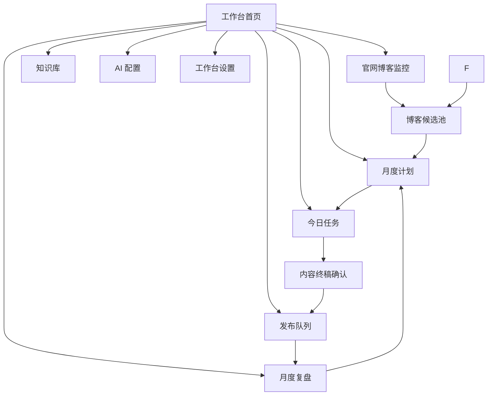
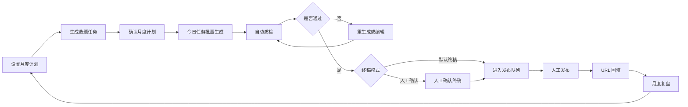
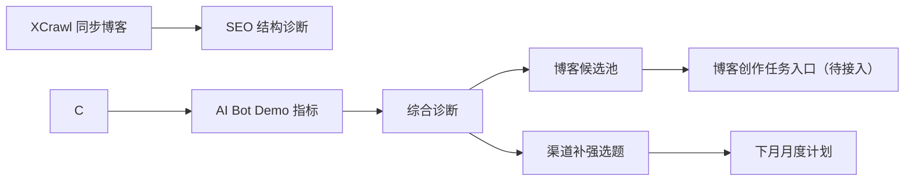

# JOTO GTM 内容工作台低保真原型

## 1. 原型定位

本文件是 JOTO GTM 内容工作台 MVP 的低保真原型说明，用于在开发前确认页面结构、核心操作路径、信息优先级和状态流转。

它不是视觉设计稿，也不规定最终 UI 风格。当前阶段只解决四个问题：

1. 用户进入工作台后先看到什么。
2. 月度计划如何生成、确认和调整。
3. 渠道文章如何批量生成、质检、确认和发布。

## 2. 页面总览



MVP 优先开发的页面顺序建议：

| 优先级 | 页面 | 原因 |
|---|---|---|
| P0 | 工作台首页 | 提供统一入口和任务概览 |
| P0 | 月度计划 | 决定本月写什么 |
| P0 | 今日任务 | 承接批量生成 |
| P0 | 内容终稿确认 | 控制质量和发布风险 |
| P0 | 发布队列 | 支持人工发布和 URL 回填 |
| P1 | 官网博客监控 | 支持 SEO/GEO 诊断 |
| P1 | 月度复盘 | 反哺下月选题 |
| P1 | 知识库 | 管理内容生成依据 |
| P2 | AI 配置 / 工作台设置 | 后台配置能力 |

## 3. 全局导航

```text
+------------------------------------------------------+
| JOTO GTM 工作台                 [同步] [设置] [用户] |
+------------------+-----------------------------------+
| 首页             |                                   |
| 月度计划           |                                   |
| 今日任务         |                                   |
| 发布队列         |            页面主内容              |
| 官网博客监控     |                                   |
| 月度复盘         |                                   |
| 知识库           |                                   |
| AI 配置          |                                   |
| 工作台设置       |                                   |
+------------------+-----------------------------------+
```

全局导航采用左侧栏，主内容区采用“表格 + 右侧详情面板”的效率型布局。MVP 不做营销型首页，不做复杂大屏。

## 4. 工作台首页

### 4.1 页面目标

首页只回答一个问题：今天需要处理什么。

### 4.2 线框图

```text
+------------------------------------------------------+
| 首页                                     [同步数据] |
+------------------------------------------------------+
| 本月执行概览                                            |
| 计划文章 15 | 已生成 8 | 已确认 6 | 已发布 5 | 待回填 3 |
+----------------------------+-------------------------+
| 今日任务                   | 快捷操作                |
| 待生成：3                  | [生成今日文章]          |
| 待确认：2                  | [查看月度计划]            |
| 待发布：4                  | [进入发布队列]          |
+----------------------------+-------------------------+
| SEO 问题：12               | DeepSeek 命中：4/8      |
| GEO 未命中：5              | 豆包命中：3/8           |
| AI Bot PV：128 [Demo]      | ChatGPT 命中：5/8       |
+----------------------------+-------------------------+
| 需要处理                                                    |
| 1. 周三还有 2 篇文章未确认                                  |
| 2. CSDN 有 1 篇文章已发布但未回填 URL                       |
| 3. 3 篇官网博客进入候选池，建议下月补强                     |
+------------------------------------------------------+
```

### 4.3 关键交互

| 操作 | 结果 |
|---|---|
| 点击“生成今日文章” | 跳转今日任务页，带入今日待生成任务 |
| 点击“查看月度计划” | 跳转月度计划页 |
| 点击“进入发布队列” | 跳转发布队列页，默认筛选待发布/待回填 |
| 点击诊断提醒 | 跳转对应详情页 |

## 5. 月度计划页

### 5.1 页面目标

月度计划页用于一次性确定一周内容任务。用户可以自动生成，也可以手动调整。

### 5.2 线框图

```text
+------------------------------------------------------+
| 月度计划  2026-06-16 ~ 2026-06-22       [生成月度计划] |
+------------------------------------------------------+
| 发布设置                                                |
| 每月发布天数：[5]                                      |
| 默认每日篇数：[3]                                      |
| 启用渠道：[公众号] [CSDN] [掘金] [知乎/头条通用稿]      |
| 内容对象：[JOTO 官方品牌] [唯客 AI 护栏]                |
| 终稿模式：[默认终稿] [人工确认]                         |
+------------------------------------------------------+
| 本月任务表                                              |
| 日期 | 渠道 | 产品 | 标题 | 类型 | 状态 | 操作          |
| 周一 | 公众号 | JOTO | ... | 品牌 | 待确认 | 编辑/重生成 |
| 周一 | CSDN | 唯客 | ... | 技术 | 已确认 | 查看        |
| 周二 | 知乎/头条 | 唯客 | ... | FAQ | 待确认 | 编辑/删除  |
+------------------------------------------------------+
| [批量确认] [重生成未确认] [保存为草稿] [确认月度计划]     |
+------------------------------------------------------+
```

### 5.3 右侧详情面板

```text
+------------------------------+
| 任务详情                     |
+------------------------------+
| 标题                         |
| [可编辑输入框]               |
|                              |
| 内容类型                     |
| [品牌/场景/技术/FAQ/对比]    |
|                              |
| 目标关键词                   |
| [关键词列表]                 |
|                              |
| 调用知识库                   |
| [品牌事实库]                 |
| [唯客产品知识库]             |
| [官网博客知识库]             |
| [竞品知识库: 仅对比类启用]   |
|                              |
| 操作                         |
| [保存修改] [重生成标题]       |
+------------------------------+
```

### 5.4 状态规则

| 状态 | 含义 | 可执行操作 |
|---|---|---|
| 草稿 | 月度计划未确认 | 编辑、重生成、删除 |
| 待确认 | 系统已生成但人工未确认 | 编辑、确认、重生成、删除 |
| 已确认 | 可进入每日任务 | 查看、少量编辑 |
| 执行中 | 已有任务进入生成流程 | 不建议大规模修改 |
| 已完成 | 本月度计划结束 | 查看、生成月度复盘 |

## 6. 今日任务页

### 6.1 页面目标

今日任务页用于执行当天文章生产。它不负责重新做策略，只负责把已确认任务变成稿件。

### 6.2 线框图

```text
+------------------------------------------------------+
| 今日任务  2026-06-16                    [批量生成] |
+------------------------------------------------------+
| 筛选：状态 [全部] 渠道 [全部] 产品 [全部]              |
+------------------------------------------------------+
| 任务列表                                                |
| 状态 | 渠道 | 标题 | 类型 | 质检 | 操作                |
| 待生成 | CSDN | ... | 技术 | - | 生成/编辑任务        |
| 已生成 | 公众号 | ... | 品牌 | 通过 | 查看/确认终稿      |
| 质检失败 | 掘金 | ... | 技术 | 阻断 | 查看问题/重生成    |
+------------------------------------------------------+
| 批量操作：[生成选中] [重新生成失败项] [进入发布队列]   |
+------------------------------------------------------+
```

### 6.3 批量生成弹窗

```text
+----------------------------------------+
| 批量生成确认                           |
+----------------------------------------+
| 将生成以下任务：                       |
| 公众号：1 篇                           |
| CSDN：1 篇                             |
| 掘金：1 篇                             |
| 知乎/头条通用稿：1 篇                  |
|                                        |
| 使用知识库：                           |
| 品牌事实库、唯客产品库、官网博客库     |
| 对比类任务将额外调用竞品知识库         |
|                                        |
| [取消] [开始生成]                      |
+----------------------------------------+
```

## 7. 内容终稿确认页

### 7.1 页面目标

终稿确认页用于人工判断内容是否可以进入发布队列。即使是默认终稿模式，也要先通过自动质检。

### 7.2 线框图

```text
+------------------------------------------------------+
| 内容终稿确认                         状态：待确认   |
+-------------------------------+----------------------+
| 正文编辑区                    | 质检面板             |
|                               |                      |
| 标题：[输入框]                | 总体结果：通过/失败  |
| 摘要：[输入框]                |                      |
|                               | 阻断项               |
| 正文                          | - 事实冲突：无        |
| [富文本/Markdown 编辑区]      | - 敏感夸大：无        |
|                               | - 竞品混淆：无        |
|                               |                      |
|                               | 警告项               |
|                               | - 官网链接缺失        |
|                               | - 标题相似度偏高      |
|                               |                      |
|                               | 调用来源             |
|                               | 品牌事实库            |
|                               | 唯客产品知识库        |
|                               | 官网博客知识库        |
+-------------------------------+----------------------+
| [保存草稿] [重新生成] [确认终稿] [加入发布队列]       |
+------------------------------------------------------+
```

### 7.3 质检规则

| 质检项 | 级别 | 处理 |
|---|---|---|
| 事实冲突 | 阻断 | 必须修改或重生成 |
| 敏感夸大表达 | 阻断 | 必须修改 |
| JOTO 与竞品能力混淆 | 阻断 | 必须修改 |
| 标题高度重复 | 阻断/警告 | 视重复程度处理 |
| 缺少核心品牌词 | 警告 | 可人工忽略 |
| 缺少官网链接 | 警告 | 可人工忽略 |
| 渠道格式不匹配 | 警告 | 建议修改 |

## 8. 发布队列页

### 8.1 页面目标

发布队列用于承接已经确认的终稿。MVP 不做自动发布，只做人工发布辅助、导出和 URL 回填。

### 8.2 线框图

```text
+------------------------------------------------------+
| 发布队列                              [导出发布清单] |
+------------------------------------------------------+
| 筛选：状态 [待发布/已发布/待回填/已回填] 渠道 [全部] |
+------------------------------------------------------+
| 发布列表                                                |
| 状态 | 渠道 | 标题 | 计划时间 | URL | 操作           |
| 待发布 | 公众号 | ... | 06-16 | - | 查看/标记已发布 |
| 已发布 | CSDN | ... | 06-16 | - | 回填 URL        |
| 已回填 | 掘金 | ... | 06-15 | 查看 | 查看数据       |
+------------------------------------------------------+
| 批量操作：[导出选中] [标记已发布] [批量回填]           |
+------------------------------------------------------+
```

### 8.3 URL 回填弹窗

```text
+----------------------------------------+
| 回填发布 URL                           |
+----------------------------------------+
| 渠道：CSDN                             |
| 标题：...                              |
| 发布时间：[日期时间]                   |
| 发布 URL：[输入框]                     |
| 备注：[输入框]                         |
|                                        |
| [取消] [保存]                          |
+----------------------------------------+
```

### 8.4 导出字段

| 字段 | 说明 |
|---|---|
| publish_date | 计划发布时间 |
| channel | 渠道 |
| title | 标题 |
| summary | 摘要 |
| content | 正文 |
| tags | 标签 |
| official_url | 官网链接 |
| notes | 备注 |

## 9. 官网博客监控页

### 9.1 页面目标


### 9.2 线框图

```text
+------------------------------------------------------+
| 官网博客监控                         [同步博客内容] |
+------------------------------------------------------+
+------------------------------------------------------+
| 概览                                                   |
| 总文章 228 | SEO 问题 32 | GEO 未命中 12 | 候选 8     |
| AI Bot PV 128 [Demo] | Top Paths [Demo]               |
+------------------------------------------------------+
| 博客列表                                                |
| 标题 | URL | 收录 | SEO 问题 | GEO 结果 | 日志可信度 | 操作 |
| ... | ... | 是 | 3 | 未命中 | Demo | 诊断/入候选池 |
+------------------------------------------------------+
| 右侧诊断详情                                            |
| SEO 问题：标题重复 / canonical 异常 / 内链不足          |
| GEO 问题：ChatGPT 未提及 JOTO / 豆包未引用官网链接     |
| 日志说明：当前 AI Bot 指标为 Demo 数据                  |
| 建议动作：[生成渠道补强选题] [加入博客候选池]           |
+------------------------------------------------------+
```

### 9.3 数据可信度展示

| 标签 | 页面展示 | 含义 |
|---|---|---|
| 真实 | 绿色标签 | 来自 XCrawl、GEO API、人工回填等真实执行 |
| 导入 | 蓝色标签 | 来自 CSV 或表格导入 |
| Demo | 灰色标签 | 仅用于 MVP 演示 |
| 待接入 | 黄色标签 | 已有接口位，但暂无真实数据 |


### 10.1 页面目标


### 10.2 线框图

```text
+------------------------------------------------------+
+------------------------------------------------------+
| 平台：[DeepSeek] [豆包] [ChatGPT]                    |
| Prompt 组：[品牌认知] [产品场景] [对比] [FAQ]        |
| 运行模式：[全部平台] [指定平台] [指定 Prompt]         |
+------------------------------------------------------+
| 测试任务                                                |
| Prompt | 平台 | 状态 | 提及JOTO | 提及唯客 | 引用官网 |
| ...    | ChatGPT | 完成 | 是 | 否 | 是                  |
| ...    | 豆包 | 完成 | 否 | 否 | 否                     |
+------------------------------------------------------+
| 回答快照                                                |
| [展示 AI 原始回答]                                      |
| 自动判断：未提及 JOTO / 未引用官网                      |
| 人工修正：[提及JOTO] [提及唯客] [引用官网]              |
| 操作：[保存修正] [加入博客候选池] [生成渠道补强选题]    |
+------------------------------------------------------+
```

### 10.3 判断逻辑

| 判断项 | 自动解析 | 人工修正 |
|---|---|---|
| 是否提及 JOTO | 支持 | 支持 |
| 是否提及聚托 | 支持 | 支持 |
| 是否提及唯客 | 支持 | 支持 |
| 是否引用官网 | 支持 | 支持 |
| 是否只推荐竞品 | 支持 | 支持 |
| 是否错误理解产品 | 部分支持 | 支持 |

## 11. 博客候选池

### 11.1 页面目标

博客候选池是未来博客创作模块的入口，但 MVP 阶段不执行博客创作。

### 11.2 线框图

```text
+------------------------------------------------------+
| 博客候选池                            [导出候选清单] |
+------------------------------------------------------+
+------------------------------------------------------+
| 候选列表                                                |
| 标题建议 | 来源 | 原因 | 优先级 | 状态 | 操作          |
| ... | SEO诊断 | 缺少 Dify 安全接入文章 | 中 | 待接入 | 查看 |
+------------------------------------------------------+
| 状态说明：当前仅沉淀候选，不进入博客创作流程            |
+------------------------------------------------------+
```

## 12. 月度复盘页

### 12.1 页面目标


### 12.2 线框图

```text
+------------------------------------------------------+
| 月度复盘  2026-06-16 ~ 2026-06-22      [生成月度复盘]   |
+------------------------------------------------------+
| 管理层摘要                                              |
| 本月发布 15 篇，已回填 12 篇；官网博客发现 8 个候选主题 |
+------------------------------------------------------+
| 渠道执行复盘                                            |
| 渠道 | 发布数 | 阅读 | 互动 | 高表现主题 | 建议        |
| 公众号 | 3 | ... | ... | 品牌定位 | 继续         |
| CSDN | 4 | ... | ... | 技术解释 | 加强         |
+------------------------------------------------------+
| 官网博客诊断                                            |
| SEO 问题：...                                           |
| GEO 未命中：...                                         |
| AI Bot 指标：Demo 数据，仅用于演示                      |
+------------------------------------------------------+
| 下月建议                                                |
| 1. 继续强化 Dify 企业版服务商相关选题                   |
| 2. 增加 Dify 接入 AI 护栏的技术解释                     |
| 3. 将 3 个主题加入博客候选池                            |
+------------------------------------------------------+
| [导出月度复盘] [生成下月计划草稿]                           |
+------------------------------------------------------+
```

## 13. 知识库页

### 13.1 页面目标

知识库页用于管理内容生成和诊断依据。竞品知识库可以迁移，但必须限制调用范围。

### 13.2 线框图

```text
+------------------------------------------------------+
| 知识库管理                              [新增知识库] |
+------------------------------------------------------+
| 知识库列表                                                |
| 名称 | 类型 | 可信等级 | 状态 | 更新方式 | 最近同步 | 操作 |
| 品牌事实库 | 品牌 | 最高 | 启用 | 手动 | ... | 编辑 |
| 唯客产品库 | 产品 | 最高 | 启用 | 手动 | ... | 编辑 |
| 官网博客库 | 博客 | 高 | 启用 | 自动 | ... | 同步 |
| 竞品知识库 | 竞品 | 参考 | 启用 | 导入 | ... | 编辑 |
+------------------------------------------------------+
| 调用限制                                                |
| 竞品知识库默认不参与普通品牌文章生成                    |
| 仅对比类、差异化选题、市场分析任务可调用                |
+------------------------------------------------------+
```

## 14. AI 配置页

### 14.1 页面目标

AI 配置页用于管理模型、API、Prompt 和运行参数。API Key 不应直接展示在文档或日志中。

### 14.2 线框图

```text
+------------------------------------------------------+
| AI 配置                                  [新增配置]  |
+------------------------------------------------------+
| Provider | 用途 | Model | 状态 | 操作                  |
+------------------------------------------------------+
| Prompt 配置                                             |
| 名称 | 类型 | 渠道 | 状态 | 操作                       |
| CSDN技术解释 | 内容生成 | CSDN | 启用 | 编辑/复制          |
+------------------------------------------------------+
```

## 15. 工作台设置页

### 15.1 页面目标

工作台设置页管理默认规则，不处理具体任务。

### 15.2 线框图

```text
+------------------------------------------------------+
| 工作台设置                                            |
+------------------------------------------------------+
| 发布规则                                                |
| 默认每月发布天数：[5]                                  |
| 默认每日篇数：[3]                                      |
| 默认渠道：[公众号] [CSDN] [掘金] [知乎/头条通用稿]      |
+------------------------------------------------------+
| 终稿规则                                                |
| 终稿模式：[默认终稿] [人工确认]                         |
| 入队条件：[必须通过自动质检]                            |
+------------------------------------------------------+
| 日志模式                                                |
| 当前模式：[Demo CSV]                                    |
| 可选模式：[Demo] [CSV导入] [Nginx日志] [CDN日志]         |
+------------------------------------------------------+
| [保存设置]                                              |
+------------------------------------------------------+
```

## 16. 主流程原型



## 17. 博客诊断流程原型



## 18. 开发注意事项

| 注意事项 | 说明 |
|---|---|
| 1. Demo 数据必须标记 | AI Bot 指标在真实日志接入前不能展示为真实数据 |
| 2. 竞品知识库必须限制调用 | 普通品牌文章默认不调用竞品知识库 |
| 3. 终稿入队必须过质检 | 默认终稿模式也不能绕过阻断项 |
| 4. 发布与 URL 回填分离 | MVP 不做自动发布 |
| 5. 博客候选池不触发创作 | 当前只作为未来入口 |
| 6. 页面优先表格效率 | 不做重仪表盘和复杂视觉 |
