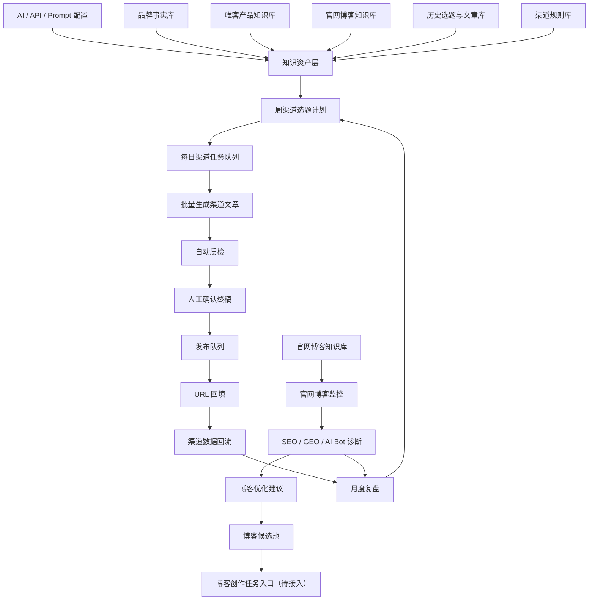
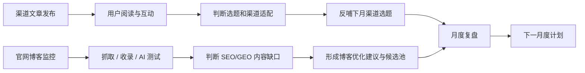
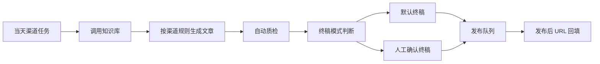
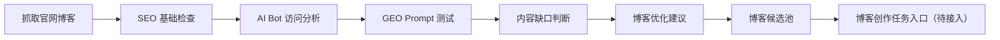

# JOTO GTM 内容工作台 MVP PRD

## 1. 文档信息

| 项目 | 内容 |
|---|---|
| 产品名称 | JOTO GTM 内容工作台 |
| 文档版本 | MVP 方向版 PRD |
| 创建日期 | 2026-06-16 |
| 当前阶段 | 产品方向确认、范围定义、业务逻辑梳理 |
| 面向对象 | 公司负责人、市场负责人、产品负责人、内容运营、后续开发团队 |
| MVP 范围 | JOTO 官方品牌传播 + 唯客 AI 护栏单一产品内容自动化 |
| 暂不承担 | 官网博客文章创作、全渠道自动发布、完整 CRM、通用 GEO SaaS 产品化 |

## 2. 执行摘要

JOTO GTM 内容工作台的 MVP 目标，不是继续做深一个通用 GEO 系统，而是把当前已经存在的 `GEOFlow`、`GEO SEO`、`XCrawl`、渠道内容规则、Skills、SOP 和自动化脚本重新组织成一个服务真实市场工作的内容生产与诊断系统。


本阶段工作台的核心工作流是：

```text
月度计划配置
-> 自动生成渠道选题与任务
-> 批量创作当天渠道文章
-> 人工确认终稿
-> 进入发布队列
-> 发布后 URL 回填
-> 渠道数据与官网博客 SEO/GEO 诊断回流
-> 反哺下月选题
```

官网博客在 MVP 阶段不进入主创作流程，只作为核心监控对象、分析对象和未来创作入口。系统需要监控官网博客的 SEO、GEO、AI Bot 访问、AI 问答测试和内容缺口，并将诊断结果转化为渠道选题建议和博客候选池。未来当团队需要接入博客创作时，再从博客候选池进入“博客创作任务”模块。

一句话定位：

> JOTO GTM 内容工作台是一个基于公司知识资产和渠道规则的自动化内容生产与官网博客诊断系统，MVP 先服务渠道内容发布和博客 SEO/GEO 监控，后续再扩展为完整内容资产工作台。

## 3. 项目背景

### 3.1 当前业务背景

JOTO 当前希望通过内容提升品牌曝光、产品认知和潜在客户获取。此前项目中，GEO 是一个重要探索方向：通过优化官网博客、信源站和内容资产，让 AI 搜索、AI 问答和大模型更容易识别 JOTO、唯客 AI 护栏以及相关产品能力。

经过实际尝试后，团队对投入产出比形成了新的判断：

| 观察项 | 当前判断 | 对产品方向的影响 |
|---|---|---|
| 1. 通用 GEOFlow 偏重 | 原 GEOFlow 作为通用 GEO 产品较重，超过当前内部市场工作的真实需要 | 不继续把 MVP 做成通用 GEO 平台 |
| 3. AI 引用更偏官网博客 | 独立信源站更多是测试资产，AI 当前更可能引用官网博客 | 官网博客成为 GEO 监控重点 |
| 4. 渠道文章主要给人看 | CSDN、掘金、公众号、知乎/头条等内容更适合触达用户和验证选题 | 渠道指标不能用 AI 引用作为主指标 |
| 6. 自动化资产已经存在 | 当前项目已有 Skills、SOP、规则和脚本 | MVP 应优先迁移复用，而不是重建 |

### 3.2 当前内容体系问题

| 问题            | 表现                                | 影响                         |
| ------------- | --------------------------------- | -------------------------- |
| 1. 内容资产分散     | 官网、产品站、渠道文章、插件市场、GitHub、旧站点各自表达   | 品牌认知不集中，AI 和用户都难以形成稳定理解    |
| 2. 渠道生产依赖人工   | 每月和每天都要手动想选题、定标题、拆任务、改写文章         | 人工成本高，容易断更、重复或跑偏           |
| 3. 规则没有统一调度   | 公众号、CSDN、掘金等渠道规则存在，但没有统一入口执行      | 自动化生产无法稳定复用                |
| 4. 官网博客缺少诊断闭环 | 博客已有内容资产，但没有稳定转化为 SEO/GEO 诊断和策略建议 | 无法知道哪些博客需要补强，哪些主题值得继续写     |
| 5. GEO 指标容易误读 | AI Bot PV 容易被误认为 AI 引用效果          | 数据可能误导内容策略                 |
| 6. 终稿仍需人工判断   | AI 可以批量生成，但品牌口径、事实准确性、发布风险仍需人工确认  | 工作台应把人工放在确认和判断环节，而不是重复劳动环节 |

## 4. 产品目标

### 4.1 业务目标

| 目标 | 说明 |
|---|---|
| 1. 提升渠道内容生产效率 | 从人工逐篇策划、撰写，升级为系统按周规划、按日批量生成 |
| 2. 强化 JOTO 官方品牌表达 | 稳定输出 JOTO 与 Dify 服务商、企业 AI 服务、AI 安全治理的关系 |
| 3. 支撑唯客 AI 护栏传播 | 围绕 AI 安全、企业大模型治理、Dify 安全接入等场景持续产出渠道内容 |
| 4. 建立官网博客诊断能力 | 对官网博客进行 SEO、GEO、AI Bot 和 AI 引用测试监控 |
| 5. 让数据反哺选题 | 用渠道表现和博客诊断结果决定下月写什么、少写什么、补什么 |
| 6. 为未来博客创作预留入口 | 当前不写博客，但保留博客候选池和博客创作任务入口 |

### 4.2 产品目标

| 产品目标 | 对应能力 |
|---|---|
| 1. 支持每月发布计划配置 | 每月发布量、每天发布量、渠道分配都可手动调整 |
| 2. 自动生成周选题任务 | 根据知识库、历史内容、渠道规则和诊断结果生成选题 |
| 3. 自动生成每日渠道任务 | 按日期、渠道、产品、内容类型拆分任务 |
| 4. 批量创作当天渠道文章 | 自动调用知识库、Prompt、渠道规则生成文章 |
| 5. 支持人工确认终稿 | 默认生成终稿，但可在设置中改为人工确认终稿模式 |
| 6. 支持发布队列和 URL 回填 | MVP 先不做全渠道自动发布 |
| 7. 支持官网博客监控诊断 | 只做监控、分析判断和建议，不做博客创作 |

## 5. 目标用户与使用场景

### 5.1 目标用户

| 用户角色 | 核心诉求 | 典型行为 |
|---|---|---|
| 1. 项目负责人 | 管控内容方向、发布节奏、数据反馈和下月策略 | 配置月度计划、确认任务、查看复盘、调整策略 |
| 2. 内容运营 | 快速生成渠道文章并完成发布 | 批量生成文章、审核终稿、发布内容、回填 URL |
| 3. 市场负责人 | 判断内容是否服务品牌传播和获客目标 | 查看渠道表现、官网博客诊断和主题覆盖 |
| 4. 产品负责人 | 保证唯客 AI 护栏的产品表达准确 | 维护产品知识库、审核关键产品表达 |
| 5. 技术/自动化维护者 | 维护 AI 配置、API、知识库更新和数据采集 | 配置模型、更新知识库、维护脚本和任务 |

### 5.2 核心使用场景

| 场景 | 用户动作 | 系统响应 |
|---|---|---|
| 1. 配置本月发布计划 | 设置发布天数、每日篇数、渠道占比 | 生成本月渠道选题任务 |
| 2. 调整周选题 | 删除、替换、改标题、改渠道、改发布时间 | 更新任务队列 |
| 3. 批量生成当天文章 | 选择当天任务并执行生成 | 输出各渠道文章终稿或待确认稿 |
| 4. 人工确认终稿 | 查看内容、风险点、关键词、链接建议 | 确认后进入发布队列 |
| 5. 发布和回填 | 在外部平台发布后填写 URL | 系统记录渠道资产和发布状态 |
| 6. 监控官网博客 | 查看 SEO、GEO、AI Bot、AI 测试结果 | 输出博客诊断和优化建议 |
| 7. 月度复盘 | 查看渠道表现和博客诊断汇总 | 生成下月选题建议 |

## 6. 产品定位与设计原则

### 6.1 产品定位

JOTO GTM 内容工作台不是单纯的 AI 写作工具，也不是完整营销自动化平台。它的 MVP 是一个内部内容增长操作台：用自动化完成渠道选题、任务拆分、文章生成、发布管理和数据复盘，同时监控官网博客的 SEO/GEO 表现。

当前阶段，渠道文章和官网博客承担不同职责：

| 内容类型 | 主要服务对象 | 核心目标 | 主要评价指标 |
|---|---|---|---|
| 渠道文章 | 人 | 触达用户、验证选题、引导认知、产生互动 | 阅读、互动、收藏、评论、转化线索、渠道适配 |
| 官网博客 | AI + 搜索 + 用户 | 成为稳定信源、承接 SEO/GEO、沉淀权威内容 | 抓取、收录、排名、AI 提及、AI 引用、内容结构 |

### 6.2 设计原则

| 原则 | 含义 |
|---|---|
| 2. 先自动化重复劳动 | 选题、定标题、任务拆分、初稿生成、渠道适配尽量自动化 |
| 3. 人只做关键判断 | 人工主要负责月度计划确认、终稿确认、风险判断和策略调整 |
| 4. 官网博客只做监控诊断 | MVP 不把博客创作放进主流程，只保留未来入口 |
| 5. 渠道文章主要给人看 | 渠道指标以用户反馈为主，AI 抓取和引用只作为辅助观察 |
| 7. 不引入原信源站模块 | 原信源站内容可作为资产迁移，但信源站本身不是 MVP 模块 |
| 8. 轻平台、重流程 | 优先把月度计划到发布回填的流程跑通，避免重新做一个重系统 |

## 7. MVP 范围

### 7.1 MVP 包含范围

| 模块 | 是否包含 | 说明 |
|---|---|---|
| 1. AI 配置中心 | 包含 | 继承类似 GEOFlow 的模型 API、Prompt、知识库调用配置 |
| 2. 知识库管理 | 包含 | 迁移品牌事实库、产品知识库、官网博客知识库 |
| 3. 知识库更新 | 包含 | 支持动态更新和手动配置 |
| 4. 月度计划管理 | 包含 | 支持一周选题任务生成，发布量和每天任务可手动调整 |
| 5. 每日任务队列 | 包含 | 展示当天待生成、待确认、待发布、已发布任务 |
| 6. 渠道文章批量生成 | 包含 | 生成公众号、CSDN、掘金、知乎/头条等渠道文章 |
| 7. 终稿确认机制 | 包含 | 默认生成终稿，但可在设置中切换为人工确认终稿 |
| 8. 发布队列 | 包含 | MVP 先做发布队列，不做全渠道自动发布 |
| 9. URL 回填 | 包含 | 发布后回填文章链接，形成内容台账 |
| 10. 官网博客监控 | 包含 | 监控官网博客 SEO、GEO、AI Bot、AI 测试表现 |
| 12. 博客候选池 | 包含 | 记录建议新增或建议优化的博客主题 |
| 13. 博客创作任务入口 | 预留 | 保留入口，但作为待接入区域 |
| 14. 月度复盘 | 包含 | 汇总渠道表现、博客诊断、下月建议 |

### 7.2 MVP 不包含范围

| 暂不包含 | 原因 |
|---|---|
| 1. 官网博客创作主流程 | 当前负责人暂不承担博客创作任务 |
| 2. 全渠道自动发布 | MVP 先做发布队列和 URL 回填，降低平台接口和风控复杂度 |
| 3. 原有信源站模块 | 信源站不进入工作台模块，内容可作为资产迁移 |
| 4. 通用 GEO SaaS 产品能力 | 当前只服务 JOTO 内部 GTM 内容工作 |
| 5. 多产品复杂矩阵 | MVP 先聚焦 JOTO 官方品牌和唯客 AI 护栏 |
| 6. 完整 CRM | 当前目标是内容生产、发布管理和诊断复盘 |
| 7. 复杂 BI 看板 | 只保留能指导选题、发布和诊断的指标 |

## 8. 整体业务架构



整体分为四层：

| 层级 | 核心问题 | 主要能力 |
|---|---|---|
| 1. 配置与知识层 | AI 基于什么写、怎么写 | API 配置、Prompt 配置、知识库、渠道规则 |
| 2. 渠道生产层 | 本月写什么、今天发什么 | 月度计划、每日任务、批量创作、终稿确认 |
| 3. 发布管理层 | 内容是否已发布、链接在哪里 | 发布队列、状态管理、URL 回填 |
| 4. 诊断复盘层 | 发完后如何改进 | 渠道数据、官网博客 SEO/GEO 诊断、月度复盘、下月建议 |

## 9. 数据反馈逻辑

### 9.1 总体逻辑

MVP 的数据反馈必须拆成两条线：渠道内容反馈线和官网博客 SEO/GEO 反馈线。两条线共同反哺下月选题，但评价指标不同。



### 9.2 渠道文章反馈逻辑

渠道文章主要给人看，次要给 AI 看。它的核心任务是触达用户、验证选题、建立认知和引导潜在咨询。

```text
渠道文章发布
-> 用户是否阅读
-> 是否互动、收藏、评论、转发
-> 是否产生官网访问或咨询线索
-> 判断标题、主题、渠道是否有效
-> 反哺下月渠道选题
-> 筛选值得沉淀为官网博客的主题
```

| 指标类型 | 核心指标 | 用途 |
|---|---|---|
| 1. 传播指标 | 阅读量、浏览量、曝光量 | 判断内容是否获得基础分发 |
| 2. 兴趣指标 | 点赞、收藏、评论、转发 | 判断用户是否真正关心该主题 |
| 3. 转化前指标 | 私信、咨询、官网点击、联系方式点击 | 判断是否有获客信号 |
| 4. 标题指标 | 高点击标题、低点击标题、重复标题 | 反哺标题生成规则 |
| 5. 渠道适配指标 | 不同渠道的阅读和互动差异 | 判断 CSDN、掘金、公众号等各自适合什么内容 |
| 6. SEO/GEO 辅助指标 | 是否收录、是否出现品牌词、是否被 AI 抓取 | 辅助观察，不作为渠道文章主成功指标 |

渠道文章不应该主要用“是否被 AI 引用”评价。更合理的问题是：

1. 这个选题有没有人看？
2. 这个标题是否能获得点击？
3. 这个表达是否能让用户理解 JOTO 和唯客 AI 护栏？
4. 这个主题是否值得未来沉淀成官网博客？

### 9.3 官网博客反馈逻辑

官网博客主要给 AI 和搜索看，同时也给用户看。它是更稳定的信源资产，应该承担 SEO、GEO、品牌实体建设、产品解释和权威内容沉淀。

```text
官网博客存在
-> 搜索引擎和 AI Bot 是否能抓取
-> 页面是否被收录
-> 关键词是否有排名或曝光
-> AI 问答是否提到 JOTO / 唯客
-> AI 是否引用官网博客链接
-> 判断博客内容是否需要补强
-> 形成博客优化建议或未来创作任务
```

| 指标类型 | 核心指标 | 用途 |
|---|---|---|
| 1. 可抓取指标 | AI Bot PV、bot breakdown、top paths、top articles | 判断 AI 爬虫是否访问过官网内容 |
| 2. SEO 指标 | 收录状态、关键词排名、搜索曝光、点击率 | 判断博客是否进入搜索结果 |
| 3. GEO 指标 | AI 回答是否提到 JOTO、是否提到唯客、是否引用官网链接 | 判断博客是否进入 AI 回答候选 |
| 4. 内容结构指标 | 标题、摘要、内链、外链、schema、canonical、FAQ 结构 | 判断页面是否适合搜索和 AI 理解 |
| 5. 内容覆盖指标 | 已覆盖问题、缺失关键词、重复主题、薄弱主题 | 判断博客内容资产是否完整 |
| 6. 权威性指标 | 产品事实、案例、技术解释、品牌主体信息 | 判断内容是否足够可信 |

AI Bot PV 只能说明 AI 爬虫访问过页面，不能说明 AI 已经引用页面。工作台需要明确区分：

```text
被发布
-> 被抓取
-> 被收录或进入索引
-> 被 AI 检索到
-> AI 回答中提及 JOTO / 唯客
-> AI 回答引用官网博客链接
```

## 10. 核心业务流程

### 10.1 月度计划流程


| 步骤 | 说明 |
|---|---|
| 1. 设置发布规则 | 发布天数、每日篇数、渠道分配、产品方向都支持手动调整 |
| 2. 读取知识资产 | 读取品牌事实库、唯客产品知识库、官网博客知识库、历史选题 |
| 3. 读取渠道数据 | 参考上周阅读、互动、收藏、评论、转化信号 |
| 4. 读取博客诊断 | 参考官网博客 SEO/GEO 缺口、AI 测试结果 |
| 5. 生成候选选题 | 生成本月可发布的渠道选题池 |
| 6. 自动任务化 | 为每个选题绑定渠道、日期、产品、内容类型、关键词 |
| 7. 人工确认 | 用户可保留、删除、改标题、改时间、改渠道、改数量 |
| 8. 生成每日任务 | 形成每天可执行的渠道内容任务 |

### 10.2 每日渠道内容生产流程



| 步骤 | 说明 |
|---|---|
| 1. 读取当天任务 | 系统读取当天需要生成的渠道文章 |
| 2. 调用知识库 | 调用品牌事实库、产品知识库、官网博客知识库和历史内容 |
| 3. 渠道生成 | 按公众号、CSDN、掘金、知乎/头条等规则生成文章 |
| 4. 自动质检 | 检查事实、关键词、品牌词、链接、重复度、渠道风格 |
| 5. 终稿处理 | 默认生成终稿；也可在工作台设置中改为人工确认终稿 |
| 6. 发布队列 | 审核通过后进入待发布状态 |
| 7. URL 回填 | 发布完成后回填链接，进入数据监控 |

### 10.3 官网博客监控诊断流程



| 步骤 | 说明 |
|---|---|
| 1. 抓取官网博客 | 获取官网博客列表、标题、正文、链接、更新时间 |
| 2. SEO 检查 | 检查收录、标题、摘要、内链、外链、canonical、结构化信息 |
| 3. AI Bot 分析 | 查看 AI Bot PV、bot breakdown、top paths、top articles |
| 5. 内容缺口判断 | 判断哪些问题 AI 没提到 JOTO，哪些博客缺少补强 |
| 6. 输出建议 | 生成博客优化建议、渠道选题建议、未来博客候选主题 |
| 7. 进入候选池 | 当前不创作博客，只沉淀候选池 |
| 8. 预留创作入口 | 后续可从候选池进入博客创作任务模块 |

## 11. 功能模块描述

| 模块 | 核心功能 | MVP 目标 |
|---|---|---|
| 1. 工作台首页 | 展示本月度计划、今日任务、待确认、待发布、博客诊断提醒 | 让负责人一进入系统就知道今天要处理什么 |
| 2. AI 配置中心 | 配置模型 API、Prompt、知识库调用和生成策略 | 继承 GEOFlow 类似能力，保证 AI 可配置 |
| 3. 知识库管理 | 管理品牌事实库、唯客产品知识库、官网博客知识库 | 保证内容生成基于正确资料 |
| 4. 知识库更新 | 支持动态抓取更新和人工手动配置 | 保证资料不过期，且能补充人工判断 |
| 5. 月度计划管理 | 设置一周发布节奏、每日篇数、渠道分配 | 自动生成当周渠道任务 |
| 6. 每日任务队列 | 展示当天文章任务、状态、渠道、链接 | 让执行流程可追踪 |
| 7. 渠道内容生成 | 批量生成公众号、CSDN、掘金、知乎/头条文章 | 降低每日内容生产成本 |
| 8. 自动质检 | 检查关键词、品牌词、重复度、事实风险、渠道适配 | 降低人工审核压力 |
| 9. 终稿确认 | 支持默认终稿和人工确认终稿两种模式 | 兼顾效率和可控性 |
| 10. 发布队列 | 管理待发布、已发布、失败、待回填状态 | MVP 先不做自动发布 |
| 11. URL 回填 | 记录发布后的文章链接和平台 | 形成渠道内容资产台账 |
| 13. 博客候选池 | 存放建议优化、建议新增的博客主题 | 为未来博客创作模块预留入口 |
| 14. 月度复盘 | 汇总渠道表现、博客诊断、下月建议 | 让数据反哺下一月度计划 |

## 12. 可迁移的现有内容、架构与机制

### 12.1 可迁移内容资产

| 来源 | 可迁移内容 | 迁移价值 | 迁移方式 |
|---|---|---|---|
| 1. GEOFlow | 品牌事实库、产品知识库、官网博客知识库 | 作为 AI 生成和诊断的事实基础 | 迁移为工作台知识资产层 |
| 2. GEOFlow | AI 配置、API 配置、Prompt 配置 | 支撑不同模型和生成策略 | 迁移为 AI 配置中心 |
| 3. GEOFlow | 知识库动态更新和手动配置机制 | 支持资料自动刷新和人工维护 | 迁移为知识库管理模块 |
| 4. GEO SEO | 渠道规则、选题库、文章生产库 | 支撑渠道自动化生产 | 迁移为渠道规则库和历史内容库 |
| 5. GEO SEO | 公众号、CSDN、掘金等 SOP | 支持不同渠道风格适配 | 迁移为渠道生成模板 |
| 6. XCrawl | 官网博客抓取、内容采集、诊断脚本 | 支持博客知识库更新和监控诊断 | 迁移为博客采集与诊断任务 |
| 8. 历史 Manifest | 日期、标题、渠道、状态记录 | 支持任务追踪和内容资产沉淀 | 迁移为内容任务台账 |
| 9. 现有 Skills | 内容生成、检查、复盘、分发相关能力 | 降低自动化成本 | 迁移为后台自动化动作 |
| 10. 原信源站内容 | 已沉淀的文章和知识资产 | 可作为参考语料 | 只迁移内容，不迁移信源站模块 |

### 12.2 可迁移架构机制

| 机制 | 原来源 | 在工作台中的新定位 |
|---|---|---|
| 1. AI 配置机制 | GEOFlow | 统一管理模型、API、Prompt、知识库调用 |
| 2. 知识库机制 | GEOFlow | 支撑品牌事实库、产品知识库、官网博客知识库 |
| 3. 知识库动态更新 | GEOFlow / XCrawl | 定期抓取官网博客和指定资料 |
| 4. 知识库手动配置 | GEOFlow | 人工补充品牌事实、产品说明、禁用表达 |
| 5. 内容任务模型 | GEOFlow / GEO SEO | 承载月度计划、每日任务、文章状态、发布状态 |
| 6. 多渠道变体机制 | GEOFlow 外部分发模型 | 同一主题生成不同渠道版本 |
| 7. 渠道指标记录 | GEOFlow 外部分发表 | 记录发布 URL、目标关键词、渠道反馈 |
| 8. AI Bot 识别 | GEOFlow TrafficClassifier | 识别访问日志里的 AI Bot PV 和 bot breakdown |
| 9. Prompt 矩阵 | GEOFlow GEO 文章类型矩阵 | 支持不同内容类型的生成策略 |
| 10. 自动检查脚本 | GEO SEO 渠道检查脚本 | 检查格式、字数、关键词、重复度和渠道适配 |
| 11. 月度复盘生成机制 | XCrawl Review 逻辑 | 生成内容表现复盘和下月建议 |

### 12.3 迁移优先级

| 优先级 | 内容 | 原因 |
|---|---|---|
| P0 | AI 配置、知识库、渠道规则、月度计划、批量生成、终稿确认、发布队列、URL 回填 | 没有这些无法形成 MVP 主流程 |
| P1 | 官网博客抓取、历史选题去重、渠道质检、博客诊断、月度复盘生成 | 直接提升内容质量和反馈闭环 |
| P3 | 博客创作任务模块、多产品管理、自动发布、复杂权限 | 作为后续扩展，不进入当前主流程 |

## 13. 内容创作逻辑

### 13.1 内容创作基于什么

| 输入来源 | 作用 |
|---|---|
| 1. 品牌事实库 | 保证 JOTO 官方表达、Dify 服务商关系、公司定位不跑偏 |
| 2. 唯客产品知识库 | 保证唯客 AI 护栏的功能、场景、价值和边界准确 |
| 3. 官网博客知识库 | 复用已有内容资产，发现 SEO/GEO 缺口，辅助渠道选题 |
| 4. 历史选题库 | 防止标题重复、主题重复、内容同质化 |
| 5. 渠道规则库 | 决定不同平台的写法、结构、语气和内容重点 |
| 7. 发布反馈数据 | 决定下一轮继续强化、停止或改写哪些主题 |

### 13.2 渠道内容类型

| 类型 | 适合渠道 | 作用 |
|---|---|---|
| 1. 官方品牌文章 | 公众号、知乎/头条 | 强化 JOTO、Dify 服务商、企业 AI 服务商定位 |
| 2. 产品场景文章 | 公众号、知乎/头条 | 解释唯客 AI 护栏解决什么问题 |
| 3. 技术解释文章 | CSDN、掘金 | 面向开发者解释 AI 护栏、Dify、安全治理 |
| 4. 问题回答文章 | 知乎、头条 | 承接用户搜索和问答需求 |
| 5. 对比判断文章 | 公众号、知乎、头条 | 帮用户理解新旧方案差异 |
| 6. 轻案例文章 | 公众号、搜狐/百家号等 | 帮用户理解业务场景和落地价值 |

## 14. 成功指标

### 14.1 效率指标

| 指标 | 目标 |
|---|---|
| 1. 周选题规划时间 | 明显低于人工逐篇策划 |
| 2. 每日渠道文章生成时间 | 支持当天任务批量生成 |
| 3. 终稿确认成本 | 人工从写作转向确认和判断 |
| 4. 发布回填完整率 | 已发布文章能够形成可追踪台账 |

### 14.2 渠道内容指标

| 指标 | 目标 |
|---|---|
| 1. 每月度计划完成率 | 按设置完成渠道文章生产和发布 |
| 2. 渠道互动表现 | 能识别高互动主题和低互动主题 |
| 3. 标题有效性 | 能沉淀表现较好的标题方向 |
| 4. 渠道适配判断 | 能判断不同渠道适合的内容类型 |
| 5. 主题升级判断 | 能筛选值得进入博客候选池的主题 |

### 14.3 官网博客 SEO/GEO 指标

| 指标 | 目标 |
|---|---|
| 1. AI Bot PV | 判断 AI 爬虫是否访问官网博客 |
| 2. bot breakdown | 判断来自哪些 AI 爬虫 |
| 3. top paths | 判断哪些路径被访问较多 |
| 4. top articles | 判断哪些博客更容易被 AI 或用户访问 |
| 5. 收录状态 | 判断博客是否进入搜索结果 |
| 6. AI 提及 | 判断 DeepSeek、豆包、ChatGPT 是否提到 JOTO 或唯客 |
| 7. AI 引用 | 判断 AI 回答是否引用官网博客链接 |
| 8. 内容缺口 | 判断哪些主题需要优化或未来新增博客 |

## 15. 风险与边界

| 风险 | 表现 | 应对方式 |
|---|---|---|
| 1. 自动化过度 | 系统生成很多文章，但方向不可控 | 保留月度计划确认和终稿确认设置 |
| 2. 数据误读 | 把 AI Bot PV 当成 AI 引用 | 明确区分抓取、收录、提及、引用 |
| 3. 博客职责混乱 | MVP 被迫承担博客创作 | 明确博客只做监控、分析、建议和候选池 |
| 4. 信源站重新变重 | 原信源站模块又进入工作台 | 只迁移内容资产，不迁移信源站模块 |
| 5. 渠道规则失效 | 平台风格和审核规则变化 | 渠道规则可配置、可更新 |
| 6. 选题同质化 | 长期围绕少数关键词重复生成 | 引入历史去重、主题覆盖和内容缺口分析 |
| 8. 工具变成重平台 | 又做成一个复杂 GEOFlow | MVP 只围绕真实内容工作流保留必要模块 |

## 16. 已确认的开放问题

| 问题 | 最终确认 |
|---|---|
| 1. 官网博客是否作为所有主稿默认落点 | 不固定，支持手动调整 |
| 2. 文章是否自动生成终稿 | 默认生成，但可在工作台设置中改为人工确认终稿 |
| 3. 是否接入全渠道自动发布 | MVP 先做发布队列和 URL 回填 |
| 4. 官网博客在 MVP 中承担什么职责 | 只做监控、分析判断、建议 |
| 6. 原有信源站是否成为模块 | 不成为 MVP 模块，里面的内容可以作为资产迁移 |
| 7. 未来博客创作如何接入 | 从博客候选池进入“博客创作任务”模块，保留入口但作为待接入区域 |

## 17. 后续扩展方向

MVP 跑通后，可以按以下顺序扩展：

| 阶段 | 扩展方向 | 说明 |
|---|---|---|
| 1. 博客创作接入 | 从博客候选池进入博客创作任务 | 将官网博客从监控对象扩展为生产对象 |
| 2. 多产品接入 | 接入更多 JOTO 产品知识库 | 扩展到闪阅、SchemaRAG、DataFocus 等产品 |
| 3. 自动发布增强 | 对稳定渠道接入自动发布 | 从发布队列升级为半自动或自动发布 |
| 4. 更完整的数据看板 | 加强渠道转化、SEO、GEO 联合分析 | 用于更高层的市场决策 |
| 5. 销售线索联动 | 将内容表现和咨询线索关联 | 从内容工作台延伸到 GTM 增长台账 |

## 18. PRD 收束

这版 MVP 的关键判断是：渠道文章和官网博客不要混用同一套成功标准。

渠道文章主要给人看，负责触达用户、验证选题、建立认知和产生互动；官网博客主要给 AI 和搜索看，负责成为稳定信源、承接 SEO/GEO、沉淀权威内容。工作台要把两条反馈线并行跑起来，再在月度复盘中合并为下一周选题策略。


只要这个闭环先跑通，JOTO 就能从“人工写文章”升级为“系统化管理内容增长”：系统负责规划、生成、记录和提醒，人负责判断、确认和策略调整。

