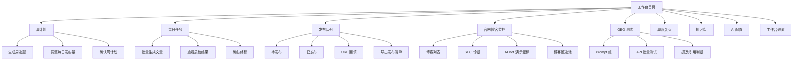
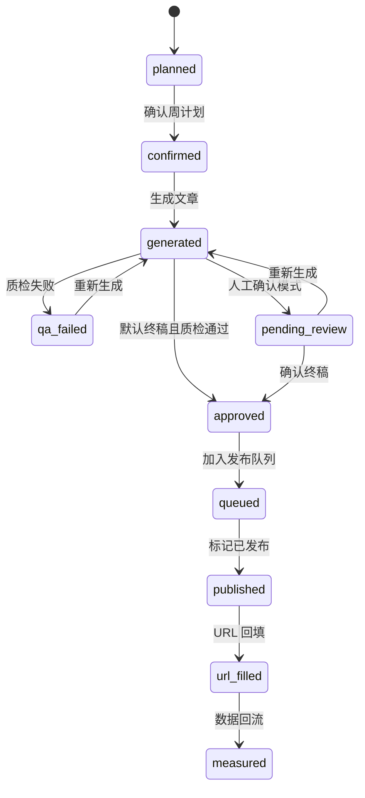
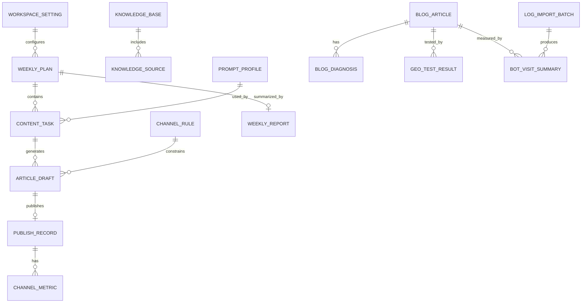
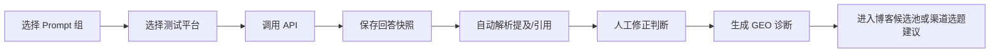

# JOTO GTM 内容工作台 PRD2

## 1. 文档定位

| 项目 | 内容 |
|---|---|
| 文档名称 | PRD2.md |
| 文档类型 | 工程开发前产品需求说明 |
| 依赖文档 | MVP-PRD1.md |
| 当前版本 | MVP 开发前草案 |
| 创建日期 | 2026-06-16 |
| 核心目标 | 将 PRD1 的方向拆解为可开发的页面、模块、数据对象、接口、字段和开发边界 |
| 不包含 | 技术栈选型、具体数据库建表 SQL、视觉高保真设计、部署方案 |

本文件不重复 PRD1 中已经明确的项目背景、业务战略和产品定位，只补充工程开发前必须对齐的产品结构。PRD2 的重点是让开发团队知道：工作台有哪些页面、每个页面做什么、数据从哪里来、核心对象如何流转、哪些能力必须做、哪些能力只做演示占位或后续接入。

## 2. MVP 开发目标

MVP 阶段需要交付一个可内部使用的 JOTO GTM 内容工作台，用于完成以下闭环：

```text
配置知识库与 AI
-> 制定周计划
-> 自动生成渠道任务
-> 批量生成渠道文章
-> 自动质检
-> 默认终稿或人工确认
-> 进入发布队列
-> 发布后 URL 回填
-> 官网博客监控与 GEO 测试
-> 周度复盘
-> 反哺下周选题
```

本阶段的关键开发目标有 6 个：

| 目标 | 说明 |
|---|---|
| 1. 让周计划可配置 | 支持按周生成选题任务，每天发布量、渠道分布可手动调整 |
| 2. 让渠道内容可批量生成 | 支持公众号、CSDN、掘金、知乎/头条通用稿 |
| 3. 让终稿进入发布队列 | 支持默认终稿，也支持切换为人工确认终稿 |
| 4. 让发布结果可回填 | MVP 不做自动发布，只做发布状态和 URL 回填 |
| 5. 让官网博客可诊断 | 用 XCrawl 抓取内容，用 GEO API 测试 AI 提及与引用 |
| 6. 让 AI Bot 指标可演示且可替换 | 暂用 Demo CSV / 模拟日志，后续接 Nginx/CDN 日志 |

## 3. 已确认的开发前决策

| 决策项          | 最终确认                          | 对开发的影响                            |
| ------------ | ----------------------------- | --------------------------------- |
| 1. 首批渠道      | 公众号、CSDN、掘金、知乎/头条通用稿          | 渠道规则先固定为 4 类                      |
| 2. 知乎与头条     | 合并为一个通用稿                      | 使用 `zhihu_toutiao_general` 作为渠道类型 |
| 3. GEO 测试平台  | DeepSeek、豆包、ChatGPT 都有 API 可用 | MVP 以 API 自动测试为主，人工修正为兜底          |
| 4. 官网博客日志    | 暂时可能拿不到真实访问日志                 | 做日志导入接口，先用 Demo CSV / 模拟日志演示      |
| 5. XCrawl 角色 | 只负责内容抓取和 SEO 结构诊断             | 不能作为访问日志来源                        |
| 6. 竞品知识库     | 可以迁移进工作台                      | 仅用于对比分析、差异化选题和竞品参考                |
| 7. 原信源站      | 不作为 MVP 模块                    | 内容可作为参考资产迁移                       |
| 8. 博客创作      | 当前不进入主流程                      | 只保留博客候选池和待接入入口                    |

## 4. 信息架构



## 5. 页面线框图与功能说明

### 5.1 工作台首页

```text
+------------------------------------------------------+
| JOTO GTM 工作台                       [设置] [同步] |
+----------------------+-------------------------------+
| 本周概览             | 今日任务                      |
| 计划 15 篇           | 待生成 3                      |
| 已生成 8             | 待确认 2                      |
| 已发布 6             | 待回填 URL 4                  |
+----------------------+-------------------------------+
| 渠道表现             | 官网博客诊断                  |
| 公众号 3 / CSDN 2    | SEO 问题 12                  |
| 掘金 2 / 知乎头条 1  | AI Bot PV 128 [Demo]         |
+----------------------+-------------------------------+
| 需要处理             | 快捷操作                      |
| 1. 今日还有 2 篇未确认 | [生成今日文章] [查看周计划] |
| 2. 有 4 条 URL 待回填 | [运行 GEO 测试] [生成周报]  |
+------------------------------------------------------+
```

首页只回答一个问题：今天负责人要处理什么。页面不追求复杂 BI，优先展示任务状态、发布状态、博客诊断提醒和快捷操作。

### 5.2 周计划页

```text
+------------------------------------------------------+
| 周计划  2026-06-16 ~ 2026-06-22       [生成选题]     |
+------------------------------------------------------+
| 发布设置                                             |
| 每周发布天数 [5]  默认每天篇数 [3]  渠道 [多选]     |
| 产品范围 [JOTO 官方品牌] [唯客 AI 护栏]              |
+------------------------------------------------------+
| 周任务表                                             |
| 日期      渠道        标题            类型      状态 |
| 周一      公众号      ...             品牌      待确认 |
| 周一      CSDN        ...             技术解释  已确认 |
| 周二      知乎/头条   ...             FAQ       待确认 |
+------------------------------------------------------+
| 操作：[批量确认] [重新生成未确认] [调整每日数量]     |
+------------------------------------------------------+
```

| 功能 | 说明 |
|---|---|
| 1. 生成周计划 | 按周生成渠道选题任务 |
| 2. 调整发布量 | 每天篇数、渠道分配、发布时间都可手动调整 |
| 3. 确认任务 | 未确认任务不进入每日生成队列 |
| 4. 局部重生成 | 对不满意的标题或任务可单独重生成 |
| 5. 不强制博客创作 | 博客只进入候选池，不进入周计划主流程 |

### 5.3 每日任务页

```text
+------------------------------------------------------+
| 今日任务  2026-06-16                    [批量生成]   |
+------------------------------------------------------+
| 筛选：状态 [全部] 渠道 [全部] 产品 [全部]            |
+------------------------------------------------------+
| 任务卡片                                             |
| 标题：企业接入 Dify 后为什么需要 AI 护栏             |
| 渠道：CSDN    类型：技术解释    状态：待生成         |
| 操作：[生成] [编辑任务] [删除]                       |
+------------------------------------------------------+
| 已生成内容                                           |
| [标题] [摘要] [关键词] [质检结果] [查看正文]         |
| 操作：[确认终稿] [重新生成] [进入发布队列]           |
+------------------------------------------------------+
```

每日任务页承担执行功能。用户不应该在这里重新做策略判断，而是处理当天已经确认的任务。

### 5.4 内容编辑与终稿确认页

```text
+------------------------------------------------------+
| 内容终稿确认                                         |
+-------------------------+----------------------------+
| 正文编辑区              | 质检面板                   |
| 标题                    | 关键词命中                 |
| 摘要                    | 品牌词命中                 |
| 正文                    | 重复度检查                 |
|                         | 渠道规则检查               |
|                         | 竞品混淆风险               |
|                         | 阻断项 / 警告项            |
+-------------------------+----------------------------+
| [保存草稿] [重新生成] [确认终稿] [加入发布队列]      |
+------------------------------------------------------+
```

质检面板必须区分两类结果：

| 类型 | 处理规则 |
|---|---|
| 阻断项 | 不允许进入发布队列，必须修改或重新生成 |
| 警告项 | 允许人工忽略，但需要记录忽略原因 |

默认终稿模式下，也必须通过自动质检后才能进入发布队列。

### 5.5 发布队列页

```text
+------------------------------------------------------+
| 发布队列                              [导出发布清单] |
+------------------------------------------------------+
| 状态      渠道        标题      发布时间     URL     |
| 待发布    公众号      ...       -            -       |
| 已发布    CSDN        ...       06-16        [回填]  |
| 已回填    知乎/头条   ...       06-16        查看    |
+------------------------------------------------------+
| 操作：[标记已发布] [回填 URL] [按平台导出]           |
+------------------------------------------------------+
```

MVP 不做自动发布。发布队列要解决两个问题：一是把可发布内容集中管理，二是让人工发布后可以回填 URL，形成内容资产台账。

### 5.6 官网博客监控页

```text
+------------------------------------------------------+
| 官网博客监控                         [同步博客内容] |
+------------------------------------------------------+
| 总文章数 228 | SEO 问题 32 | GEO 未命中 12 | 候选 8 |
| AI Bot PV 128 [Demo] | Top Paths [Demo]              |
+------------------------------------------------------+
| 博客列表                                             |
| 标题      收录  SEO问题  GEO测试  日志数据  操作    |
| ...       是    3       未命中   Demo     [诊断]    |
+------------------------------------------------------+
| 诊断详情                                             |
| SEO 问题：标题重复 / canonical 异常 / 内链不足       |
| GEO 问题：ChatGPT 未提及 JOTO / 豆包未引用官网链接  |
| 日志说明：AI Bot 指标当前为 Demo 数据                |
| 建议：进入博客候选池 / 生成渠道补强选题              |
+------------------------------------------------------+
```

官网博客监控页必须明确区分三类数据：

| 数据类型 | 来源 | 标识 |
|---|---|---|
| 内容抓取数据 | XCrawl / 官网接口 | 真实数据 |
| GEO 测试数据 | DeepSeek、豆包、ChatGPT API | 真实数据 |
| AI Bot 指标 | Demo CSV / 模拟日志，后续接 Nginx/CDN 日志 | Demo / 导入数据 |

### 5.7 GEO 测试页

```text
+------------------------------------------------------+
| GEO 测试                              [批量运行测试] |
+------------------------------------------------------+
| 平台：[DeepSeek] [豆包] [ChatGPT]                    |
| Prompt 组：[品牌认知] [产品场景] [对比] [FAQ]        |
+------------------------------------------------------+
| 测试任务                                             |
| Prompt                 平台       状态      结果     |
| Dify 服务商推荐...     ChatGPT    已完成    提及JOTO |
| 企业 AI 护栏...        豆包       已完成    未引用   |
+------------------------------------------------------+
| 结果判断                                             |
| 是否提及 JOTO：是 / 否                               |
| 是否提及唯客：是 / 否                                |
| 是否引用官网：是 / 否                                |
| 引用链接：...                                        |
| 操作：[人工修正判断] [加入博客候选池]                |
+------------------------------------------------------+
```

GEO 测试以 API 自动执行为主，人工修正为兜底。人工修正不修改原始回答快照，只修改系统判断字段。

## 6. 核心状态流转



状态设计原则：

1. 周计划未确认前，不生成正式文章。
2. 质检阻断项未解决前，不允许进入发布队列。
3. 默认终稿不等于无检查，必须先通过自动质检。
4. 发布和 URL 回填分开，因为 MVP 不做自动发布。
5. 数据回流可以是人工回填、表格导入或后续接口接入。

## 7. 模块数据结构图



## 8. 核心字段表

### 8.1 工作台设置 `workspace_setting`

| 字段 | 说明 | 必填 |
|---|---|---|
| id | 设置 ID | 是 |
| default_weekly_days | 默认每周发布天数 | 是 |
| default_daily_count | 默认每日文章数 | 是 |
| enabled_channels | 启用渠道，MVP 为公众号、CSDN、掘金、知乎/头条通用稿 | 是 |
| enabled_products | 启用对象，MVP 为 JOTO 官方品牌、唯客 AI 护栏 | 是 |
| final_review_mode | 终稿模式：默认终稿 / 人工确认 | 是 |
| geo_platforms | GEO 测试平台，MVP 为 DeepSeek、豆包、ChatGPT | 是 |
| log_mode | 日志模式：Demo / CSV 导入 / 真实日志接入 | 是 |

### 8.2 知识库 `knowledge_base`

| 字段 | 说明 | 必填 |
|---|---|---|
| id | 知识库 ID | 是 |
| name | 知识库名称 | 是 |
| type | 品牌事实库 / 产品知识库 / 官网博客知识库 / 历史渠道文章库 / 信源站资产 / 竞品知识库 | 是 |
| trust_level | 可信等级：最高 / 高 / 中 / 参考 | 是 |
| status | 启用 / 停用 | 是 |
| update_mode | 手动 / 自动同步 / 导入 | 是 |
| usage_scope | 可调用场景 | 是 |
| last_synced_at | 最近同步时间 | 否 |

知识库调用限制：

| 知识库 | 默认用途 | 调用限制 |
|---|---|---|
| 品牌事实库 | 品牌表达、公司定位 | 所有内容可调用 |
| 唯客产品知识库 | 产品功能、场景、边界 | 所有唯客相关内容可调用 |
| 官网博客知识库 | 选题、诊断、内容补强 | 可用于生成和诊断 |
| 历史渠道文章库 | 去重、风格参考 | 不作为事实源 |
| 信源站内容资产 | 参考语料 | 不作为高可信事实源 |
| 竞品知识库 | 对比、差异化选题、竞品分析 | 普通品牌文章默认不调用 |

### 8.3 周计划 `weekly_plan`

| 字段 | 说明 | 必填 |
|---|---|---|
| id | 周计划 ID | 是 |
| week_start | 周开始日期 | 是 |
| week_end | 周结束日期 | 是 |
| target_total_count | 计划总篇数 | 是 |
| daily_distribution | 每日数量配置 | 是 |
| channel_distribution | 渠道数量配置 | 是 |
| status | 草稿 / 已确认 / 执行中 / 已完成 | 是 |
| strategy_notes | 本周策略说明 | 否 |

### 8.4 内容任务 `content_task`

| 字段 | 说明 | 必填 |
|---|---|---|
| id | 任务 ID | 是 |
| weekly_plan_id | 所属周计划 | 是 |
| publish_date | 计划发布日期 | 是 |
| channel | 公众号 / CSDN / 掘金 / 知乎/头条通用稿 | 是 |
| product | JOTO 官方品牌 / 唯客 AI 护栏 | 是 |
| title | 标题 | 是 |
| content_type | 品牌 / 场景 / 技术解释 / FAQ / 对比 / 案例 | 是 |
| target_keywords | 目标关键词 | 否 |
| knowledge_scope | 本任务允许调用的知识库范围 | 是 |
| status | 计划中 / 已确认 / 已生成 / 待确认 / 已确认终稿 / 待发布 / 已发布 / 已回填 | 是 |

### 8.5 文章稿件 `article_draft`

| 字段 | 说明 | 必填 |
|---|---|---|
| id | 稿件 ID | 是 |
| task_id | 对应任务 | 是 |
| title | 最终标题 | 是 |
| summary | 摘要 | 否 |
| content | 正文 | 是 |
| channel | 渠道 | 是 |
| prompt_profile_id | 使用的 Prompt 配置 | 否 |
| knowledge_used | 实际调用的知识库来源 | 否 |
| qa_result | 质检结果 | 否 |
| version | 版本号 | 是 |
| status | 草稿 / 终稿 / 已废弃 | 是 |

### 8.6 发布记录 `publish_record`

| 字段 | 说明 | 必填 |
|---|---|---|
| id | 发布记录 ID | 是 |
| draft_id | 对应稿件 | 是 |
| channel | 发布渠道 | 是 |
| publish_status | 待发布 / 已发布 / 已回填 / 失败 | 是 |
| published_url | 发布链接 | 否 |
| published_at | 发布时间 | 否 |
| exported_at | 导出发布时间 | 否 |
| notes | 备注 | 否 |

### 8.7 官网博客文章 `blog_article`

| 字段 | 说明 | 必填 |
|---|---|---|
| id | 博客文章 ID | 是 |
| title | 标题 | 是 |
| url | 官网 URL | 是 |
| published_at | 发布时间 | 否 |
| updated_at | 更新时间 | 否 |
| content_hash | 内容指纹，用于判断更新 | 否 |
| indexed_status | 收录状态 | 否 |
| source | XCrawl / 官网 API / 手动导入 | 是 |
| last_crawled_at | 最近抓取时间 | 否 |

### 8.8 博客诊断 `blog_diagnosis`

| 字段 | 说明 | 必填 |
|---|---|---|
| id | 诊断 ID | 是 |
| blog_article_id | 对应博客 | 是 |
| seo_issues | SEO 问题 | 否 |
| geo_issues | GEO 问题 | 否 |
| content_gap | 内容缺口 | 否 |
| suggestion_type | 建议优化 / 建议新增 / 暂不处理 | 是 |
| candidate_status | 是否进入博客候选池 | 是 |
| data_confidence | 数据可信度：真实 / 导入 / Demo / 待接入 | 是 |

### 8.9 GEO 测试结果 `geo_test_result`

| 字段                 | 说明                      | 必填  |
| ------------------ | ----------------------- | --- |
| id                 | 测试 ID                   | 是   |
| platform           | DeepSeek / 豆包 / ChatGPT | 是   |
| model_name         | 使用模型                    | 是   |
| prompt_group       | 品牌认知 / 产品场景 / 对比 / FAQ  | 是   |
| prompt             | 测试问题                    | 是   |
| answer_snapshot    | 回答快照                    | 是   |
| mentioned_joto     | 是否提及 JOTO               | 是   |
| mentioned_weike    | 是否提及唯客                  | 是   |
| cited_official_url | 是否引用官网链接                | 是   |
| cited_urls         | 引用链接列表                  | 否   |
| parser_result      | 自动解析结果                  | 否   |
| manual_override    | 是否人工修正                  | 是   |
| tested_at          | 测试时间                    | 是   |

### 8.10 日志导入批次 `log_import_batch`

| 字段 | 说明 | 必填 |
|---|---|---|
| id | 导入批次 ID | 是 |
| source_type | demo_csv / simulated / nginx_log / cdn_log | 是 |
| file_name | 文件名 | 否 |
| imported_at | 导入时间 | 是 |
| imported_by | 导入人 | 否 |
| row_count | 导入行数 | 是 |
| status | 待处理 / 已处理 / 失败 | 是 |

### 8.11 AI Bot 访问汇总 `bot_visit_summary`

| 字段 | 说明 | 必填 |
|---|---|---|
| id | 汇总 ID | 是 |
| log_import_batch_id | 来源批次 | 否 |
| blog_article_id | 对应博客 | 否 |
| path | 访问路径 | 是 |
| bot_name | GPTBot / ClaudeBot / PerplexityBot / 其他 | 否 |
| pv | 访问量 | 是 |
| date | 统计日期 | 是 |
| data_confidence | 真实 / 导入 / Demo / 待接入 | 是 |

## 9. 数据来源说明

| 数据来源 | 用途 | MVP 方式 | 可信标识 |
|---|---|---|---|
| GEOFlow 品牌事实库 | JOTO 官方表达、Dify 服务商关系 | 迁移 + 手动维护 | 真实 |
| GEOFlow 产品知识库 | 唯客 AI 护栏产品事实 | 迁移 + 手动维护 | 真实 |
| GEOFlow 竞品知识库 | 对比分析、差异化选题 | 迁移 + 限制调用 | 参考 |
| 官网博客 API / XCrawl | 博客列表、正文、SEO 结构 | 自动抓取 | 真实 |
| GEO SEO 渠道规则 | 渠道文章生成规则 | 迁移 + 手动维护 | 真实 |
| 历史选题库 | 去重、选题参考 | 导入 / 持续沉淀 | 真实 |
| 发布 URL 回填 | 渠道内容台账 | 人工回填 | 真实 |
| 渠道指标 | 阅读、点赞、收藏、评论 | 人工回填 + 表格导入 | 导入 |
| GEO API 测试 | AI 提及和引用判断 | DeepSeek、豆包、ChatGPT API | 真实 |
| AI Bot 指标 | AI Bot PV、bot breakdown、top paths、top articles | Demo CSV / 模拟日志，后续接真实日志 | Demo / 导入 |

## 10. 日志不可用时的 MVP 替代策略

当前已知 `jotoai.com/blog` 大概率是 Ubuntu + Nginx + Next.js 部署形态，但如果暂时无法获取 Nginx 或 CDN 访问日志，MVP 采用临时替代策略：

```text
XCrawl 内容抓取
-> 真实博客内容与 SEO 诊断

DeepSeek / 豆包 / ChatGPT API
-> 真实 GEO 测试结果

Demo CSV / 模拟日志
-> AI Bot PV、bot breakdown、top paths、top articles 演示

日志导入接口
-> 未来替换为 Nginx/CDN access log
```

### 10.1 临时数据规则

| 能力 | 正式数据源 | MVP 临时数据源 | 页面标识 | 后续替换方式 |
|---|---|---|---|---|
| AI Bot PV | Nginx/CDN access log | Demo CSV / 模拟日志 | Demo | 接入真实日志导入 |
| bot breakdown | Nginx/CDN access log | Demo CSV / 模拟日志 | Demo | 字段保持不变 |
| top paths | Nginx/CDN access log | Demo CSV / 模拟日志 | Demo | 字段保持不变 |
| top articles | Nginx/CDN access log | Demo CSV / 模拟日志 | Demo | 字段保持不变 |
| SEO 结构诊断 | 页面抓取 | XCrawl | 真实 | 保留 |
| GEO 测试 | AI API | AI API | 真实 | 保留 |
| 博客候选池 | 诊断结果 | SEO + GEO + Demo 日志 | 部分真实 | 日志接入后增强 |

### 10.2 Demo CSV 建议字段

| 字段 | 示例 | 说明 |
|---|---|---|
| timestamp | 2026-06-16 10:30:00 | 访问时间 |
| path | /articles/example | 访问路径 |
| status_code | 200 | HTTP 状态 |
| user_agent | GPTBot/1.0 | 访问者标识 |
| referrer | - | 来源 |
| ip | 1.1.1.1 | IP |
| source_type | manual_demo | 数据来源 |

### 10.3 页面展示规则

页面必须展示数据可信度标签：

| 标签 | 含义 |
|---|---|
| 真实数据 | 来自 XCrawl、GEO API、人工回填等真实执行 |
| 导入数据 | 来自人工上传 CSV 或表格 |
| Demo 数据 | 仅用于 MVP 演示 |
| 待接入 | 已有接口位，但还没有真实数据源 |

AI Bot 相关指标在真实日志接入前，不能用于正式策略判断，只用于演示页面、验证流程和保留接口。

## 11. GEO API 测试说明

### 11.1 平台范围

| 平台 | MVP 方式 | 说明 |
|---|---|---|
| DeepSeek | API 自动测试 | 保存回答快照和解析结果 |
| 豆包 | API 自动测试 | 保存回答快照和解析结果 |
| ChatGPT | API 自动测试 | 使用 API 测试，不依赖网页端账号记忆 |

### 11.2 测试流程



### 11.3 自动解析字段

| 判断项 | 说明 |
|---|---|
| 是否提及 JOTO | 回答中是否出现 JOTO、聚托等品牌主体 |
| 是否提及唯客 | 回答中是否出现唯客 AI 护栏相关表述 |
| 是否引用官网 | 是否出现 `jotoai.com` 或 `jotoai.com` |
| 是否引用博客 | 是否出现官网博客文章链接 |
| 是否推荐竞品 | 回答中是否只推荐竞品而不提 JOTO |
| 是否存在错误理解 | 回答是否混淆产品能力或品牌关系 |

## 12. 接口说明

| 接口 | 用途 |
|---|---|
| `GET /dashboard/summary` | 获取首页概览 |
| `POST /weekly-plans/generate` | 生成周选题计划 |
| `PATCH /weekly-plans/{id}` | 调整周计划配置 |
| `POST /content-tasks/{id}/generate` | 生成单篇文章 |
| `POST /content-tasks/batch-generate` | 批量生成当天文章 |
| `PATCH /article-drafts/{id}` | 编辑稿件 |
| `POST /article-drafts/{id}/approve` | 确认终稿 |
| `POST /publish-records` | 加入发布队列 |
| `PATCH /publish-records/{id}/url` | 回填发布 URL |
| `POST /publish-records/export` | 按平台导出发布清单 |
| `POST /blog-articles/sync` | 同步官网博客内容 |
| `POST /blog-articles/{id}/diagnose` | 诊断单篇博客 |
| `POST /geo-tests/run` | 执行 GEO API 测试 |
| `PATCH /geo-test-results/{id}/override` | 人工修正 GEO 判断 |
| `POST /log-imports` | 上传 Demo CSV 或未来真实日志 |
| `GET /bot-visit-summary` | 获取 AI Bot 指标汇总 |
| `GET /weekly-reports/{week}` | 获取周度复盘 |

接口设计原则：

1. 生成类接口必须可追踪任务状态。
2. 批量任务不要阻塞前端，应有执行中、成功、失败状态。
3. 所有 AI 生成结果都要保留输入来源、Prompt 版本和生成时间。
4. GEO 测试结果必须保存回答快照。
5. AI Bot 指标必须保留 `data_confidence`，避免 Demo 数据被误读。
6. URL 回填必须支持后补，因为 MVP 不做自动发布。

## 13. 开发范围限制

| 限制 | 说明 |
|---|---|
| 1. 不做官网博客创作主流程 | 只保留博客候选池和待接入入口 |
| 2. 不做原信源站模块 | 只迁移信源站内容资产 |
| 3. 不做全渠道自动发布 | MVP 只做发布队列、导出和 URL 回填 |
| 4. 不做复杂权限系统 | 只做轻角色或预留角色字段 |
| 5. 不做复杂 BI | 指标只服务周计划、发布管理和诊断复盘 |
| 6. 不做更多 GEO 平台 | MVP 只覆盖 DeepSeek、豆包、ChatGPT |
| 7. 不做多产品矩阵 | 只支持 JOTO 官方品牌和唯客 AI 护栏 |
| 8. 不把 Demo 日志当真实数据 | AI Bot 相关 Demo 指标只用于演示和接口占位 |

## 14. 验收标准

| 模块 | 验收标准 |
|---|---|
| 首页 | 能看到本周计划、今日任务、待确认、待发布、博客诊断提醒 |
| 周计划 | 能按设置生成一周渠道任务，并支持人工调整 |
| 每日任务 | 能批量生成当天文章 |
| 终稿确认 | 能在默认终稿和人工确认模式之间切换 |
| 自动质检 | 阻断项未通过时不能进入发布队列 |
| 发布队列 | 能标记已发布、回填 URL、按平台导出发布清单 |
| 知识库 | 能查看、启用、停用、同步知识库，并区分竞品知识库调用限制 |
| 官网博客监控 | 能用 XCrawl 同步博客并生成基础 SEO 诊断 |
| GEO 测试 | 能通过 DeepSeek、豆包、ChatGPT API 保存测试结果 |
| 日志占位 | 能导入 Demo CSV 并展示 AI Bot 指标，且明确标记为 Demo |
| 周报 | 能汇总渠道表现、博客诊断、GEO 测试和下周建议 |

## 15. 待确认 / 待提供清单

当前大部分关键问题已确认，剩余事项如下：

| 优先级 | 待确认项 | 当前建议 |
|---|---|---|
| P0 | DeepSeek、豆包、ChatGPT 的具体 API Key、模型名、调用额度 | 不写入 PRD，开发时通过配置中心管理 |
| P0 | 渠道发布字段模板 | 先用通用字段 + 渠道扩展字段 |
| P0 | GEOFlow 竞品知识库具体内容范围 | 迁移前做一次清洗和分类 |
| P1 | 官网真实访问日志获取时间 | MVP 先用 Demo CSV，后续接 Nginx/CDN 日志 |
| P1 | 渠道数据是否支持表格导入 | 建议支持 CSV/Excel 导入 |
| P1 | 周报样式 | 默认管理层摘要 + 运营执行明细 |
| P2 | 低保真原型是否单独出图 | 建议开发前补一版低保真原型 |

## 16. 本版 PRD2 收束

本版 PRD2 相比上一版草案，只更新已经确认的新内容：

1. 渠道侧将知乎和头条合并为 `知乎/头条通用稿`。
2. GEO 测试从“部分 API + 人工录入”调整为 `DeepSeek、豆包、ChatGPT 三平台 API 自动测试 + 人工修正兜底`。
3. 官网博客监控明确拆分为 `XCrawl 内容抓取` 和 `访问日志分析`，并说明 XCrawl 不能替代访问日志。
4. 访问日志暂不可用时，MVP 使用 `Demo CSV / 模拟日志` 演示 AI Bot PV、bot breakdown、top paths、top articles，同时保留真实日志导入接口。
5. 知识库结构新增 `竞品知识库`，但只用于对比、差异化选题和市场分析，不作为品牌事实源。

核心原则不变：MVP 先把“渠道内容生产 + 官网博客诊断 + GEO API 测试 + 发布回填 + 周度复盘”跑通，真实日志、博客创作、自动发布和多产品扩展都保留接口，但不进入当前主交付范围。

