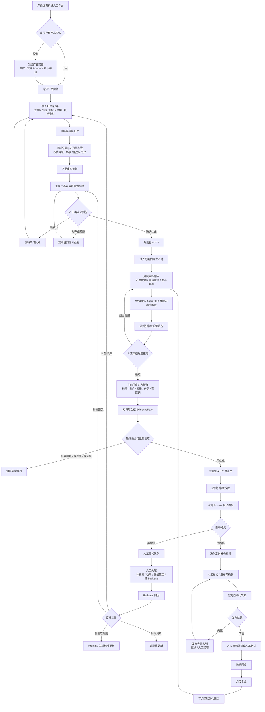
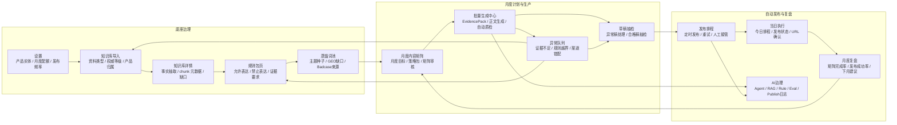
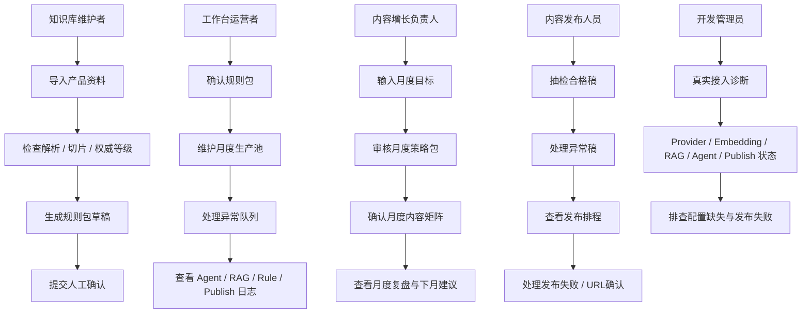

# V5 新版用户流程图：月度内容矩阵

## 流程定位

V5 主流程不是周计划，而是：

```text
月度目标输入
-> 月度内容策略包
-> 月度内容矩阵
-> 人工审核
-> 批量生成一个月内容
-> 自动质检
-> 异常队列
-> 定时自动化发布
-> 月度复盘
```

周计划 / 日任务只是月度矩阵拆解后的执行视图。

## 总流程图



## 页面级流程图



## 角色流程图



## 新流程中的关键保护点

1. 规则包草稿不能自动生效。
2. 没有 active 规则包的产品不能进入月度内容生产池。
3. 月度矩阵必须人工审核后才能批量生成。
4. 没有 EvidencePack 的矩阵项不能生成正文。
5. 规则引擎 blocker 必须进入异常队列。
6. 合格稿进入定时发布前必须通过自动质检，并支持人工抽检。
7. 定时正式自动发布依赖真实平台配置；缺配置时显示 `pending_config`。
8. 发布失败必须进入失败队列，不能伪装为已发布。

