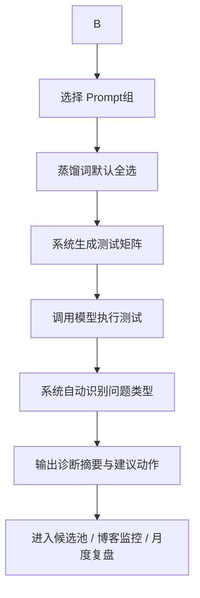
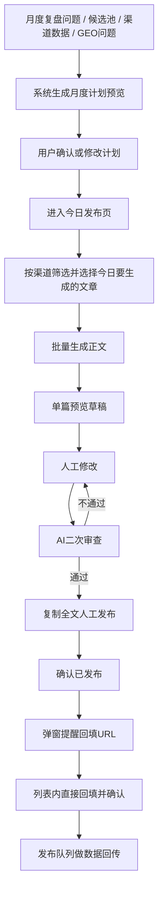

# 内容增长系统 V2 补充修正文档

## 1. 文档定位

本文档用于承接上一轮 `content-growth-system-v2-rules.md` 之后的确认、质疑与修正。

目标不是重复原方案，而是把已经确认的部分冻结下来，把需要调整的部分改成更适合长期运营内容增长系统的版本，避免后续开发时继续沿用不准确的规则。

本文档不涉及代码实现。

---

## 2. 已确认项

以下内容已确认，后续无需反复讨论，可视为当前版本的固定规则：

1. 知识库类型建议确认：
   - 品牌事实
   - 产品资料
   - 官网博客
   - 渠道历史
   - 竞品参考
   - 用户自定义
2. 知识库内部调用控制确认。
3. “调用范围”改为“使用场景”，第一版按默认使用场景。
4. V2 边界确认：
   - 标准化导入
   - 自动抓取更新
   - 内容预览
   - 规则切片
   - Chunk 预览
5. AI 二次审查规则确认。
6. 提示文案、发布回填 URL 规则确认。
7. 页面职责变化确认：
   - 今日任务负责生成、改稿、质检、确认发布、回填 URL
   - 发布队列只负责数据回传
8. 渠道数据回传逻辑确认。
9. V2 只做规则切片和 Chunk 预览，向量化与语义检索放到 V3。

---

## 3. 自动化设置修正

### 3.1 不放在内容生成页

上一版里，把“内容生成时默认调用哪些知识库类型”放在内容生成相关自动化里，这一点不合适。

修正为：

1. 内容生成时不让用户手动选知识库类型。
2. 内容生成时由 AI 根据任务语义自动选择知识库。

### 3.2 内容生成时由 AI 自动路由知识库

系统自动选择知识库时，依据应包括：

1. 当前任务的产品
2. 当前任务的主蒸馏词
3. 当前任务的来源问题
4. 当前渠道
5. 是否需要官网链接目标
6. 内容类型（FAQ / 技术拆解 / 对比 / 案例 / 认知解释）

建议的默认路由：

| 任务类型 | 默认调用知识库 |
|---|---|
| 品牌表达类 | 品牌事实 + 官网博客 |
| 产品推广类 | 产品资料 + 官网博客 |
| 对比类 | 品牌事实 + 产品资料 + 竞品参考 |
| 渠道改写类 | 官网博客 + 渠道历史 |
| 官网引用补强类 | 官网博客 |

### 3.3 自动抓取配置放在哪里

自动抓取官网博客、产品站点、竞品站点等配置，应放在对应业务页面：

1. 知识库页：自动抓取并更新知识库。
2. 博客监控页：自动抓取官网博客并更新监控数据。

### 3.4 官网博客抓取配置建议

官网博客自动化配置建议支持：

1. 时间维度：
   - 按周
   - 周几
   - 几点
2. 运行信息：
   - 上一次抓取时间
   - 下一次抓取时间
3. 操作：
   - 启用 / 停用
   - 立即手动抓取

### 3.5 “统一底层”的自然语言解释

所谓“统一底层”，不是说给用户一个总自动化页面。

它的意思是：

> 用户看到的是分散的业务入口，系统底层跑的是统一格式的自动任务对象。

也就是：

1. 用户入口分散
2. 系统任务结构统一
3. 这样既不破坏业务理解，也便于后续维护

---

## 4. Prompt 组与蒸馏词的关系修正

### 4.1 角色分工

Prompt 组和蒸馏词不是一个维度。

它们各自负责：

| 对象 | 作用 |
|---|---|
| Prompt 组 | 决定“怎么问” |
| 蒸馏词 | 决定“测哪个认知节点” |

### 4.2 为什么不能一对一绑定

同一个蒸馏词，可以被多个 Prompt 组测试。

例如蒸馏词“AI 输出安全”，可以放进：

1. 品牌认知问题
2. 产品场景问题
3. 对比问题
4. FAQ 问题

反过来，一个 Prompt 组也会覆盖多个蒸馏词。

所以它们不应该一对一绑定，而应该：

1. 多对多关联
2. Prompt 组有“推荐蒸馏词”
3. 实际测试时蒸馏词默认全选

### 4.3 更稳的默认操作逻辑


1. 用户选择平台
2. 用户选择 Prompt 组
3. 蒸馏词默认全选

这样做的原因：

1. 操作更快
2. 不容易漏测
3. 覆盖更完整
4. 更适合自动化运行

### 4.4 GEO 自动化后的实际流程



---


### 5.1 不建议的旧思路

“每月 15 篇以上才每月测，否则一个月测一次”不够合理。

因为每月 15 篇已经意味着月度内容变化很大，一个月才测一次会导致补强动作滞后。

### 5.2 建议区间

更合理的频率标准：

|---|---|

### 5.3 额外触发条件

除固定频率外，以下情况建议额外补测一次：

1. 官网上新一批博客
2. 官网首页或产品页改版
3. 新蒸馏词矩阵上线
4. 重要活动周 / 发布周

### 5.4 判断逻辑

测试频率不仅取决于“发了多少内容”，还取决于：

1. 官网信源变化速度
2. GEO 问题被发现的时效要求

长期目标不是省测试次数，而是让 GEO 失真尽快暴露。

---

## 6. GEO 中“引用官网”的判断修正

### 6.1 原问题

上一版只判断“是否引用官网”，过于粗糙。

实际中 AI 可能：

1. 直接引用官网
2. 引用官网博客
3. 引用官方渠道文章
4. 引用第三方渠道文章
5. 只提品牌，不给来源

这几种情况，对官方推广和品牌控制力的意义完全不同。

### 6.2 建议拆成四层引用结果

| 层级 | 含义 |
|---|---|
| 官网直引 | 明确出现官网域名或官网核心页面 URL |
| 官方内容引用 | 引用官网博客、官网栏目、官方产品页 |
| 官方渠道引用 | 引用公众号、知乎、掘金、CSDN 的官方账号文章 |
| 非官方引用 | 第三方文章、转载、总结页 |

### 6.3 是否必须引用官网

不是所有问题都必须引用官网，但以下内容应优先追求官网直引：

1. 产品能力
2. 服务边界
3. 官方方案
4. 案例事实
5. 转化相关问题

而以下问题可以接受“官方渠道引用”为次优：

1. 行业观点
2. 场景讨论
3. 方法论文章
4. 经验总结

### 6.4 可观察结果与不可观察结果

系统可以观察到的是：

1. AI 是否贴出官网 URL
2. 是否贴出官方渠道 URL
3. 回答内容是否明显基于官网事实

系统无法直接知道：

1. 模型内部到底先抓了官网吗
2. 它内部到底优先读了哪一个页面

所以工作台里应该记录“可见引用结果”，而不是假装知道模型内部路径。

---

## 7. 月度计划与今日发布的边界修正

### 7.1 月度计划只做计划预览

修正后，月度计划不参与正文生产，也不展示预计草稿结构。

月度计划只负责：

1. 生成标题级计划预览
2. 展示渠道、产品、类型、蒸馏词、来源问题
3. 允许人工确认或修改

### 7.2 正文只在今日发布页生成

正文生成必须放在今日发布页。

顺序应该是：



### 7.3 计划生成规则修正

上一版按“优先级”排列不够准确。

修正为四层约束模型：

#### 第一层：硬约束

必须满足：

1. 带品牌词
2. 带产品重点
3. 带官网链接目标
4. 符合本月发布数量和渠道节奏

#### 第二层：语义约束

必须满足：

1. 每篇任务绑定主蒸馏词
2. 每篇任务知道来源问题

#### 第三层：优化约束

重点补：

1. GEO 未命中
2. 官网引用不足
3. 渠道表现差但重要的主题

不是一味延展“表现好”的主题，而是：

> 用表现好的文章结构、钩子、风格，去补表现差但重要的主题。

#### 第四层：风格约束

1. 参考高表现文章结构
2. 参考高表现文章钩子
3. 参考高表现文章表达方式
4. 不简单复制旧主题

### 7.4 月度计划预览字段

月度计划预览只展示：

1. 标题
2. 渠道
3. 产品
4. 类型
5. 主蒸馏词
6. 来源问题

不生成正文。

---

## 8. Prompt 与规则模板修正

### 8.1 当前问题

当前工作台里的正文生成 Prompt 偏轻，只给：

1. 渠道
2. 产品
3. 标题
4. 内容类型
5. 关键词

这不足以保障长期稳定。

### 8.2 参考已有项目的结构化思路

GEOFlow 在知识构建上已经有更强的结构化思路：

1. 先把网页内容整理成 `knowledge_markdown`
2. 再产出关键词和标题
3. 再进入下游任务

工作台更适合借用的是这种“结构化输入方式”，而不是照搬 GEOFlow 的全部后台逻辑。

### 8.3 建议拆成五类 Prompt / 规则模板

#### 模板 1：月度计划生成模板

输入：

1. 来源问题
2. 主蒸馏词
3. 产品
4. 品牌
5. 渠道规则

输出：

1. 标题级月度计划预览

#### 模板 2：渠道标题模板

作用：

同一主题，根据不同渠道生成不同标题。

#### 模板 3：证据选择模板

作用：

1. 从知识库 Chunk 自动选择 2-4 段高相关证据
2. 推荐官网链接目标

#### 模板 4：批量正文生成模板

输入：

1. 标题
2. 渠道
3. 产品
4. 蒸馏词
5. 来源问题
6. 证据 Chunk
7. 官网链接目标

输出：

1. 正文草稿

#### 模板 5：AI 二次质检模板

输入：

1. 正文
2. 人工修改部分
3. 规则约束

输出：

1. 通过 / 未通过
2. 未通过位置
3. 建议修改动作

### 8.4 不同渠道的规则模板

| 渠道 | 规则重点 |
|---|---|
| 公众号 | 观点、判断、案例、业务语境 |
| CSDN | 步骤、流程、技术拆解、工程实践 |
| 掘金 | 开发者视角、架构、实现、踩坑 |
| 知乎/头条 | 问题回答、结论先行、对比判断 |

### 8.5 AI 稳定性的根源

稳定性不是来自更大的模型，而来自：

1. 输入结构固定
2. 证据来源固定
3. 渠道规则固定
4. 质检规则固定
5. 人工修改后重新质检

---

## 9. 今日发布页修正

### 9.1 这是今日发布页，不是月度计划页

上一版里部分字段误写成“月度计划展现形式”，这里修正：

下列列表形态属于 **今日发布页**：

1. 标题
2. 产品
3. 类型
4. 状态（未确认 / 已确认）
5. URL（已回填 / 未回填）

### 9.2 今日发布页顶部指标

页面正上方应显示：

1. 今日计划发布几篇
2. 今日已发布几篇
3. 本月还剩几篇

### 9.3 用户操作流程

今日发布页的标准流程：

1. 按渠道筛选
2. 选择月度计划中的哪些文章今天要生成
3. 这些文章进入下方表格
4. 批量生成正文
5. 每一行提供“预览草稿”入口
6. 单篇进入草稿预览页
7. 人工修改
8. AI 二次审查
9. 通过后复制全文人工发布
10. 在今日列表确认已发布
11. 弹窗提醒回填 URL
12. 列表内直接回填 URL 并确认

### 9.4 单篇页面不是生成页

修正为：

1. 正文生成是批量动作
2. 单篇页面没有“生成草稿”
3. 单篇页面只有“预览草稿”

### 9.5 二次审查未通过后的动作

单篇草稿预览页中，如果 AI 二次审查未通过，应提供：

1. `返回修改前`
2. `删除`

这两个动作即可，不增加其他多余操作。

---

## 10. 发布队列修正

发布队列页面只负责数据回传。

它不再承担：

1. URL 回填
2. 发布确认
3. 正文处理

它只负责：

1. 导入渠道数据表
2. 回传数据
3. 匹配已发布 URL
4. 更新指标
5. 支撑月度复盘

---

## 11. 博客监控页修正

### 11.1 标题展示规则

按当前修正要求：

1. URL 放在详情里
2. 不增加副标题
3. 不显示“待解析标题”
4. 不做“重新解析标题”这类多余动作
5. 能解析就直接解析
6. 解析不了就留空

### 11.2 页面重心

博客监控页的重点应是：

1. 让用户一眼看到问题
2. 先看问题类型
3. 再看受影响文章
4. 最后才看明细表

而不是一开始就进入大表格。

---

## 12. 蒸馏词矩阵复盘与多模型验证修正

### 12.1 蒸馏词矩阵复盘要进入工作台

这一点确认：

1. 要加入工作台
2. 适合放在月度复盘页
3. 也适合放在蒸馏词库页

复盘内容应包括：

1. 哪些蒸馏词本月被覆盖
2. 哪些蒸馏词内容类型不完整
3. 哪些蒸馏词 GEO 命中提升
4. 哪些蒸馏词仍被竞品占位

### 12.2 多模型验证作为固定自动前置动作

这一点也按你的要求修正：

1. 多模型验证是蒸馏词生成前的固定动作
2. 不需要人工确认
3. 验证通过后自动进入蒸馏词库

更准确地说，它应变成一个自动状态：

```text
auto_validated
```

意思是：

1. 该蒸馏词已经通过多模型复现验证
2. 自动进入词库
3. 后续若表现差，系统可再自动降权或停用

---

## 13. 前端设计规范修正

### 13.1 设计方向明确

后续工作台前端设计统一按以下目标执行：

1. B 端产品感
2. 清晰
3. 简洁
4. 直观
5. 科技感，但克制
6. 舒适
7. 蓝色为主色调
8. 图表、指标、数字等业务指标可用高饱和色突出
9. 用户流程交互顺畅

### 13.2 skill 的适用边界

本地的前端设计 skill 可作为方法参考，但不能直接套：

1. `design-taste-frontend`
   - 明确不适合 dashboard / data table / multi-step product UI
   - 不能直接拿来做工作台
2. `frontend-design`
   - 它“先明确页面职责、受众、信息层级”的方法适合工作台

所以工作台应遵循的不是“营销页审美”，而是：

> B 端产品设计规范 + 适度设计感 + 统一信息层级

### 13.3 当前页面可优化点

#### 问题 1：表格出现过早

现在很多页面一上来就是表格。

应改成：

1. 先看关键指标
2. 再看诊断摘要
3. 再看建议动作
4. 最后才看明细表

#### 问题 2：数字层级不够突出

指标卡片与正文说明权重太接近。

应让：

1. 关键数字更大
2. 说明文字更轻
3. 风险值更显眼

#### 问题 3：操作入口权重混乱

当前多个按钮都像一级动作。

应明确：

1. 主动作
2. 次动作
3. 维护动作

#### 问题 4：筛选器太抢眼

筛选器不应压过诊断内容。

应收在工具栏中，作为辅助控制，而不是首页主视觉。

#### 问题 5：跨页面视觉语言不统一

GEO、博客监控、月度复盘、月度计划目前更像不同工具。

应统一：

1. 主色
2. 状态标签颜色
3. 卡片边界
4. 图表颜色规则
5. 诊断摘要结构

### 13.4 具体视觉规范建议

1. 主色：蓝色
2. 背景：浅蓝灰 / 中性灰，不刺眼
3. 状态色：
   - 风险：红 / 橙
   - 正常：绿
   - 信息：青 / 紫，但少用
4. 圆角：统一在 8px 以内
5. 图表：只用少量高饱和色强调关键值
6. 卡片：少而准，不做卡套卡
7. 页面信息顺序：
   - 指标
   - 诊断
   - 动作
   - 明细

---

## 14. 当前版本结论

本轮修正后，系统的业务结构更加清晰：

1. 知识库负责持续更新与结构化沉淀
2. 月度计划只做标题级计划预览
3. 今日发布页负责批量生成、单篇预览、人工修改、AI 质检、确认发布与 URL 回填
4. 发布队列只负责数据回传
6. 蒸馏词矩阵复盘与多模型验证会逐步成为工作台长期运营能力的一部分

这套修正后的规则，比上一版更适合落成一个长期运营的内容增长系统。
