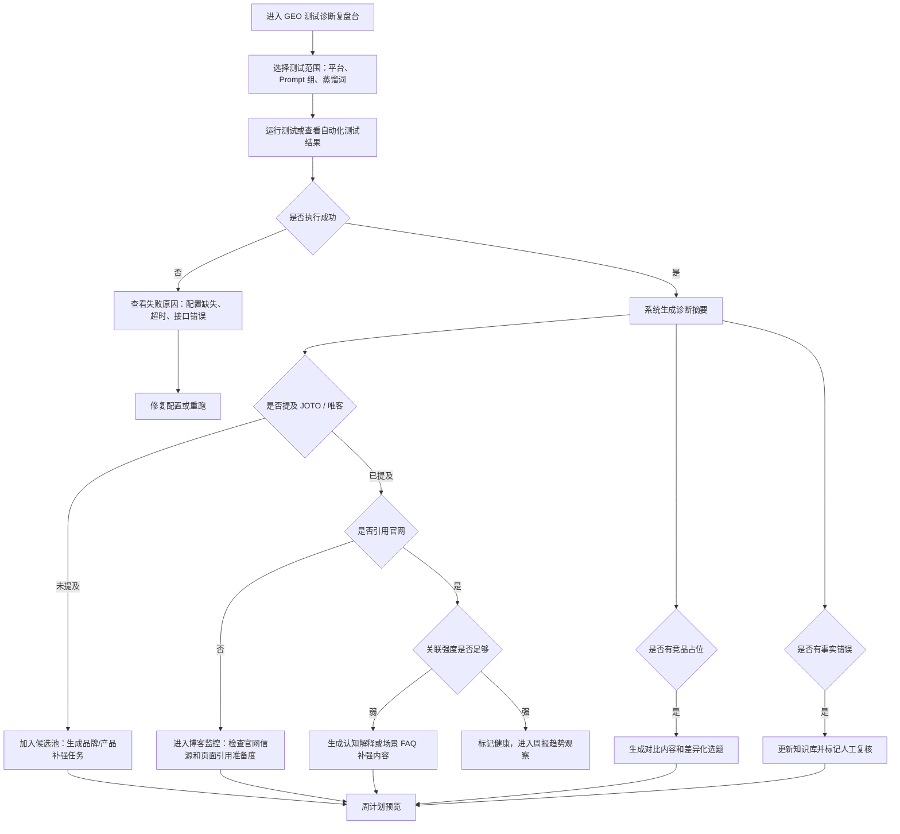
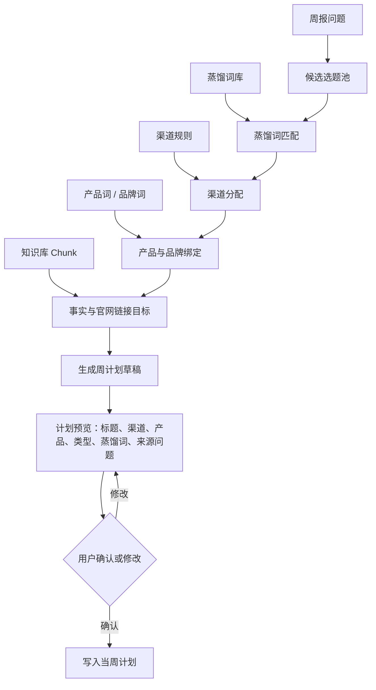
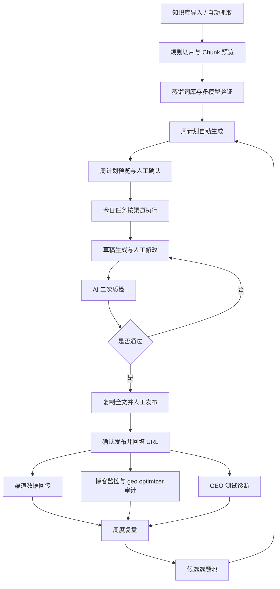

# 内容增长系统 V2 规则与页面改造方案

## 1. 文档定位

本文档是在 `content-growth-dashboard-refactor.md` 基础上的 V2 细化方案，用于回答当前关于知识库、RAG、自动化、GEO 诊断、周计划、草稿预览、发布数据回传、博客监控、蒸馏词矩阵和多模型验证的需求与疑问。

本文档不涉及代码实现，目标是先把长期运营的业务规则、页面职责和用户流程讲清楚。

系统最终目标是构建一个长期运营的内容增长系统，而不是一个单次生成文章的工具。它要持续完成：

1. 内容生产：稳定生成适合不同渠道的人类可读内容。
2. GEO 建设：围绕 AI 认知节点建立长期权重。
3. 官网信源建设：让官网内容更容易被 AI 引用。
4. 数据监控：通过发布数据、博客监控、GEO 测试反哺下一轮计划。
5. 运营闭环：让问题能够进入候选池、周计划、草稿、发布、复盘。

## 2. 知识库类型与可信等级

### 2.1 结论

用户可见的“可信等级”应该删掉，但底层可以保留对应字段或内部判断逻辑。

用户不需要手动判断一份资料是“最高、高、中、参考”。用户真正需要做的是设置：

1. 这是什么类型的资料。
2. 这份资料用于什么业务场景。
3. 是否启用。
4. 是否需要人工确认。

### 2.2 知识库类型建议

知识库类型建议调整为：

| 类型 | 说明 | 可用于内容生成吗 | 主要用途 |
|---|---|---|---|
| 品牌事实 | JOTO 品牌定位、公司介绍、服务边界、官方表述 | 可以 | 保证品牌表达一致 |
| 产品资料 | 唯客、Dify 服务、产品能力、功能说明 | 可以 | 支撑产品推广重点 |
| 官网博客 | 官网已发布文章、案例、FAQ、技术说明 | 可以 | 作为可信事实和官网引用来源 |
| 渠道历史 | CSDN、掘金、知乎、公众号历史内容和数据 | 可以，但更偏参考 | 参考风格、选题、表达，避免同质化 |
| 竞品参考 | 竞品官网、竞品回答、竞品文章、竞品功能说明 | 可以，但需标记用途 | 做对比、差异化、市场判断 |
| 用户自定义 | 用户自己定义的资料类型 | 根据设置决定 | 承接临时或特殊知识资产 |

这里建议用“用户自定义”替换“外部来源”。原因是“外部来源”太宽泛，用户并不知道它该怎么用；“用户自定义”更适合长期运营，可以让你后续按业务实际增加新的资料分类。

### 2.3 内部调用控制

虽然不让用户设置可信等级，但系统内部仍然需要控制不同类型资料的调用方式。

| 类型    | 默认调用方式                               |
| ----- | ------------------------------------ |
| 品牌事实  | 可进入生成 Prompt，可作为事实依据，可在质检中作为标准       |
| 产品资料  | 可进入生成 Prompt，可作为产品卖点和产品边界            |
| 官网博客  | 可进入生成 Prompt，可作为官网链接和引用来源            |
| 渠道历史  | 主要用于风格、选题、渠道表达、标题参考，不应直接作为事实依据       |
| 竞品参考  | 可进入生成 Prompt，但必须带有“竞品参考”标签，避免被写成自家能力 |
| 用户自定义 | 根据用户选择的用途进入不同流程                      |

### 2.4 业务效果

删掉可信等级后，知识库导入会更像真实业务：

```text
导入资料
-> 选择知识库类型
-> 系统自动推断调用规则
-> 用户设置是否启用
-> 系统在生成、质检、复盘中按类型使用
```

这样可以降低用户操作成本，也避免把“可信等级”这种判断交给用户手动填写。

## 3. 调用范围到底是什么

### 3.1 原先调用范围的含义

原先“调用范围”的设计，是为了说明某个知识库可以被哪些流程使用，例如：

1. 内容生成。
2. GEO 测试。
3. 博客监控。
4. 周计划选题。
5. 候选池补强。
6. 竞品对比。

但你当前的理解是：知识库来源主要用于内容生成，不涉及其他流程。

这个理解是对的，但只覆盖了第一层。

### 3.2 为什么长期系统仍需要“调用范围”

如果工作台只是写文章，知识库确实只需要用于内容生成。

但如果它要变成长期内容增长系统，知识库会逐渐影响多个环节：

```text
知识库
-> 周计划选题
-> 内容生成
-> AI 质检
-> 官网链接推荐
-> 博客监控诊断
-> GEO 测试问题生成
-> 候选池补强
-> 周报复盘解释
```

例如：

1. 官网博客知识库可以帮助系统判断“这篇渠道文章应该引用哪个官网链接”。
2. 竞品参考库可以帮助系统判断“这个蒸馏词是否被竞品占位”。
3. 渠道历史库可以帮助系统判断“这个选题过去在哪个渠道表现更好”。
4. 品牌事实库可以帮助 AI 质检判断“有没有写偏品牌定位”。

### 3.3 建议改名

“调用范围”这个词比较抽象，建议改成更用户化的名字：

```text
使用场景
```

可选项可以是：

| 使用场景 | 说明 |
|---|---|
| 内容生成 | 生成文章时可调用 |
| 选题规划 | 生成周计划和候选选题时可参考 |
| AI 质检 | 检查品牌、产品、官网引用是否符合规则 |
| 官网引用 | 推荐官网链接和事实来源 |
| GEO 诊断 | 辅助解释 GEO 未命中原因 |
| 竞品对比 | 只用于竞品差异化分析 |
| 渠道风格 | 只用于渠道表达参考 |

### 3.4 第一版建议

第一版不需要让用户复杂多选。

可以根据知识库类型给默认使用场景：

| 类型 | 默认使用场景 |
|---|---|
| 品牌事实 | 内容生成、AI 质检 |
| 产品资料 | 内容生成、AI 质检 |
| 官网博客 | 内容生成、官网引用、GEO 诊断 |
| 渠道历史 | 选题规划、渠道风格 |
| 竞品参考 | 竞品对比、GEO 诊断 |
| 用户自定义 | 用户选择 |

## 4. 知识库 RAG 与 Chunk V2 落地

### 4.1 你的决策

你计划直接进入 V2：

```text
标准化导入
+ 自动化抓取站点更新知识库
+ 内容预览
+ 规则切片
+ Chunk 预览
```

这个方向是合理的。因为你的系统不是一次性写几篇文章，而是要长期运营内容资产。如果没有 Chunk 层，知识库后面会很快变成“资料很多，但模型不知道该用哪段”。

### 4.2 V2 功能边界

V2 不等于完整向量数据库，也不等于复杂语义检索。

V2 的边界建议是：

1. 可以导入 URL、Markdown、Docx、手动文本。
2. 可以自动抓取指定站点更新资料。
3. 可以预览解析后的知识库正文。
4. 可以按规则切片。
5. 可以预览 Chunk。
6. 可以在生成文章时优先选择相关 Chunk。
7. 暂时不强制做向量化。

### 4.3 规则切片怎么做

规则切片优先按结构，而不是一上来就让模型自由切。

推荐规则：

1. 按 Markdown 标题切。
2. 标题下内容过长时按段落切。
3. 每个 Chunk 保留来源 URL、原始标题、章节路径。
4. Chunk 太短时和前后段合并。
5. Chunk 太长时按自然段拆开。
6. 表格可以保留为一个独立 Chunk。
7. FAQ 问答可以一问一答作为一个 Chunk。

Chunk 字段建议：

| 字段 | 说明 |
|---|---|
| chunkId | 唯一 ID |
| knowledgeBaseId | 属于哪个知识库 |
| sourceUrl | 来源 URL |
| sourceTitle | 来源文章标题 |
| sectionPath | 所在章节 |
| chunkTitle | Chunk 标题 |
| content | Chunk 正文 |
| tokenCount | 估算 token 数 |
| contentHash | 内容哈希，用于判断是否变化 |
| status | 启用 / 停用 |

### 4.4 对 AI 生成稳定性的影响

没有 Chunk 时，模型生成文章依赖“大段背景资料”，容易出现：

1. 引用不精准。
2. 遗漏关键产品信息。
3. 官网链接和事实对不上。
4. 长文档塞不进上下文。
5. 渠道历史、竞品资料、自家产品资料混在一起。

有 Chunk 后，生成链路可以变成：

```text
任务 Brief
-> 主蒸馏词
-> 产品词 / 品牌词
-> 官网链接目标
-> 检索或筛选相关 Chunk
-> 把少量高相关 Chunk 放入 Prompt
-> 生成文章
-> AI 质检核对规则和证据
```

效果是：

1. 文章更稳定地命中事实。
2. 产品卖点不容易乱写。
3. 官网链接更容易自然出现。
4. 竞品参考不会被误写成自家能力。
5. 后续可以追溯“这篇文章用了哪些资料”。

## 5. 自动化设置不单独建页面

### 5.1 你的要求

自动化设置不要做成单独页面，而是按业务流程分散在对应页面：

1. 内容生成页面设置内容生成相关自动化。
2. 博客监控页面设置博客抓取相关自动化。
3. GEO 测试页面设置 GEO 测试相关自动化。

这个方向是对的。自动化不应该成为一个抽象功能页，而应该贴着用户正在做的业务动作出现。

### 5.2 推荐设计

#### 内容生成页面自动化

适合配置：

1. 每周自动生成计划。
2. 每天自动生成待确认草稿。
3. 生成时默认调用哪些知识库类型。
4. 草稿生成后是否自动进入 AI 质检。

#### 博客监控页面自动化

适合配置：

1. 自动抓取官网博客。
2. 自动抓取 sitemap / RSS。
3. 自动执行 geo optimizer 页面审计。
4. 自动发现新增博客并进入监控。
5. 自动检测内容变化并刷新 Chunk。

#### GEO 测试页面自动化

适合配置：

1. 每周固定时间运行 GEO 测试。
2. 选择测试平台。
3. 选择 Prompt 组。
4. 选择蒸馏词范围。
5. 测试后自动生成诊断摘要。

### 5.3 统一底层

虽然入口分散在不同页面，但底层应该统一为同一种自动化任务：

```text
AutomationRule
- id
- name
- scene: content_generation / blog_monitor / geo_test
- frequency
- targetScope
- enabled
- lastRunAt
- nextRunAt
- lastResult
```

用户看到的是分散入口，系统内部仍然是统一任务。

## 6. GEO 测试问题、建议动作与快捷入口

### 6.1 GEO 测试可能出现的问题

GEO 测试不应该只判断“命中 / 未命中”。它应该把问题拆成可处理类型。

| 问题类型           | 判断标准                   | 系统建议动作              | 快捷入口              |
| -------------- | ---------------------- | ------------------- | ----------------- |
| 模型配置缺失         | API Key、模型配置不可用        | 先补模型配置，再重跑          | 去 AI 配置           |
| 测试执行失败         | 请求失败、超时、返回异常           | 查看错误，支持重跑           | 查看错误 / 重跑         |
| 未提及 JOTO       | 回答中没有 JOTO             | 进入候选池，生成品牌关联补强内容    | 入候选池              |
| 未提及唯客          | 有相关场景但没有唯客             | 生成产品场景补强内容          | 入候选池              |
| 提及 JOTO 但未引用官网 | 有品牌但无 jotoai.com 或官网链接 | 补官网信源文章或优化官网引用      | 去博客监控             |
| 引用官网但关联弱       | 有链接但回答没有说明 JOTO 与问题的关系 | 生成认知解释 / 场景 FAQ     | 生成补强任务            |
| 竞品占位           | 回答推荐竞品但没有 JOTO         | 生成对比内容和差异化内容        | 入候选池              |
| 蒸馏词未激活         | 回答没有出现目标核心概念           | 重新设计 Prompt 或补认知类内容 | 看 Prompt 组 / 入候选池 |
| 蒸馏词激活但未绑定 JOTO | 回答讨论了概念，但没有关联 JOTO     | 生成“蒸馏词 + JOTO”绑定内容  | 生成补强任务            |
| 回答事实错误         | 回答中出现错误产品能力或错误品牌信息     | 人工复核，更新品牌事实 / 产品资料  | 去知识库              |
| 回答过度泛化         | 回答没有具体服务商、产品、来源        | 补结构化事实、FAQ、案例       | 去博客监控             |
| 多平台结果分裂        | 不同模型结论差异大              | 标记观察，增加多轮测试         | 加入复测              |
| Prompt 组覆盖不足   | 只测了少量场景                | 增加 Prompt 组或蒸馏词覆盖   | Prompt 组管理        |
| 数据待复核          | 自动判断不确定                | 人工确认字段              | 人工复核              |

### 6.2 系统动作标准

系统建议动作不应该靠一句话随机生成，而应基于规则。

建议规则：

1. 如果模型未配置或失败，优先处理执行问题，不进入内容补强。
2. 如果未提及 JOTO，优先进入候选池。
3. 如果提及 JOTO 但无官网引用，优先进入博客监控。
4. 如果竞品占位，优先生成对比内容。
5. 如果蒸馏词未激活，优先检查 Prompt 组和蒸馏词内容矩阵。
6. 如果事实错误，优先更新知识库。
7. 如果多平台分裂，先标记观察，不直接生成大量内容。

### 6.3 GEO 测试诊断 SOP



## 7. 周计划自动生成规则

### 7.1 你的目标

你希望周计划默认自动生成，但背后的规则要明确。

周计划不能只按“每天几篇、哪些渠道”机械生成。它应该综合：

1. 蒸馏词。
2. 内容类型。
3. 渠道风格。
4. 产品词。
5. 品牌词。
6. 知识库参考。
7. 官网链接目标。
8. 上周问题。
9. 候选池信号。

### 7.2 生成链路

周计划生成应是系统自动完成，但必须有预览和人工确认。



### 7.3 生成依据

系统生成周计划时，应按以下优先级：

1. 上周 GEO 未命中和竞品占位。
2. 官网引用率低的问题。
3. 蒸馏词矩阵缺口。
4. 渠道表现好的主题延展。
5. 产品推广重点。
6. 品牌长期表达重点。
7. 默认发布频率。

### 7.4 是否需要不同提示词

需要。

周计划生成不是一个 Prompt 能解决的，至少需要几类 Prompt 或规则模块。

| 模块 | 作用 |
|---|---|
| 选题生成 Prompt | 根据问题、蒸馏词、产品重点生成候选选题 |
| 渠道适配 Prompt | 把同一主题转成 CSDN、掘金、知乎、公众号不同表达 |
| 标题生成 Prompt | 生成符合渠道风格的标题 |
| 官网链接推荐 Prompt | 根据知识库 Chunk 推荐官网事实或官网链接目标 |
| 计划解释 Prompt | 说明每个选题解决了上周哪个问题 |
| 质检 Prompt | 检查计划是否覆盖蒸馏词、品牌词、产品词、官网链接目标 |

### 7.5 周计划展示形式

周计划页不应该展示太多字段。

你建议的精简列表是合理的：

| 列表字段 | 说明 |
|---|---|
| 标题 | 内容任务标题 |
| 产品 | JOTO / 唯客 / Dify 服务等 |
| 类型 | FAQ、技术拆解、对比、案例、认知解释 |
| 状态 | 未确认 / 已确认 |
| URL | 已回填 / 未回填 |

更多信息放到详情或预览里，不在主列表挤满。

## 8. 周计划、草稿预览、AI 质检与发布闭环

### 8.1 用户操作流程

你希望的流程可以整理为：

```text
周计划页
-> 一键生成周计划
-> 进入计划预览
-> 用户确认或修改当周计划
-> 今日任务页按渠道筛选
-> 进入单篇草稿预览
-> 人工手动修改
-> AI 二次审查
-> 通过后复制全文
-> 人工发布
-> 在今日任务列表确认已发布
-> 弹窗提醒回填 URL
-> 列表内直接回填 URL 并确认
-> 后续发布队列只负责数据回传
```

### 8.2 草稿预览入口

单篇文稿的草稿预览入口建议放在两个位置：

1. 今日任务页：每条任务有“预览草稿 / 生成草稿”按钮。
2. 周计划预览页：计划确认前，可以查看“预计草稿结构”，但不生成完整正文。

最主要入口应在今日任务页，因为用户实际写文章和改稿是在当天执行。

### 8.3 草稿预览页面能力

草稿预览页应包括：

1. 文章正文。
2. 规则检查结果。
3. 手动修改高亮。
4. AI 二次审查按钮。
5. 未通过原因。
6. 通过后复制全文按钮。

### 8.4 人工修改标记

人工修改部分应被标记出来，原因是：

1. 用户知道哪些是 AI 原文，哪些是人工改动。
2. AI 二次审查时可以重点检查人工改动是否破坏规则。
3. 后续复盘可以知道哪些地方经常需要人工改。

标记方式：

```text
蓝色：AI 原始生成
黄色：人工修改
红色：AI 质检未通过位置
绿色：通过的关键规则
```

### 8.5 AI 二次审查规则

AI 二次审查应检查此前预设规则：

| 检查项 | 不通过后果 |
|---|---|
| 是否命中主蒸馏词 | 不允许发布 |
| 是否命中品牌词 | 不允许发布 |
| 是否命中产品推广重点 | 不允许发布 |
| 是否有官网链接或官网事实目标 | 不允许发布或强警告 |
| 是否符合渠道风格 | 警告或不允许发布，取决于严重度 |
| 是否有夸大承诺 | 不允许发布 |
| 是否误用竞品资料 | 不允许发布 |
| 是否人工修改破坏事实 | 不允许发布 |

### 8.6 页面提示文案

页面必须有明确提示：

1. “AI 质检未通过时，不能进入发布复制。”
2. “人工修改内容会被标记，并纳入二次审查。”
3. “通过质检后，可复制全文到对应渠道发布。”
4. “发布后请确认已发布，并回填 URL，否则周报无法统计完整效果。”

### 8.7 发布后回填 URL

你的设计是合理的：发布后，在今日任务列表点击“确认已发布”，系统顺势提醒回填 URL，并允许直接在列表中回填。

这样发布队列不再承担 URL 回填主职责。

## 9. 发布队列与渠道数据回传

### 9.1 结论

如果今日任务页已经完成 URL 回填，那么发布队列就不需要再做 URL 回填。

发布队列应转成：

```text
发布记录与数据回传中心
```

主要职责：

1. 展示已发布内容。
2. 定期导入渠道数据。
3. 关联渠道数据与已发布 URL。
4. 支撑周度复盘。
5. 标记数据导入状态。

### 9.2 渠道数据回传逻辑

渠道数据回传流程：

```text
已发布 URL
-> 导入渠道数据表
-> 系统按 URL / 标题 / 渠道匹配
-> 更新阅读、点赞、收藏、评论、分享等指标
-> 周报汇总
-> 反哺下周计划
```

### 9.3 页面职责变化

| 页面 | 职责 |
|---|---|
| 今日任务 | 生成、改稿、质检、复制、确认发布、回填 URL |
| 发布队列 | 数据回传、发布记录、渠道指标导入 |
| 周度复盘 | 分析数据表现，生成下周计划信号 |

## 10. 博客监控加入 geo optimizer skill 后的重构

### 10.1 当前问题

当前博客监控页的问题和 GEO 测试复盘页类似：

1. 用户不能一眼看到主要问题。
2. 博客列表过于表格化。
3. 标题有时显示网页 URL，而不是文章标题。
4. 诊断结果粗，只看到 SEO 问题数和 GEO 命中状态。
5. 加入 geo optimizer 后，如果不重构页面，指标会更多、更难看懂。

### 10.2 为什么标题会显示 URL

标题显示 URL，通常有几种原因：

1. 抓取源没有提供文章标题。
2. sitemap 或 JSON 里只有 URL，没有 title 字段。
3. 页面抓取失败，系统只能用 URL 作为 fallback。
4. 页面 title 解析失败。
5. 导入 CSV 时标题列没有映射成功。

所以这不是单纯 UI 问题，而是博客源数据质量和解析能力问题。

建议处理：

1. 如果抓到标题，显示标题。
2. 如果没抓到标题，显示“待解析标题”。
3. URL 放在副标题或详情里。
4. 提供“重新解析标题”动作。

### 10.3 加入 geo optimizer 后的核心指标

博客监控页应突出：

| 指标 | 含义 |
|---|---|
| 总监控文章数 | 当前官网博客资产规模 |
| 待处理问题数 | 需要优化或复核的文章 |
| GEO 页面健康分 | 页面是否适合被 AI 引用 |
| 引用准备度 | 是否有明确结论、来源、结构化内容 |
| AI crawler 可访问 | AI 搜索是否能抓取 |
| 官网引用缺口 | 哪些文章不适合作为信源 |
| Chunk 准备度 | 是否适合进入知识库 RAG |
| AI Bot PV | AI Bot 是否访问过 |

### 10.4 博客监控低保真图

```text
┌──────────────────────────────────────────────────────────────────────────────┐
│ 官网博客监控                                             [自动化设置] [同步博客] │
│ 监控官网博客是否可被搜索、可被 AI 引用，并沉淀为内容增长信号。                  │
└──────────────────────────────────────────────────────────────────────────────┘

┌──────────────┬──────────────┬──────────────┬──────────────┬──────────────┐
│ 监控文章       │ 待处理问题     │ GEO健康均分   │ 引用准备不足   │ AI Bot PV     │
│ 38           │ 12           │ 68           │ 9            │ 126          │
└──────────────┴──────────────┴──────────────┴──────────────┴──────────────┘

┌───────────────────────────────┬───────────────────────────────┐
│ 问题分布                       │ 官网信源状态                    │
│ AI crawler 阻断      2          │ 可作为信源        14             │
│ 缺少 schema          8          │ 部分可用          15             │
│ 引用准备度低         9          │ 不建议引用         9             │
│ 内容过薄             4          │ 待重新解析标题      3             │
└───────────────────────────────┴───────────────────────────────┘

┌──────────────────────────────────────────────────────────────────────────────┐
│ 优先处理问题                                                                  │
├──────────────────────────────────────────────────────────────────────────────┤
│ [高] AI crawler 无法访问                                                       │
│ 影响：页面即使内容好，也可能无法进入 AI 搜索引用链路。                           │
│ 建议：检查 robots / CDN / 页面访问状态。                         [查看详情]       │
├──────────────────────────────────────────────────────────────────────────────┤
│ [高] 引用准备度低                                                              │
│ 影响：模型难以提取明确答案和事实来源。                                           │
│ 建议：补 FAQ、明确结论、官网事实、结构化段落。                    [入候选池]       │
├──────────────────────────────────────────────────────────────────────────────┤
│ [中] 标题解析失败                                                              │
│ 影响：周报和候选池无法正确识别文章主题。                                         │
│ 建议：重新解析标题或手动补标题。                                  [重新解析]       │
└──────────────────────────────────────────────────────────────────────────────┘

┌──────────────────────────────────────────────────────────────────────────────┐
│ 博客列表                                                                       │
│ 标题 | URL | GEO健康分 | 引用准备度 | Chunk准备度 | AI Bot | 下一步 | 动作          │
│ 企业为什么需要 AI 应用治理 | /blog/... | 82 | 可用 | 可切片 | 12 | 观察 | 查看        │
│ 待解析标题 | /blog/xxx | 45 | 不足 | 不足 | 0 | 重新解析 | 解析标题              │
└──────────────────────────────────────────────────────────────────────────────┘
```

### 10.5 页面入口设计

| 入口 | 位置 | 作用 |
|---|---|---|
| 自动化设置 | 页面右上角 | 设置博客抓取频率、站点、是否自动审计 |
| 同步博客 | 页面右上角 | 手动同步 |
| 查看详情 | 问题卡片 / 列表 | 看单篇审计详情 |
| 入候选池 | 问题卡片 / 列表 | 转成内容补强任务 |
| 重新解析标题 | 列表 | 修复标题为 URL 的问题 |
| 刷新 Chunk | 详情页 | 内容变化后重建切片 |

## 11. 不同链路规则如何支撑 AI 生成稳定性

### 11.1 核心判断

AI 生成稳定性不是靠一个更强模型解决的，而是靠输入结构稳定。

稳定生成需要五层规则：

1. 选题规则：为什么写这篇。
2. 语义规则：绑定哪个蒸馏词。
3. 事实规则：引用哪些知识库和官网 Chunk。
4. 渠道规则：用什么风格和素材。
5. 质检规则：哪些不满足就不能发布。

### 11.2 链路规则落地

#### 蒸馏词优先链路

稳定性来自：

1. 每篇文章都有主蒸馏词。
2. 主蒸馏词对应固定内容矩阵。
3. AI 不再从标题自由发挥，而是围绕认知节点生成。

适合解决：

1. 内容长期方向不稳定。
2. 文章只堆关键词。
3. GEO 测试里模型没有激活核心概念。

#### 问题优先链路

稳定性来自：

1. 每篇文章都有真实用户问题。
2. 用户问题必须映射到蒸馏词。
3. 生成内容围绕“问题 -> 原因 -> 解决方案 -> 产品边界”展开。

适合解决：

1. 内容太像品牌宣传。
2. 用户读完不知道解决什么问题。
3. 渠道互动弱。

#### 渠道优先链路

稳定性来自：

1. 每个渠道有固定风格规则。
2. 同一主题跨渠道不是复制，而是重写角度。
3. 渠道历史库提供表达参考。

适合解决：

1. 多渠道内容同质化。
2. CSDN / 掘金 / 知乎 / 公众号风格混乱。
3. 发布节奏不稳定。

#### 官网信源优先链路

稳定性来自：

1. 每篇内容有官网链接目标。
2. 官网 Chunk 提供事实来源。
3. AI 质检检查是否自然引用官网。

适合解决：

1. GEO 测试提及品牌但不引用官网。
2. 内容缺少可信事实。
3. 模型无法把 JOTO 和某个概念绑定。

#### 监控反哺链路

稳定性来自：

1. 每个补强任务都有来源问题。
2. 周报把问题转成下周计划信号。
3. 发布后数据继续回传。

适合解决：

1. 内容生产靠拍脑袋。
2. 周计划没有复盘依据。
3. 内容增长不可持续。

### 11.3 推荐的生成输入结构

每次生成文章时，AI 不应该只拿到标题，而应拿到：

```text
任务目标：
- 本文解决什么问题
- 本文服务哪个渠道
- 本文优化上一周哪个问题

语义约束：
- 主蒸馏词
- 辅助蒸馏词
- 品牌词
- 产品词

事实约束：
- 可引用知识库 Chunk
- 官网链接目标
- 禁止误用的竞品资料

渠道约束：
- 渠道风格
- 推荐内容类型
- 标题风格

质检规则：
- 必须通过项
- 警告项
- 禁止项
```

这套结构比“换更好的模型”更重要。

## 12. 蒸馏词矩阵复盘、多模型验证、语义检索和向量化

### 12.1 蒸馏词矩阵复盘

#### 业务逻辑

蒸馏词矩阵复盘是为了判断：

```text
我们是不是围绕关键 AI 认知节点形成了足够内容资产？
```

不是看单篇文章，而是看一个蒸馏词下面是否形成内容矩阵。

例如“AI 输出安全”下面应该有：

1. 认知解释。
2. 场景 FAQ。
3. 技术拆解。
4. 对比判断。
5. 案例复盘。
6. 官网博客信源。
7. 多渠道分发。
8. GEO 测试命中。

#### 业务效果

1. 避免内容东一篇西一篇。
2. 知道哪些认知节点已经成型。
3. 知道哪些蒸馏词还薄弱。
4. 周计划可以基于矩阵缺口自动补内容。

#### 如何加入工作台

可以加入到周报或知识库的蒸馏词库中：

| 页面 | 加入方式 |
|---|---|
| 蒸馏词库 | 每个蒸馏词显示内容矩阵完成度 |
| 周度复盘 | 本周覆盖了哪些蒸馏词，哪些需要补 |
| 周计划 | 根据矩阵缺口生成下周任务 |

### 12.2 多模型交叉验证蒸馏词

#### 业务逻辑

多模型交叉验证是为了避免“自造蒸馏词”。

流程：

```text
输入一个业务领域或用户问题
-> 分别问多个模型
-> 汇总回答中高频出现的概念
-> 统计复现次数
-> 形成候选蒸馏词
-> 人工确认是否进入蒸馏词库
```

#### 业务效果

1. 蒸馏词更接近模型真实认知。
2. 避免把公司内部话术误当成 AI 认知节点。
3. GEO 测试更有依据。
4. 内容矩阵更容易被 AI 理解。

#### 如何加入工作台

可以作为蒸馏词库里的一个动作：

```text
[多模型验证]
```

输出：

| 字段 | 说明 |
|---|---|
| 候选蒸馏词 | 模型高频概念 |
| 出现模型数 | 被几个模型提到 |
| 示例回答 | 每个模型怎么说 |
| 建议层级 | 核心 / 场景 / 产品 |
| 是否加入词库 | 人工确认 |

### 12.3 语义检索

#### 业务逻辑

语义检索是为了让系统不是按关键词找资料，而是按“意思相近”找资料。

例如任务是：

```text
Dify 应用上线后如何避免模型输出高风险内容？
```

即使知识库里没有完全一样的词，也应该能找到：

1. AI 输出安全。
2. 唯客 AI 护栏。
3. 发布前风险审查。
4. 敏感内容识别。
5. Prompt Injection 防护。

#### 业务效果

1. 生成文章时引用资料更准。
2. 不依赖用户手动挑知识库。
3. 长期知识库越多，价值越明显。
4. 能支撑更稳定的 RAG。

#### 如何加入工作台

V2 先做规则切片和 Chunk 预览。

后续 V3 再加：

1. Chunk embedding。
2. 根据任务 Brief 检索相关 Chunk。
3. 生成前展示“将使用的知识片段”。
4. 用户可以勾选 / 排除。

### 12.4 向量化

#### 业务逻辑

向量化是语义检索的技术基础。

它把每个 Chunk 转成向量，之后系统可以计算：

```text
任务问题和哪个 Chunk 语义最接近？
```

#### 业务效果

1. 提高知识调用准确性。
2. 降低长上下文成本。
3. 支撑自动推荐官网链接。
4. 支撑相似选题去重。
5. 支撑内容矩阵缺口分析。

#### 加入工作台的时机

不建议在 V2 一开始就强依赖向量化。

原因：

1. 向量化需要模型、存储、重建、失败处理。
2. 当前更重要的是先把规则切片和 Chunk 预览做清楚。
3. 用户需要先看懂系统到底会用哪些资料。

推荐路径：

```text
V2：规则切片 + Chunk 预览
V3：向量化 + 语义检索
V4：自动 Chunk 推荐 + 内容矩阵智能补缺
```

## 13. 总体闭环

最终系统应形成：



## 14. 阶段优先级

### P0

1. 删除用户可见可信等级。
2. 知识库类型改为品牌事实、产品资料、官网博客、渠道历史、竞品参考、用户自定义。
3. 直接做 V2 知识库导入：标准化导入、自动抓取、内容预览、规则切片、Chunk 预览。
4. 周计划自动生成增加预览，不直接覆盖。
5. 今日任务增加草稿预览、人工修改标记、AI 二次质检、通过后复制。
6. 今日任务承担确认发布和 URL 回填。
7. 发布队列转成渠道数据回传中心。

### P1

1. GEO 测试诊断复盘台增加问题类型、建议动作、快捷入口。
2. 博客监控接入 geo optimizer skill，并重构为问题诊断看板。
3. 周报跳转下周计划预览，不直接生成计划。
4. 内容生成接入蒸馏词、品牌词、产品词、官网链接目标、知识库 Chunk。

### P2

1. 蒸馏词矩阵复盘。
2. 多模型交叉验证蒸馏词。
3. 语义检索。
4. 向量化。
5. 自动 Chunk 推荐。

## 15. 结论

这套系统的核心不是“AI 自动写文章”，而是让每篇文章都来自明确的问题、明确的蒸馏词、明确的产品和品牌目标、明确的官网事实来源，并且能通过发布数据、博客监控和 GEO 测试持续反哺下一轮计划。

只有这样，工作台才会从内容生成工具变成长期运营的内容增长系统。
