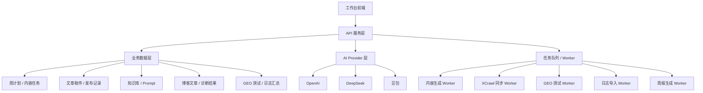
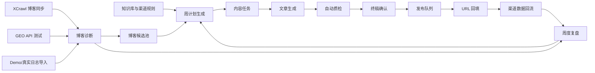

# JOTO GTM 内容工作台开发计划说明

## 1. 文档定位

本文件基于以下三份文档编写：

1. `D:\GTM\工作台\MVP-PRD1.md`
2. `D:\GTM\工作台\PRD2.md`
3. `D:\GTM\工作台\design\low-fi-prototype.md`

它不是新的 PRD，也不是代码设计文档，而是开发前的技术审查、选型清单、阶段拆分和验收标准说明。

本文件要回答四个问题：

1. 当前方案从工程角度有哪些关键风险和约束。
2. MVP 应该选择什么技术路径，为什么。
3. 开发应分几个阶段，每个阶段交付什么。
4. 每个阶段如何验收，避免做成一个“看起来有页面但跑不通流程”的系统。

## 2. 总体开发结论

MVP 不建议直接在原 GEOFlow 的 PHP 前端上继续堆页面。更合理的开发路径是：

> 保留和迁移 GEOFlow / GEO SEO / XCrawl 中已经存在的数据、知识库、脚本和业务机制；重做一个更轻、更流畅的工作台前端；后端优先做 API 化和任务编排，避免把内容生产流程继续绑定在重页面里。

推荐总体架构：

```text
前端工作台
-> API 服务层
-> 内容任务与发布台账
-> AI / Prompt / 知识库配置
-> 自动化任务 Worker
-> XCrawl / GEOFlow / GEO SEO 资产迁移
```

MVP 的核心不是“把所有模块都做完整”，而是先跑通主链路：

```text
周计划
-> 今日任务
-> 批量生成
-> 自动质检
-> 终稿确认
-> 发布队列
-> URL 回填
-> 官网博客诊断
-> GEO API 测试
-> 周度复盘
```

## 3. 技术审查

### 3.1 当前可复用资产审查

| 来源 | 可复用内容 | 建议处理 |
|---|---|---|
| GEOFlow | AI 配置、API 配置、知识库机制、任务模型、多渠道变体、TrafficClassifier | 保留机制，重做工作台前端；优先 API 化 |
| GEOFlow 数据库模型 | Article、Task、KnowledgeBase、Prompt、ExternalArticleVariant、ExternalChannelMetric 等 | 作为数据建模参考，不建议原样全量搬迁 |
| GEO SEO | 渠道规则、文章选题库、文章生产库、渠道检查脚本 | 迁移为工作台的规则库、历史库和质检逻辑 |
| XCrawl | 官网博客抓取、内容采集、Review、Citation Monitor 脚本 | 迁移为后台 Worker 或命令任务 |
| GEO Citation Monitor | Prompt 测试模板、AI 引用监控思路 | 改造成三平台 GEO API 测试模块 |
| 原信源站 | 内容资产 | 只作为知识库参考，不作为工作台模块 |
| 竞品知识库 | 竞品内容、对比资料 | 迁移为参考知识库，只在对比/差异化任务中调用 |

### 3.2 当前方案的关键风险

| 风险 | 说明 | 工程应对 |
|---|---|---|
| 1. 前端继续变重 | 原 GEOFlow PHP 页面用户体验不流畅，继续扩展会拖慢使用效率 | 新工作台前端独立建设，后端能力 API 化 |
| 2. 数据源真假混用 | AI Bot 指标 MVP 阶段可能来自 Demo CSV，容易被误读 | 所有指标必须带 `data_confidence` |
| 3. 知识库污染 | 竞品知识库、信源站资产、历史文章混入事实源会影响生成质量 | 知识库分级，生成时按场景限制调用 |
| 4. 生成任务阻塞页面 | 批量生成、GEO 测试、博客诊断都可能耗时 | 用异步任务队列和任务状态轮询 |
| 5. 过早做全自动发布 | 渠道接口复杂且风控不稳定 | MVP 只做发布队列、导出和 URL 回填 |
| 6. 过早做完整权限 | 内部工具一开始做复杂权限会拖慢交付 | 先做轻角色或预留角色字段 |
| 7. 周报只有数据没有判断 | 复盘如果只列指标，不能反哺下周选题 | 周报必须输出“继续写/减少写/补强写”的建议 |

### 3.3 必须坚持的工程边界

| 边界 | 说明 |
|---|---|
| 1. 不做博客创作主流程 | 只保留博客候选池和待接入入口 |
| 2. 不做原信源站模块 | 只迁移内容资产 |
| 3. 不做全渠道自动发布 | 只做发布队列、导出、URL 回填 |
| 4. 不做复杂 BI | 指标只服务任务执行和策略复盘 |
| 5. 不做多产品矩阵 | MVP 只支持 JOTO 官方品牌和唯客 AI 护栏 |
| 6. 不把 Demo 日志当真实数据 | AI Bot Demo 只用于演示流程 |

## 4. 技术选型清单

### 4.1 前端选型

| 选项 | 优点 | 风险 | 结论 |
|---|---|---|---|
| 继续使用 GEOFlow PHP 页面 | 复用原项目快 | 用户体验已被验证不够流畅，后续扩展重 | 不推荐 |
| React / Next.js 工作台 | 页面体验好，适合任务看板和表格工作台，生态成熟 | 需要独立前端工程 | 推荐 |
| Vue / Nuxt 工作台 | 国内团队熟悉度高，开发效率高 | 与现有 Next.js 资产关联弱一些 | 可选 |
| 低代码/管理后台框架 | 开发快 | 后续交互和 AI 任务流可能受限 | 不作为首选 |

推荐：

```text
React / Next.js + 成熟后台组件库
```

原因：

1. 官网博客站点已经呈现 Next.js 特征，团队后续可能更容易统一前端经验。
2. 工作台需要大量表格、状态、表单、抽屉详情、任务流，React 生态成熟。
3. 可以把 GEOFlow 的后端能力和 XCrawl 脚本封装为 API/Worker，前端保持轻。

组件库建议：

| 选项 | 适用情况 | 建议 |
|---|---|---|
| Ant Design | 内部后台、表格、筛选、表单、抽屉密集 | 推荐 |
| shadcn/ui | 更轻、更可定制、更现代 | 适合后续精细设计 |
| 自研组件 | 视觉统一度高 | MVP 不推荐 |

MVP 推荐：

```text
Ant Design 优先，保证表格、表单、筛选、抽屉、上传、导出快速可用。
```

### 4.2 后端选型

| 选项 | 优点 | 风险 | 结论 |
|---|---|---|---|
| 继续使用 Laravel / GEOFlow 后端 | 可复用已有模型、迁移和业务逻辑 | 如果继续用 PHP 渲染前端会变重 | 可作为 API 后端复用 |
| Node.js API 服务 | 与 XCrawl 脚本和内容生成任务天然接近 | 需要迁移/重建部分 GEOFlow 模型 | 推荐作为新工作台主服务 |
| Next.js API Routes 全栈 | 前后端一体，MVP 快 | 批量任务、Worker、长任务管理需要额外设计 | 可用于早期 |
| Python 后端 | AI/RAG/数据处理生态强 | 当前项目主要脚本在 Node 与 PHP | 暂不首选 |

推荐路径：

```text
短期：Next.js / Node API + Worker 脚本
中期：根据复杂度拆出独立 API 服务和任务队列
```

原因：

1. 当前 XCrawl 自动化脚本是 Node 生态，内容抓取、生成、诊断更容易复用。
2. 工作台 MVP 需要的不是复杂业务事务，而是任务编排、文件导入、AI API 调用、状态流转。
3. GEOFlow 中可复用的更像“模型和机制”，不一定要复用 PHP 页面。

### 4.3 数据库选型

| 选项 | 优点 | 风险 | 结论 |
|---|---|---|---|
| SQLite | 本地 MVP 快速，维护简单 | 多人协作和线上部署能力有限 | 适合原型，不适合正式 MVP |
| MySQL | 与 Laravel/GEOFlow 生态兼容，稳定 | JSON/搜索能力一般 | 推荐 |
| PostgreSQL | JSON、全文搜索、扩展能力强 | 若团队不熟悉会增加维护成本 | 可选 |

推荐：

```text
MySQL 优先。
```

原因：

1. GEOFlow 大概率已有关系型数据库和 Laravel 迁移基础。
2. 工作台核心是任务、文章、发布记录、测试结果，关系型数据更适合。
3. 后续如果需要向量检索，再单独引入向量库或搜索服务，不要在 MVP 一开始复杂化。

### 4.4 AI 与任务执行选型

| 模块 | 推荐方案 |
|---|---|
| AI Provider | OpenAI / DeepSeek / 豆包统一 Provider 抽象 |
| GEO 测试 | 三平台 API 自动测试 + 人工修正兜底 |
| 内容生成 | 异步任务，保存 Prompt、知识库来源和生成快照 |
| 批量任务 | Worker 队列，不阻塞页面 |
| 任务状态 | pending / running / success / failed / cancelled |
| 错误处理 | 保存错误信息，允许重试 |

### 4.5 文件与导入导出

| 能力 | 推荐 |
|---|---|
| Demo 日志导入 | CSV 优先 |
| 渠道数据导入 | CSV/Excel 均可，MVP CSV 优先 |
| 发布清单导出 | CSV/Excel，按平台导出 |
| 周报导出 | Markdown 优先，后续支持 PDF/Word |

### 4.6 不建议 MVP 引入的技术

| 技术/能力 | 不建议原因 |
|---|---|
| 完整 RAG 向量库 | 知识库规模和召回需求尚未验证 |
| 完整权限系统 | 内部 MVP 不需要 |
| 全渠道自动发布 | 平台接口和风控不稳定 |
| 实时数据流 | 当前不是实时监控系统 |
| 复杂 BI 图表引擎 | MVP 重点是执行和诊断，不是大屏 |
| 微服务架构 | 当前模块规模不足以支撑微服务成本 |

## 5. 推荐系统架构

### 5.1 逻辑架构



### 5.2 数据流



### 5.3 页面与 API 对应

| 页面 | 核心 API |
|---|---|
| 首页 | `GET /dashboard/summary` |
| 周计划 | `POST /weekly-plans/generate`、`PATCH /weekly-plans/{id}` |
| 今日任务 | `POST /content-tasks/batch-generate`、`POST /content-tasks/{id}/generate` |
| 终稿确认 | `PATCH /article-drafts/{id}`、`POST /article-drafts/{id}/approve` |
| 发布队列 | `POST /publish-records`、`PATCH /publish-records/{id}/url`、`POST /publish-records/export` |
| 官网博客监控 | `POST /blog-articles/sync`、`POST /blog-articles/{id}/diagnose` |
| GEO 测试 | `POST /geo-tests/run`、`PATCH /geo-test-results/{id}/override` |
| 日志导入 | `POST /log-imports`、`GET /bot-visit-summary` |
| 周度复盘 | `GET /weekly-reports/{week}` |

## 6. 开发阶段拆分

### 6.1 阶段总览

| 阶段 | 名称 | 目标 | 建议优先级 |
|---|---|---|---|
| Phase 0 | 开发准备与资产审计 | 明确数据源、迁移范围、配置方式 | 必做 |
| Phase 1 | 基础框架与数据底座 | 搭好项目、数据模型、API 基础 | 必做 |
| Phase 2 | 周计划与任务流 | 跑通“本周写什么、今天写什么” | 必做 |
| Phase 3 | 内容生成与质检 | 跑通批量生成、质检、终稿确认 | 必做 |
| Phase 4 | 发布队列与回填 | 跑通人工发布辅助和 URL 台账 | 必做 |
| Phase 5 | 官网博客监控与 GEO 测试 | 跑通博客同步、诊断、三平台 API 测试 | 必做 |
| Phase 6 | 周度复盘与选题反哺 | 形成下周建议和博客候选池 | 必做 |
| Phase 7 | 打磨、验收、试运行 | 处理体验、异常、数据可信度 | 必做 |
| Phase 8 | 后续增强 | 真实日志、博客创作、自动发布、多产品 | 后置 |

## 7. Phase 0：开发准备与资产审计

### 7.1 目标

在正式开发前确认哪些东西可以直接迁移，哪些需要清洗，哪些只能做占位。

### 7.2 工作内容

1. 确认首批渠道规则：公众号、CSDN、掘金、知乎/头条通用稿。
2. 梳理 GEOFlow 知识库：
   - 品牌事实库
   - 唯客产品知识库
   - 官网博客知识库
   - 竞品知识库
3. 梳理 GEO SEO 规则、选题库、文章生产库。
4. 梳理 XCrawl 可复用脚本。
5. 明确三平台 API 配置项：
   - OpenAI / ChatGPT
   - DeepSeek
   - 豆包
6. 准备 Demo 日志 CSV 样例。
7. 明确开发环境、数据库、密钥配置方式。

### 7.3 验收标准

| 验收项 | 标准 |
|---|---|
| 资产清单 | 有一份可迁移资产清单，标明迁移/清洗/后置 |
| 知识库分级 | 明确哪些是事实源，哪些是参考源 |
| API 配置项 | 明确 provider、model、base_url、key 的配置方式 |
| Demo CSV | 有可用于演示 AI Bot 指标的 CSV 样例 |
| 开发边界 | 明确不做博客创作、不做自动发布、不做信源站模块 |

## 8. Phase 1：基础框架与数据底座

### 8.1 目标

搭建工作台基础工程，完成核心数据对象、状态流转和基础 API。

### 8.2 工作内容

1. 初始化前端工作台工程。
2. 建立左侧导航和基础布局。
3. 建立核心数据模型：
   - `workspace_setting`
   - `knowledge_base`
   - `weekly_plan`
   - `content_task`
   - `article_draft`
   - `publish_record`
   - `blog_article`
   - `blog_diagnosis`
   - `geo_test_result`
   - `log_import_batch`
   - `bot_visit_summary`
4. 建立基础 API 路由。
5. 建立任务状态机制。
6. 建立 `data_confidence` 数据可信度字段。

### 8.3 验收标准

| 验收项 | 标准 |
|---|---|
| 页面框架 | 左侧导航和主要页面入口可访问 |
| 数据模型 | 核心对象能创建、查询、更新 |
| 状态流转 | 内容任务支持 planned、generated、approved、queued、published、url_filled 等状态 |
| 数据可信度 | Demo、导入、真实、待接入四类标签在数据层可保存 |
| API 可用性 | 首页概览、周计划、任务、发布队列至少有基础接口 |

## 9. Phase 2：周计划与任务流

### 9.1 目标

跑通从工作台设置到周计划，再到每日任务的流程。

### 9.2 工作内容

1. 开发工作台首页基础概览。
2. 开发周计划页面。
3. 支持设置：
   - 每周发布天数
   - 每日篇数
   - 启用渠道
   - 内容对象
   - 终稿模式
4. 支持生成一周任务草稿。
5. 支持编辑标题、渠道、日期、类型、关键词。
6. 支持批量确认、局部重生成、删除。
7. 支持确认周计划后进入每日任务。

### 9.3 验收标准

| 验收项 | 标准 |
|---|---|
| 周计划生成 | 能按设置生成一周任务 |
| 手动调整 | 能修改每天篇数、渠道、标题、日期 |
| 任务确认 | 未确认任务不进入正式生成队列 |
| 渠道范围 | 渠道仅限公众号、CSDN、掘金、知乎/头条通用稿 |
| 知识库范围 | 任务能记录允许调用的知识库范围 |
| 博客创作限制 | 周计划不生成博客创作任务 |

## 10. Phase 3：内容生成与自动质检

### 10.1 目标

跑通今日任务批量生成、自动质检、终稿确认和重新生成。

### 10.2 工作内容

1. 开发今日任务页。
2. 支持单篇生成和批量生成。
3. 接入 AI Provider 抽象。
4. 接入渠道 Prompt：
   - 公众号
   - CSDN
   - 掘金
   - 知乎/头条通用稿
5. 生成文章时保存：
   - Prompt 版本
   - 调用知识库
   - 生成时间
   - 生成模型
6. 建立自动质检：
   - 事实冲突
   - 敏感夸大
   - 品牌词缺失
   - 官网链接缺失
   - 标题重复
   - 渠道格式
   - 竞品混淆
7. 支持默认终稿和人工确认终稿。

### 10.3 验收标准

| 验收项 | 标准 |
|---|---|
| 批量生成 | 今日任务可批量生成稿件 |
| 知识库调用 | 稿件记录实际使用的知识库 |
| 渠道适配 | 不同渠道生成结构和语气不同 |
| 质检结果 | 质检结果区分阻断项和警告项 |
| 阻断规则 | 阻断项未解决不能进入发布队列 |
| 竞品限制 | 普通品牌文章默认不调用竞品知识库 |
| 重新生成 | 质检失败或人工不满意时可重新生成 |

## 11. Phase 4：发布队列与 URL 回填

### 11.1 目标

跑通从终稿到发布队列，再到人工发布和 URL 回填的流程。

### 11.2 工作内容

1. 开发发布队列页。
2. 支持状态：
   - 待发布
   - 已发布
   - 待回填
   - 已回填
   - 失败
3. 支持标记已发布。
4. 支持 URL 回填。
5. 支持按平台导出发布清单。
6. 支持发布记录与文章稿件关联。
7. 支持基础渠道数据人工回填。

### 11.3 验收标准

| 验收项 | 标准 |
|---|---|
| 入队 | 已确认终稿可以进入发布队列 |
| 发布状态 | 能从待发布流转到已发布、已回填 |
| URL 回填 | 已发布内容能补充 URL 和发布时间 |
| 导出 | 能按平台导出发布清单 |
| 台账 | 每篇文章能追踪任务、稿件、发布 URL |
| 自动发布限制 | 系统不调用外部平台自动发布 |

## 12. Phase 5：官网博客监控与 GEO 测试

### 12.1 目标

跑通官网博客同步、SEO 诊断、GEO API 测试和 Demo 日志指标展示。

### 12.2 工作内容

1. 接入 XCrawl 官网博客同步。
2. 建立博客文章列表。
3. 建立 SEO 诊断：
   - 标题
   - 摘要
   - canonical
   - 内链
   - 外链
   - 内容重复
4. 接入 DeepSeek、豆包、ChatGPT API 测试。
5. 保存 GEO 测试回答快照。
6. 自动解析：
   - 是否提及 JOTO
   - 是否提及唯客
   - 是否引用官网
   - 是否推荐竞品
7. 支持人工修正判断。
8. 支持 Demo CSV 日志导入。
9. 展示 AI Bot PV、bot breakdown、top paths、top articles，并标记 Demo。

### 12.3 验收标准

| 验收项 | 标准 |
|---|---|
| 博客同步 | 能同步官网博客列表和正文基础信息 |
| SEO 诊断 | 能为博客生成基础 SEO 问题 |
| GEO API | 三个平台都能发起测试并保存结果 |
| 回答快照 | 每次测试保留原始回答 |
| 自动解析 | 系统能初步判断提及和引用 |
| 人工修正 | 用户可修正判断，不覆盖原始回答 |
| Demo 日志 | 能导入 Demo CSV 并展示 AI Bot 指标 |
| 可信标识 | AI Bot 指标必须显示 Demo/导入/真实 |

## 13. Phase 6：周度复盘与选题反哺

### 13.1 目标

将渠道表现、博客诊断、GEO 测试结果汇总为下周选题建议。

### 13.2 工作内容

1. 开发周度复盘页。
2. 汇总本周发布：
   - 计划数
   - 已生成
   - 已确认
   - 已发布
   - 已回填
3. 汇总渠道表现。
4. 汇总博客诊断。
5. 汇总 GEO 测试。
6. 生成下周建议：
   - 继续写
   - 减少写
   - 补强写
   - 进入博客候选池
7. 支持导出周报。
8. 支持生成下周计划草稿。

### 13.3 验收标准

| 验收项 | 标准 |
|---|---|
| 周报生成 | 能生成管理层摘要和运营执行明细 |
| 渠道复盘 | 能看到各渠道发布和表现 |
| 博客诊断 | 能看到 SEO/GEO 问题汇总 |
| GEO 复盘 | 能看到各平台提及和引用情况 |
| 下周建议 | 能输出具体选题方向 |
| 候选池 | 可将建议主题加入博客候选池 |
| 导出 | 支持导出 Markdown 周报 |

## 14. Phase 7：打磨、验收与试运行

### 14.1 目标

让 MVP 从“功能可用”进入“真实可试运行”。

### 14.2 工作内容

1. 统一页面空状态、加载态、失败态。
2. 完成主要异常处理：
   - AI API 调用失败
   - 生成任务超时
   - CSV 导入失败
   - URL 格式错误
   - 知识库为空
3. 完成关键操作确认：
   - 删除任务
   - 批量生成
   - 加入发布队列
   - 覆盖终稿
4. 完成数据可信度提示。
5. 完成试运行样例：
   - 生成 1 周计划
   - 生成 1 天文章
   - 回填 1 批 URL
   - 跑 1 次 GEO 测试
   - 生成 1 份周报

### 14.3 验收标准

| 验收项 | 标准 |
|---|---|
| 主流程试跑 | 能完整跑完一周计划到周报的最小闭环 |
| 错误可恢复 | 生成失败、导入失败、API 失败可重试 |
| 数据不误导 | Demo 数据、导入数据、真实数据明确区分 |
| 页面效率 | 核心操作不超过 3 层跳转 |
| 文档 | 有使用说明和开发说明 |
| 可演示 | 可以对外展示 MVP 价值，但清楚标注临时数据 |

## 15. Phase 8：后续增强方向

这些能力不进入 MVP 主交付，但应预留接口：

| 能力 | 接入时机 |
|---|---|
| 真实 Nginx/CDN 日志接入 | 拿到服务器或 CDN 日志后 |
| 博客创作任务模块 | 团队开始承担博客创作后 |
| 自动发布 | 某个渠道接口稳定且发布规则明确后 |
| 多产品管理 | 唯客流程跑通后 |
| 更完整权限 | 多人协作规模扩大后 |
| 向量检索 / RAG | 知识库规模明显扩大且普通检索不够后 |
| 销售线索联动 | 内容与咨询/线索数据可以打通后 |

## 16. 阶段验收总表

| 阶段 | 必须通过的验收 |
|---|---|
| Phase 0 | 资产清单、知识库分级、API 配置项、Demo CSV 样例完成 |
| Phase 1 | 工作台基础框架、核心数据模型、状态和 API 可用 |
| Phase 2 | 周计划可生成、编辑、确认，并生成每日任务 |
| Phase 3 | 今日任务可批量生成文章，质检通过后进入终稿确认 |
| Phase 4 | 发布队列可用，支持导出、标记发布、URL 回填 |
| Phase 5 | 博客同步、SEO 诊断、GEO API 测试、Demo 日志展示可用 |
| Phase 6 | 周报能输出执行复盘、博客诊断和下周建议 |
| Phase 7 | 完整主流程可试运行，异常可恢复，数据可信度明确 |

## 17. 最小可演示版本定义

如果需要压缩开发范围，最小可演示版本只保留以下能力：

1. 工作台首页。
2. 周计划生成。
3. 今日任务批量生成。
4. 自动质检。
5. 发布队列与 URL 回填。
6. 官网博客同步。
7. GEO API 测试。
8. Demo AI Bot 指标。
9. 周度复盘。

不进入最小演示版本：

1. 真实访问日志接入。
2. 博客创作。
3. 自动发布。
4. 多产品管理。
5. 完整权限。
6. 复杂 BI。

## 18. 开发前最终检查清单

| 检查项 | 是否必须 | 说明 |
|---|---|---|
| API Key 配置方式 | 必须 | 密钥不能写入代码和文档 |
| 知识库迁移范围 | 必须 | 尤其是竞品知识库调用限制 |
| 渠道规则文件 | 必须 | 公众号、CSDN、掘金、知乎/头条通用稿 |
| Demo 日志 CSV | 必须 | 用于 AI Bot 指标演示 |
| 官网博客同步方式 | 必须 | XCrawl 或官网 API |
| Prompt 模板 | 必须 | 内容生成和 GEO 测试 |
| 低保真原型确认 | 必须 | 避免开发中反复改页面结构 |
| 周报样式 | 建议 | 默认管理层摘要 + 运营明细 |
| 真实日志来源 | 后置 | 暂时保留接口即可 |

## 19. 总结

这个工作台的开发重点不是一次性做一个完整营销平台，而是先把 JOTO 当前真实的内容工作变成可运行的系统。

工程上要坚持三点：

1. 前端重做，保证工作台操作流畅。
2. 后端复用已有资产，但通过 API 和 Worker 重组，不照搬旧页面。
3. 数据必须分清真实、导入、Demo 和待接入，避免 MVP 演示数据误导策略判断。

只要 Phase 1 到 Phase 7 跑通，工作台就能支持当前最核心的业务闭环：系统自动规划和生成渠道内容，人工确认并发布，官网博客被持续监控和诊断，GEO 测试结果进入复盘，最后反哺下一周选题。

