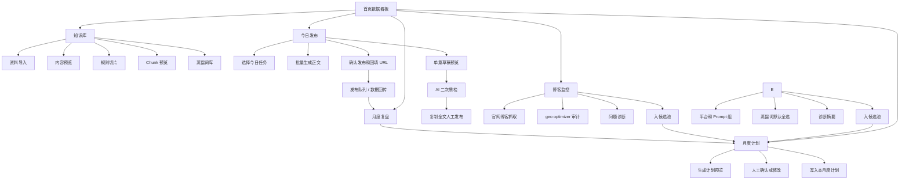
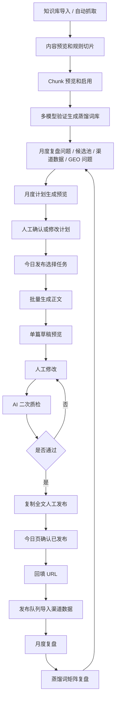
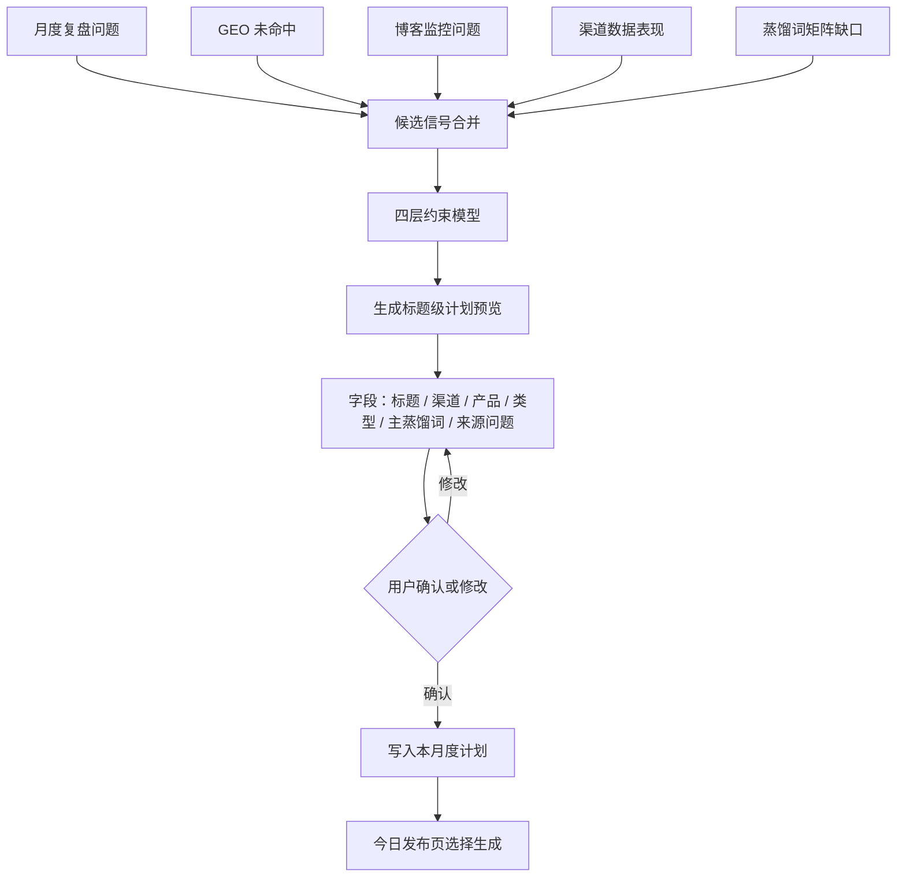
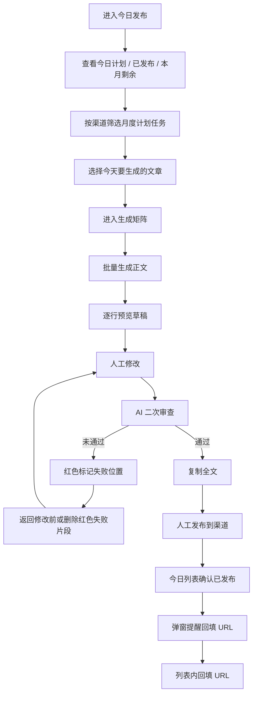
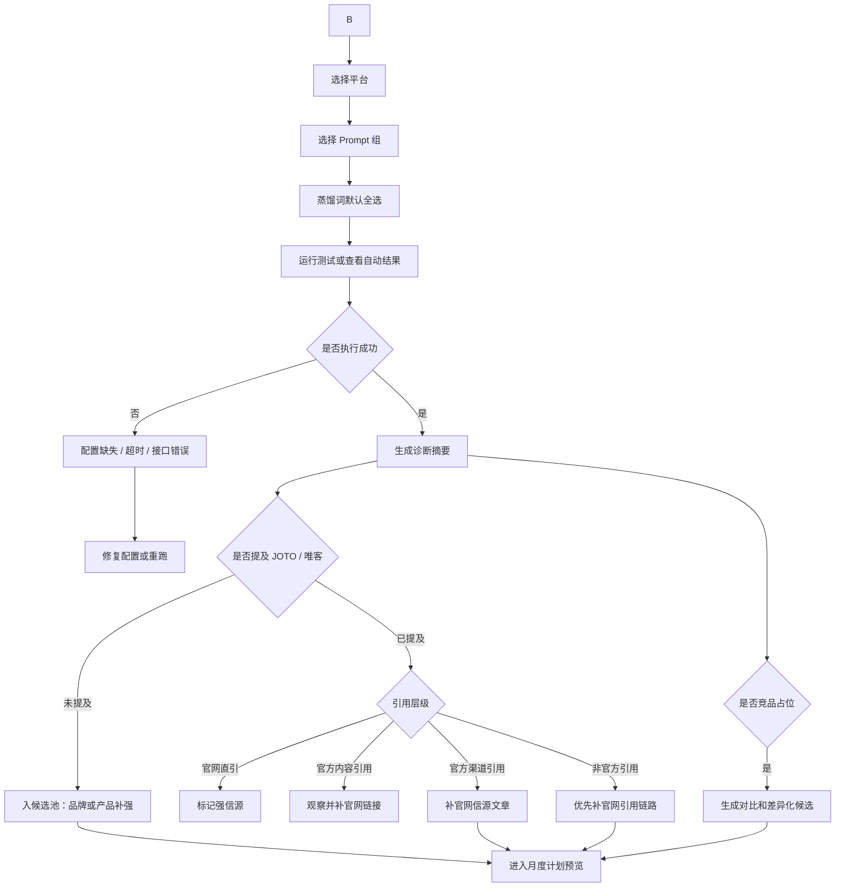

# PRD-V3: JOTO 内容增长工作台改造

## 1. 文档定位

本文档是当前工作台进入 V3 改造前的产品需求文档，承接以下已确认文档与讨论结论：

1. `content-growth-system-v2-rules.md`
2. `content-growth-system-v2-clarifications.md`
3. `geo-distilled-terms-refactor.md`

本 PRD 的目标不是再做一个单点功能，而是把工作台从“能生成和管理内容的工具”升级为“长期运营的内容增长系统”。

核心业务目标：

1. 让每篇内容同时服务人类阅读、渠道传播、GEO 认知节点建设和官网信源建设。
3. 让用户每天看到的是明确任务，每月看到的是增长复盘，每月看到的是认知资产沉淀。

## 2. 总体结论

V3 的改造方向可以概括为一句话：

> 工作台前台按业务流程拆清楚，系统后台按统一规则串起来。

用户侧不需要看到复杂的“可信等级”“调用范围”“向量检索”等技术概念。用户只需要完成几类动作：

1. 导入资料。
2. 确认月度计划。
3. 批量生成今日文章。
4. 单篇预览、修改、质检。
5. 人工发布并回填 URL。
6. 导入渠道数据。
7. 查看博客监控、GEO 诊断、月度复盘。

系统侧需要承担复杂性：

1. 自动判断知识库类型和使用场景。
2. 自动选择生成所需的知识片段。
3. 自动把蒸馏词、品牌词、产品词、官网链接目标放入生成规则。
4. 自动把 GEO、博客监控、渠道数据转成候选主题和月度计划信号。
5. 自动做 AI 二次质检，不通过则不允许复制发布。

## 3. 用户与业务场景

### 3.1 目标用户

主要用户是 JOTO 内容运营者和增长负责人。这个人不应该每天在不同表格、不同模型、不同渠道后台之间来回拼接信息。工作台要把信息组织成可执行任务。

### 3.2 核心使用场景

| 场景 | 用户目标 | 工作台应承担的工作 |
|---|---|---|
| 周初规划 | 确认本月要写什么 | 根据月度复盘问题、GEO 缺口、渠道数据、蒸馏词矩阵自动生成计划预览 |
| 日常生产 | 今天要发哪些内容 | 从已确认月度计划中选择任务，批量生成正文 |
| 单篇修改 | 确保文章能发布 | 支持人工修改、标记修改位置、AI 二次质检 |
| 发布闭环 | 记录真实发布 URL | 今日发布页确认发布并回填 URL |
| 数据回传 | 让渠道数据进入复盘 | 发布队列只负责导入渠道数据和匹配已发布内容 |
| 官网监控 | 判断官网博客是否适合被 AI 引用 | 博客监控页优先展示诊断、风险和动作，再展示列表 |
| 长期沉淀 | 建立 AI 认知节点权重 | 蒸馏词矩阵复盘、多模型验证、内容矩阵补强 |

## 4. 当前工作台问题详细梳理

### 4.1 首页

当前问题：

1. 已经有任务队列和指标卡，但更像“待办入口集合”，不是完整经营看板。
2. 没有清晰展示本月从计划到生成、发布、回填、数据回传的进度。
3. 工作台整体流程结构没有在首页形成可视化认知。
4. 用户进入首页后，不能一眼判断今天最重要的业务阻塞是什么。

V3 方向：

1. 首页改为数据看板。
2. 顶部展示本月开始到今日的核心进度：
   - 计划数量
   - 已生成数量
   - 已发布数量
   - 待回填 URL 数量
   - 待数据回传数量
3. 中部展示工作台流程图。
4. 底部展示跨页面优先待办，按风险排序，不按页面分散排序。

### 4.2 知识库页

当前问题：

1. 知识库更像静态 CRUD 和列表管理。
2. 91 条不同名称的知识库来源不够透明，用户不知道每个库从哪里来。
3. 用户可见可信等级没有必要，反而增加理解成本。
4. 缺少统一导入流程：URL、Markdown、Docx、手动文本、自动抓取应进入同一个导入管道。
5. 缺少内容预览、规则切片和 Chunk 预览。
6. 自动抓取站点更新知识库还没有和导入链路自然衔接。

V3 方向：

1. 删除用户可见可信等级，底层保留内部判断字段。
2. 知识库类型固定为：
   - 品牌事实
   - 产品资料
   - 官网博客
   - 渠道历史
   - 竞品参考
   - 用户自定义
3. 导入链路统一为：
   - 选择导入方式
   - 解析内容
   - 内容预览
   - 规则切片
   - Chunk 预览
   - 设置知识库名称和类型
   - 导入并启用
4. 自动抓取配置放在知识库资料更新区域，不放在内容生成页。
5. 自动抓取应支持：
   - 按周
   - 周几
   - 几点
   - 上一次抓取时间
   - 下一次抓取时间
   - 立即手动抓取
   - 启用 / 停用

### 4.3 月度计划页

当前问题：

1. 月度计划仍然带有“进入今日任务生成队列”“覆盖草稿和发布队列”等旧逻辑。
2. 月度计划和正文生成边界不够清楚。
3. 月度计划生成规则如果只按优先级排序，会把产品推广和品牌长期表达放到后面，这是错误的。
4. 月度计划预览字段应轻量，但当前状态字段和后续发布状态过多。

V3 方向：

1. 月度计划只做标题级计划预览，不生成正文，不展示草稿结构。
2. 月度计划预览字段只保留：
   - 标题
   - 渠道
   - 产品
   - 类型
   - 主蒸馏词
   - 来源问题
3. 支持用户修改本月度计划生成篇数。
4. 一键生成月度计划后先进入计划预览。
5. 用户确认或修改后，计划才进入本月可执行池。
6. 正文生成全部移到今日发布页。

### 4.4 今日发布页

当前问题：

1. 当前页面支持批量生成，也支持单篇生成，这会和“统一从今日任务批量生成正文”的目标冲突。
2. 今日页面还带有“进入发布队列”的旧心智。
3. 缺少顶部“今日计划、今日已发布、本月剩余”的执行进度。
4. 用户需要先从月度计划选择今天要生成哪些文章，再批量生成，而不是默认所有任务都混在一个表格里。

V3 方向：

1. 顶部展示：
   - 今日计划发布几篇
   - 今日已发布几篇
   - 本月还剩几篇
2. 上半区从已确认月度计划中选择今天要生成的文章。
3. 下半区展示已选择的今日生成矩阵。
4. 正文生成只保留批量生成。
5. 每行生成完成后提供“预览草稿”入口。
6. 今日发布页负责：
   - 选择任务
   - 批量生成
   - 进入单篇草稿预览
   - 确认已发布
   - 弹窗提醒回填 URL
   - 列表内直接回填 URL

### 4.5 单篇草稿预览页

当前问题：

1. 当前页面更像“终稿确认页”，职责是保存、重新生成、加入发布队列。
2. 这和最新边界冲突：单篇页面不是生成页，也不是发布队列入口。
3. 当前未突出人工修改标记和 AI 二次审查规则。
4. “删除”动作必须明确是删除红色未通过审计的修改片段，不是放弃整篇文章。

V3 方向：

1. 单篇页面只负责：
   - 预览草稿
   - 人工修改
   - 标记人工修改
   - AI 二次审查
   - 通过后复制全文
2. 不提供单篇生成正文入口。
3. AI 二次审查未通过时：
   - 红色标出未通过位置
   - 提供“返回修改前”
   - 提供“删除”
4. “删除”仅删除红色未通过审计的人工修改片段或风险片段，不删除整篇文章。
5. 质检未通过时，复制全文按钮禁用，并显示明确提示。

### 4.6 发布队列页

当前问题：

1. 当前发布队列仍承担发布确认、URL 回填、指标录入等多种职责。
2. 这会和今日发布页职责冲突。
3. 用户会不清楚到底在哪个页面确认发布、在哪个页面回填 URL。

V3 方向：

1. 发布队列改名或定位为“数据回传”。
2. 只负责：
   - 导入渠道数据表
   - 匹配已发布 URL
   - 更新阅读、点赞、收藏、评论、分享等指标
   - 标记匹配失败项
   - 支撑月度复盘
3. 不再负责：
   - 正文处理
   - 发布确认
   - URL 回填


当前问题：

1. 当前结果以表格矩阵为主，用户无法一眼看到本次测试最严重的问题。
2. Prompt 组缺少前端展示和修改入口。
3. 蒸馏词未作为测试范围的稳定维度进入页面。
4. 官网引用判断过于二元，没有区分不同引用层级。
5. 缺少测试频率建议与自动化配置。

V3 方向：

2. 顶部先展示诊断摘要和风险指标，再展示结果明细。
3. 测试范围选择：
   - 用户选择平台
   - 用户选择 Prompt 组
   - 蒸馏词默认全选
4. Prompt 组放入抽屉，可查看、编辑、启用、停用。
5. 官网引用改为四层指标：
   - 官网直引
   - 官方内容引用
   - 官方渠道引用
   - 非官方引用
7. 额外触发：
   - 官网上新一批博客
   - 官网首页或产品页改版
   - 新蒸馏词矩阵上线
   - 重要活动周或发布周

### 4.8 博客监控页

当前问题：

1. 页面现在仍然较偏导入区和博客列表。
2. 诊断结果没有成为第一视觉中心。
3. 标题有时显示 URL，会让用户误以为这是文章标题。
4. 加入 geo optimizer skill 后，如果仍然先展示表格，信息会更难理解。

V3 方向：

1. 按“诊断页优先，表格页靠后”改造。
2. 顶部展示：
   - 监控文章数
   - 待处理问题
   - GEO 页面健康分
   - 引用准备不足
   - Chunk 准备度不足
   - AI Bot PV
3. 中部展示问题分布、优先处理问题、建议动作。
4. 表格放在靠后位置，作为明细。
5. 标题规则：
   - URL 放在详情里
   - 不增加副标题
   - 不显示“待解析标题”
   - 不提供多余的重新解析动作
   - 能解析就显示标题
   - 解析不了就留空
6. 加入 geo optimizer skill 后，重点检测：
   - AI crawler 可访问性
   - 页面结构可提取性
   - 引用准备度
   - 结论明确度
   - FAQ / How-to / Schema 完整度
   - Chunk 准备度

### 4.9 月度复盘页

当前问题：

1. 表格过重，用户不能一眼看到本月内容增长是否健康。
2. “生成下月计划草稿”直接出现在月度复盘页，会越过计划预览和人工确认。
3. 月度复盘需要更多图表和关键指标，而不是所有信息都平铺成表格。
4. 蒸馏词矩阵复盘还没有成为固定模块。

V3 方向：

1. 月度复盘页先展示本月核心指标和趋势，再展示问题。
2. “生成下月计划草稿”改为“进入月度计划生成预览”。
3. 下月计划统一在月度计划页生成、预览、确认。
4. 新增蒸馏词矩阵复盘：
   - 本月覆盖了哪些蒸馏词
   - 哪些蒸馏词内容类型不完整
   - 哪些蒸馏词 GEO 命中提升
   - 哪些蒸馏词仍被竞品占位
5. 新增可视化：
   - 发布完成漏斗
   - 渠道表现对比
   - GEO 命中趋势
   - 官网引用层级分布
   - 蒸馏词矩阵覆盖热力图

### 4.10 博客候选池

当前问题：

1. 候选池已经能承接 GEO 和博客监控信号，但还带有“MVP 不触发博客创作”的旧说明。
2. 候选池需要从“临时候选列表”升级为“问题信号中转站”。

V3 方向：

1. 候选池承接来源：
   - GEO 未命中
   - 官网引用不足
   - 博客监控问题
   - 渠道表现差但重要主题
   - 蒸馏词矩阵缺口
2. 候选池输出到月度计划预览，不直接生成正文。
3. 候选项必须保留来源问题和建议补强原因。

## 5. V3 产品范围

### 5.1 V3 必做范围

1. 首页数据看板改造。
2. 知识库标准化导入与 Chunk 预览设计。
3. 月度计划只做计划预览。
4. 今日发布承接正文批量生成、发布确认、URL 回填。
5. 单篇草稿预览页支持人工修改、AI 二次质检、复制全文。
6. 发布队列收敛为数据回传。
8. 博客监控改成诊断优先。
9. 月度复盘加入图表、蒸馏词矩阵复盘和跳转月度计划生成预览。
10. 五类 Prompt 和规则模板固定到对应流程。

### 5.2 V3 可选增强

1. 语义检索和向量化。
2. 自动 Chunk 推荐。
3. 更细的渠道历史风格学习。

说明：V3 的业务闭环不应强依赖向量化。先让无向量版本通过规则切片、Chunk 预览和结构化 Prompt 跑通，再接入语义检索更稳。

### 5.3 V3 不做范围

1. 不做全自动发布到外部平台。
2. 不做用户可见可信等级。
3. 不在内容生成页让用户选择知识库类型。
4. 不在单篇草稿页提供单篇生成正文。
5. 不在发布队列承担 URL 回填。
6. 不伪造 Nginx、CDN 或远程服务器真实日志。
7. 不假装知道模型内部到底先引用了哪个网页，只记录可观察引用结果。

## 6. 改造后信息架构



## 7. 全链路流程

### 7.1 内容增长闭环



### 7.2 月度计划生成链路



### 7.3 今日发布执行链路






## 8. 四层指标和四层约束

### 8.1 GEO 引用四层指标


| 层级 | 判断方式 | 业务意义 | 系统动作 |
|---|---|---|---|
| 官网直引 | 回答中明确出现 `jotoai.com` 或官网核心页面 URL | 最强官方信源，说明官网已进入可见引用链 | 标记强信源，进入趋势观察 |
| 官方内容引用 | 引用官网博客、官网栏目、官方产品页 | 说明官方内容被模型采纳，但可能不一定指向核心转化页 | 观察，并补充内部链接和产品页指向 |
| 官方渠道引用 | 引用公众号、知乎、掘金、CSDN 官方账号文章 | 有官方表达，但官网权重仍不足 | 生成官网信源补强任务 |
| 非官方引用 | 第三方文章、转载、总结页 | 品牌控制力弱，可能被错误信息影响 | 优先补官网内容和结构化事实 |

### 8.2 月度计划四层约束模型

月度计划不能按简单优先级生成，应使用四层约束共同约束。

| 层级 | 名称 | 必须满足什么 |
|---|---|---|
| 第一层 | 硬约束 | 品牌词、产品重点、官网链接目标、渠道节奏、发布数量 |
| 第二层 | 语义约束 | 主蒸馏词、来源问题、内容类型 |
| 第三层 | 优化约束 | 修复 GEO 未命中、官网引用不足、渠道表现差但重要的主题 |
| 第四层 | 风格约束 | 参考高表现文章的结构、钩子、表达，不复制旧主题 |

关键修正：

1. 产品推广重点和品牌长期表达重点是基础约束，不放在后面。
2. 渠道表现好的主题不能被机械延展。
3. 应用高表现文章的结构、钩子和风格，去修复表现差但重要的主题。

## 9. 五类 Prompt 与规则模板

以下模板不是临时提示词，而是 V3 后续应固定到流程中的规则资产。

### 9.1 模板 1：月度计划生成模板

使用位置：月度计划页，一键生成月度计划预览。

输入：

```text
业务背景：
- 品牌：JOTO
- 产品：JOTO / 唯客 / Dify 服务 / 其他产品
- 本月度计划篇数
- 渠道发布节奏

硬约束：
- 必须包含品牌词
- 必须包含产品推广重点
- 每篇必须有官网链接目标
- 不生成正文

语义约束：
- 候选蒸馏词列表
- 来源问题列表
- 内容类型范围：FAQ / 技术拆解 / 对比 / 案例 / 认知解释

优化约束：
- 上周 GEO 未命中问题
- 官网引用不足问题
- 渠道表现差但重要主题
- 蒸馏词矩阵缺口

风格约束：
- 各渠道风格规则
- 高表现文章结构参考
- 高表现文章钩子参考
```

生成规则：

1. 不输出正文。
2. 每条计划必须说明来源问题。
3. 每条计划必须绑定主蒸馏词。
4. 每条计划必须绑定产品。
5. 每条计划必须分配渠道。
6. 不允许只延展表现好主题，要优先补重要但薄弱的主题。
7. 标题应体现用户问题、蒸馏词和产品价值，不堆关键词。

输出结构：

```json
{
  "items": [
    {
      "title": "标题",
      "channel": "CSDN / 掘金 / 知乎 / 公众号",
      "product": "产品",
      "contentType": "内容类型",
      "primaryDistilledTerm": "主蒸馏词",
      "sourceProblem": "来源问题",
      "officialLinkTarget": "官网链接目标",
      "reason": "为什么本月要写这篇"
    }
  ]
}
```

### 9.2 模板 2：渠道标题模板

使用位置：月度计划生成和计划编辑。

输入：

```text
主题：
- 来源问题
- 主蒸馏词
- 产品
- 内容类型

渠道：
- CSDN / 掘金 / 知乎 / 公众号

渠道规则：
- CSDN：偏技术步骤、工程实践、问题解决
- 掘金：偏开发者视角、架构拆解、踩坑经验
- 知乎：偏问题回答、判断、对比、结论先行
- 公众号：偏观点、业务语境、案例和方法论
```

生成规则：

1. 同一主题跨渠道不能复制标题。
2. 标题必须让用户知道“解决什么问题”。
3. 标题自然包含产品或场景，不硬塞品牌。
4. 技术渠道标题更具体，观点渠道标题更有判断。
5. 不使用夸大承诺和绝对化表达。

输出结构：

```json
{
  "channel": "渠道",
  "title": "标题",
  "titleReason": "标题为什么适合该渠道",
  "riskNotes": ["可能风险"]
}
```

### 9.3 模板 3：证据选择模板

使用位置：今日发布批量生成正文前。

输入：

```text
任务：
- 标题
- 渠道
- 产品
- 主蒸馏词
- 来源问题
- 官网链接目标

可用知识库：
- 品牌事实 Chunk
- 产品资料 Chunk
- 官网博客 Chunk
- 渠道历史 Chunk
- 竞品参考 Chunk
```

选择规则：

1. 优先选择品牌事实、产品资料、官网博客。
2. 渠道历史只用于风格和表达参考，不作为事实依据。
3. 竞品参考必须标记为竞品参考，不能写成自家能力。
4. 每篇文章选择 2 到 4 段高相关 Chunk。
5. 必须推荐一个官网链接目标。
6. 如果没有足够证据，要给出缺口提示，而不是硬编。

输出结构：

```json
{
  "selectedChunks": [
    {
      "chunkId": "chunk-id",
      "sourceType": "品牌事实 / 产品资料 / 官网博客 / 渠道历史 / 竞品参考",
      "whySelected": "选择原因",
      "usage": "事实依据 / 官网引用 / 风格参考 / 竞品对比"
    }
  ],
  "officialLinkTarget": "URL",
  "missingEvidence": ["缺少的证据"]
}
```

### 9.4 模板 4：批量正文生成模板

使用位置：今日发布页批量生成正文。

输入：

```text
任务 Brief：
- 标题
- 渠道
- 产品
- 内容类型
- 主蒸馏词
- 来源问题
- 本文要优化的上一周问题

品牌和产品约束：
- 必须出现 JOTO 或对应品牌词
- 必须准确描述产品能力
- 不夸大产品效果
- 不把竞品资料写成自家能力

GEO 约束：
- 首段必须锚定主蒸馏词
- 正文必须解释认知逻辑
- 必须建立蒸馏词和 JOTO / 产品的关联
- 必须自然出现官网链接或官网事实目标

渠道约束：
- 渠道风格规则
- 字数范围
- 标题和小标题风格

证据：
- 已选择 Chunk
- 官网链接目标
```

生成规则：

1. 开头直接进入用户问题和主蒸馏词。
2. 不先堆产品介绍，先解释问题和认知逻辑。
3. 产品出现时必须和问题解决路径相关。
4. 官网链接必须自然出现，不能像硬广告。
5. 结构要利于 AI 提取，可用 H2/H3、列表、FAQ 或对比表。
6. 结尾回扣主蒸馏词、品牌和解决方案。
7. 渠道风格必须差异化。

输出结构：

```json
{
  "title": "标题",
  "summary": "摘要",
  "content": "正文",
  "usedChunks": ["chunk-id"],
  "officialLinkTarget": "URL",
  "generationNotes": {
    "primaryDistilledTerm": "主蒸馏词",
    "brandMention": true,
    "productMention": true,
    "officialCitation": true
  }
}
```

### 9.5 模板 5：AI 二次质检模板

使用位置：单篇草稿预览页，人工修改后。

输入：

```text
草稿正文：
- 原始 AI 草稿
- 当前人工修改后的正文
- 人工修改片段列表

任务规则：
- 标题
- 渠道
- 产品
- 主蒸馏词
- 来源问题
- 官网链接目标
- 已选证据 Chunk

审查规则：
- 蒸馏词是否命中
- 品牌词是否命中
- 产品推广重点是否准确
- 官网链接或官网事实是否存在
- 渠道风格是否匹配
- 是否夸大承诺
- 是否误用竞品资料
- 人工修改是否破坏事实
```

审查等级：

| 等级 | 含义 | 页面行为 |
|---|---|---|
| blocker | 阻断发布 | 禁用复制全文 |
| warning | 需要注意 | 允许继续，但显示提示 |
| passed | 通过 | 可复制全文 |

输出结构：

```json
{
  "passed": false,
  "summary": "质检结论",
  "issues": [
    {
      "severity": "blocker",
      "rule": "官网链接目标缺失",
      "location": "正文第 3 段",
      "failedText": "未通过片段",
      "suggestedAction": "补充官网事实或删除该风险表达",
      "allowedActions": ["返回修改前", "删除红色失败片段"]
    }
  ],
  "copyAllowed": false
}
```

关键交互规则：

1. 未通过时不允许复制全文。
2. 红色片段的“删除”只删除该失败片段，不删除整篇文章。
3. “返回修改前”只回滚人工修改片段。
4. 通过后才允许复制全文。

## 10. 页面低保真图纸

### 10.1 首页数据看板

```text
┌──────────────────────────────────────────────────────────────────────┐
│ 首页数据看板                                      [刷新数据] [去今日发布] │
│ 本月内容生产、官网监控、GEO 诊断和数据回传的总览。                       │
└──────────────────────────────────────────────────────────────────────┘

┌────────────┬────────────┬────────────┬────────────┬────────────┐
│ 本月度计划     │ 已生成       │ 已发布       │ 待回填 URL  │ 待数据回传   │
│ 24         │ 16         │ 11         │ 3          │ 8          │
└────────────┴────────────┴────────────┴────────────┴────────────┘

┌──────────────────────────────┬───────────────────────────────────────┐
│ 本月流程进度                  │ 今日优先动作                            │
│ 计划 -> 生成 -> 质检 -> 发布    │ [高] 3 篇已发布未回填 URL                │
│ ███████░░░ 70%               │ [高] GEO 官网引用不足 5 条                │
│                              │ [中] 博客引用准备度低 4 篇                │
└──────────────────────────────┴───────────────────────────────────────┘

┌──────────────────────────────────────────────────────────────────────┐
│ 工作台流程结构                                                         │
│ 知识库 -> 月度计划 -> 今日发布 -> URL 回填 -> 数据回传 -> 月度复盘 -> 下月计划 │
└──────────────────────────────────────────────────────────────────────┘
```

### 10.2 知识库导入与 Chunk 预览

```text
┌──────────────────────────────────────────────────────────────────────┐
│ 知识库                                               [自动抓取设置]      │
│ 导入资料、解析正文、规则切片，并沉淀为内容生成可调用的知识资产。           │
└──────────────────────────────────────────────────────────────────────┘

┌───────────────┬──────────────────────────────────────────────────────┐
│ 导入方式        │ [URL] [Markdown] [Docx] [手动文本] [批量文件]          │
├───────────────┼──────────────────────────────────────────────────────┤
│ 内容预览        │ 解析后的 Markdown 正文                                │
│               │ 标题、段落、表格、FAQ 保持结构                          │
├───────────────┼──────────────────────────────────────────────────────┤
│ 规则切片        │ [按标题] [按段落] [FAQ 一问一答] [表格保留]              │
├───────────────┼──────────────────────────────────────────────────────┤
│ Chunk 预览      │ Chunk 标题 | 来源 | token | 状态 | 启用/停用             │
├───────────────┼──────────────────────────────────────────────────────┤
│ 导入设置        │ 知识库名称 [________] 类型 [品牌事实 v] 状态 [启用]       │
└───────────────┴──────────────────────────────────────────────────────┘
```

### 10.3 月度计划页

```text
┌──────────────────────────────────────────────────────────────────────┐
│ 月度计划                                      本月篇数 [24] [生成计划预览] │
│ 只生成标题级计划，不生成正文。正文统一在今日发布页批量生成。              │
└──────────────────────────────────────────────────────────────────────┘

┌──────────────┬──────────────┬──────────────┬──────────────┐
│ 来源问题       │ 蒸馏词缺口      │ 渠道数据问题    │ GEO 问题       │
│ 8            │ 5            │ 6            │ 4            │
└──────────────┴──────────────┴──────────────┴──────────────┘

┌──────────────────────────────────────────────────────────────────────┐
│ 计划预览                                                               │
│ 标题 | 渠道 | 产品 | 类型 | 主蒸馏词 | 来源问题 | 状态 | 操作              │
│ ...                                                                  │
│ [批量确认] [返回重生成]                                                  │
└──────────────────────────────────────────────────────────────────────┘
```

### 10.4 今日发布页

```text
┌──────────────────────────────────────────────────────────────────────┐
│ 今日发布                                                 [批量生成正文] │
│ 从已确认月度计划中选择今天要生成的文章，生成后进入单篇草稿预览。             │
└──────────────────────────────────────────────────────────────────────┘

┌──────────────┬──────────────┬──────────────┐
│ 今日计划发布   │ 今日已发布     │ 本月还剩       │
│ 6            │ 3            │ 13           │
└──────────────┴──────────────┴──────────────┘

┌──────────────────────────────────────────────────────────────────────┐
│ 从月度计划选择今日生成                                                    │
│ [渠道筛选 v] [产品筛选 v] [内容类型 v]                                  │
│ □ 标题 A  CSDN  唯客  技术拆解  AI 输出安全                             │
│ □ 标题 B  知乎  JOTO  对比      Dify 企业交付                           │
│ [加入今日生成矩阵]                                                       │
└──────────────────────────────────────────────────────────────────────┘

┌──────────────────────────────────────────────────────────────────────┐
│ 今日生成矩阵                                                            │
│ 标题 | 产品 | 类型 | 状态 | URL | 操作                                   │
│ A   | 唯客 | 技术拆解 | 已生成 | 未回填 | [预览草稿] [确认已发布]          │
│ B   | JOTO | 对比     | 未生成 | 未回填 | [等待批量生成]                  │
└──────────────────────────────────────────────────────────────────────┘
```

### 10.5 单篇草稿预览页

```text
┌──────────────────────────────────────────────────────────────────────┐
│ 草稿预览：标题 A                                      [AI 二次审查]      │
│ 人工修改会被标记。AI 质检未通过时，不能复制全文发布。                     │
└──────────────────────────────────────────────────────────────────────┘

┌──────────────────────────────┬───────────────────────────────────────┐
│ 正文编辑区                    │ 规则审查                                │
│ 蓝色：AI 原文                  │ 主蒸馏词：通过                            │
│ 黄色：人工修改                  │ 品牌词：通过                              │
│ 红色：未通过片段                │ 官网链接：未通过                            │
│                              │ 渠道风格：警告                             │
└──────────────────────────────┴───────────────────────────────────────┘

┌──────────────────────────────────────────────────────────────────────┐
│ 未通过片段                                                             │
│ [红色片段文本]                                                          │
│ 原因：官网事实缺失或表达不准确                                            │
│ [返回修改前] [删除红色失败片段]                                           │
└──────────────────────────────────────────────────────────────────────┘

┌──────────────────────────────────────────────────────────────────────┐
│ [复制全文]  仅当 AI 二次审查通过后可用                                    │
└──────────────────────────────────────────────────────────────────────┘
```

### 10.6 发布队列 / 数据回传页

```text
┌──────────────────────────────────────────────────────────────────────┐
│ 数据回传                                      [导入渠道数据] [下载模板]   │
│ 这里不再确认发布和回填 URL，只负责把渠道数据匹配到已发布文章。              │
└──────────────────────────────────────────────────────────────────────┘

┌──────────────┬──────────────┬──────────────┬──────────────┐
│ 已发布文章     │ 已匹配数据     │ 匹配失败       │ 待导入渠道     │
│ 36           │ 24           │ 5            │ 7            │
└──────────────┴──────────────┴──────────────┴──────────────┘

┌──────────────────────────────────────────────────────────────────────┐
│ 渠道数据匹配结果                                                        │
│ 标题 | 渠道 | URL | 阅读 | 点赞 | 收藏 | 评论 | 匹配状态                  │
│ ...                                                                  │
└──────────────────────────────────────────────────────────────────────┘
```


```text
┌──────────────────────────────────────────────────────────────────────┐
│ 平台和 Prompt 组可选，蒸馏词默认全选。                                   │
└──────────────────────────────────────────────────────────────────────┘

┌──────────────┬──────────────┬──────────────┬──────────────┐
│ GEO 命中率     │ 官网直引率     │ 官方内容引用   │ 竞品占位       │
│ 42%          │ 18%          │ 31%          │ 7 条          │
└──────────────┴──────────────┴──────────────┴──────────────┘

┌──────────────────────────────┬───────────────────────────────────────┐
│ 测试范围                      │ Prompt 组抽屉                           │
│ 平台 [DeepSeek][Qwen][豆包]    │ [打开 Prompt 组]                         │
│ Prompt 组 [品牌认知 v]         │ 组名 / 问题列表 / 推荐蒸馏词 / 启用状态     │
│ 蒸馏词：默认全选                │ [保存修改] [停用]                         │
└──────────────────────────────┴───────────────────────────────────────┘

┌──────────────────────────────────────────────────────────────────────┐
│ 诊断摘要                                                               │
│ [高] 蒸馏词激活但未绑定 JOTO：建议生成绑定型内容                         │
│ [高] 官方渠道引用多于官网直引：建议补官网信源文章                         │
│ [中] Prompt 组覆盖不足：建议补对比类问题                                  │
└──────────────────────────────────────────────────────────────────────┘

┌──────────────────────────────────────────────────────────────────────┐
│ 结果明细                                                               │
│ 平台 | Prompt 组 | 蒸馏词 | 是否提及 | 引用层级 | 竞品 | 建议动作          │
└──────────────────────────────────────────────────────────────────────┘
```

### 10.8 博客监控页

```text
┌──────────────────────────────────────────────────────────────────────┐
│ 官网博客监控                                  [自动抓取设置] [手动抓取]   │
│ 先看诊断，再看列表。URL 放详情，标题能解析就显示，解析不了留空。             │
└──────────────────────────────────────────────────────────────────────┘

┌──────────────┬──────────────┬──────────────┬──────────────┬──────────────┐
│ 监控文章       │ 待处理问题     │ GEO健康分     │ 引用准备不足   │ Chunk不足     │
│ 48           │ 13           │ 72           │ 8            │ 6            │
└──────────────┴──────────────┴──────────────┴──────────────┴──────────────┘

┌──────────────────────────────┬───────────────────────────────────────┐
│ 问题分布                      │ 官网信源状态                             │
│ AI crawler 阻断 2              │ 可作为信源 18                             │
│ Schema 缺失 7                  │ 部分可用 21                               │
│ 引用准备度低 8                 │ 不建议引用 9                               │
└──────────────────────────────┴───────────────────────────────────────┘

┌──────────────────────────────────────────────────────────────────────┐
│ 优先处理问题                                                            │
│ [高] 引用准备度低：补明确结论、FAQ、官网事实              [入候选池]       │
│ [高] AI crawler 不可访问：检查 robots / CDN / 页面访问     [查看详情]     │
└──────────────────────────────────────────────────────────────────────┘

┌──────────────────────────────────────────────────────────────────────┐
│ 博客列表                                                               │
│ 标题 | GEO健康分 | 引用准备度 | Chunk准备度 | AI Bot | 动作               │
│ 企业级 AI 应用治理... | 82 | 可用 | 可切片 | 12 | 查看详情              │
│ 空标题保留为空          | 45 | 不足 | 不足   | 0  | 查看详情              │
└──────────────────────────────────────────────────────────────────────┘
```

### 10.9 月度复盘页

```text
┌──────────────────────────────────────────────────────────────────────┐
│ 月度复盘                                            [进入月度计划生成预览] │
│ 用本月数据解释问题，把信号带到下月计划，不在这里直接生成计划。              │
└──────────────────────────────────────────────────────────────────────┘

┌──────────────┬──────────────┬──────────────┬──────────────┐
│ 发布完成率     │ 数据回传率     │ GEO 命中率     │ 官网直引率     │
│ 78%          │ 61%          │ 42%          │ 18%          │
└──────────────┴──────────────┴──────────────┴──────────────┘

┌──────────────────────────────┬───────────────────────────────────────┐
│ 本月漏斗                      │ 渠道表现对比                            │
│ 计划 -> 生成 -> 发布 -> 回传    │ CSDN / 掘金 / 知乎 / 公众号               │
└──────────────────────────────┴───────────────────────────────────────┘

┌──────────────────────────────────────────────────────────────────────┐
│ 蒸馏词矩阵复盘                                                          │
│ 蒸馏词 | 内容覆盖 | 类型完整度 | GEO 提升 | 竞品占位 | 下月建议           │
└──────────────────────────────────────────────────────────────────────┘

┌──────────────────────────────────────────────────────────────────────┐
│ 下月计划信号                                                            │
│ 问题 | 来源 | 建议选题方向 | 命中蒸馏词 | 优化上周什么问题              │
└──────────────────────────────────────────────────────────────────────┘
```

## 11. 业务效果说明

| 节点 | 改造前 | 改造后 | 业务效果 |
|---|---|---|---|
| 知识库 | 静态资料列表 | 结构化导入、切片、预览、自动更新 | 内容生成有稳定事实来源 |
| 月度计划 | 任务生成和后续状态混杂 | 只做计划预览 | 用户先判断方向，再进入执行 |
| 今日发布 | 任务表和生成混杂 | 今日选择、批量生成、发布确认、URL 回填 | 日常执行路径更短 |
| 草稿预览 | 终稿确认和队列入口 | 修改、质检、复制 | 文章发布前质量可控 |
| 发布队列 | 发布、URL、指标混在一起 | 只做数据回传 | 页面职责清晰，复盘数据更干净 |
| 博客监控 | 导入和列表为主 | 诊断页优先 | 官网内容资产能被持续优化 |
| 月度复盘 | 表格复盘 | 指标、图表、蒸馏词矩阵 | 下月计划有数据依据 |

## 12. 完整用户旅程图

| 阶段 | 用户看到什么 | 用户做什么 | 系统做什么 | 成功标准 |
|---|---|---|---|---|
| 资料准备 | 知识库导入页 | 上传 URL、Markdown、Docx 或配置自动抓取 | 解析、预览、规则切片、生成 Chunk | 资料可被内容生成调用 |
| 认知资产 | 蒸馏词库 / 矩阵 | 查看蒸馏词覆盖和缺口 | 多模型验证，自动入库 | 蒸馏词有来源和状态 |
| 周初计划 | 月度计划页 | 设置篇数，一键生成计划预览，修改确认 | 合并月度复盘、候选池、渠道、GEO 信号 | 计划只包含标题级任务 |
| 日常执行 | 今日发布页 | 选择今天要生成的任务，批量生成 | 调用 Prompt、知识 Chunk、渠道规则 | 批量生成成功 |
| 单篇修改 | 草稿预览页 | 修改正文，运行 AI 二次审查 | 标记人工修改和未通过片段 | 通过后可复制 |
| 人工发布 | 外部渠道和今日页 | 复制全文发布，确认已发布，回填 URL | 保存发布状态和 URL | URL 完整 |
| 数据回传 | 发布队列 / 数据回传页 | 上传渠道数据表 | 匹配 URL 和指标 | 指标进入月度复盘 |
| 月度复盘 | 月度复盘页 | 看指标、图表和下月信号 | 生成计划信号，不直接生成正文 | 跳转月度计划预览 |

## 13. 关键交互说明

1. 所有页面遵循“指标 -> 诊断 -> 动作 -> 明细”的信息顺序。
2. 主要动作只有一个，其他动作降级为次按钮或详情内动作。
3. 自动化设置不做总页面，放在对应业务页：
   - 知识库：资料抓取更新
   - 博客监控：官网博客抓取和审计
4. 内容生成时不让用户选择知识库类型，系统按任务语义自动路由。
6. Prompt 组通过抽屉展示和编辑，不作为主页面大表。
7. 月度复盘页不直接生成下月计划，只跳转到月度计划生成预览。
8. 单篇草稿质检未通过时，复制全文禁用。
9. “删除”只删除红色失败片段，不删除整篇文章。
10. 发布队列不再承担 URL 回填。

## 14. 页面设计规范优化说明

### 14.1 设计读法

本工作台是 B 端内容增长与运营系统，不是营销落地页，也不是展示型官网。

设计目标：

1. 清晰
2. 简洁
3. 直观
4. 克制的科技感
5. 舒适的长时间使用体验
6. 蓝色为主色调
7. 指标、图表、风险数字可用高饱和色突出

### 14.2 对 frontend design skill 的适用方式

`frontend-design` 的“先明确页面职责、受众和信息层级”的方法适合本项目。

`design-taste-frontend` 明确不适合 dashboard、data table 和 multi-step product UI，因此不能套营销页审美。它可以借用的是“避免模板感、先读场景”的方法，而不是它的 landing page 组件范式。

### 14.3 视觉规范

| 项目 | 建议 |
|---|---|
| 主色 | 蓝色，建议用于主按钮、选中状态、核心路径 |
| 背景 | 浅蓝灰或中性灰，避免大面积深色和高对比疲劳 |
| 成功 | 绿色，用于通过、已闭环 |
| 风险 | 红色，用于 blocker、失败、严重缺口 |
| 警告 | 橙色，用于待处理、引用不足、质检 warning |
| 信息 | 青色或紫色少量使用，用于辅助分类 |
| 圆角 | 统一 8px 以内 |
| 卡片 | 少而准，不做卡套卡 |
| 表格 | 紧凑但留足行高，默认隐藏非核心字段 |
| 图表 | 只突出关键业务数值，不做装饰型图表 |
| 动效 | 只用于状态切换、抽屉、加载和反馈，不做炫技动画 |

### 14.4 信息层级

每个诊断型页面都按以下顺序组织：

```text
页面标题
-> 核心指标
-> 诊断摘要
-> 推荐动作
-> 筛选工具栏
-> 明细表格
```

不要让筛选器和表格抢在诊断前面。

## 15. 验收标准

### 15.1 业务验收

1. 用户可以从首页看出本月内容生产进度。
2. 用户可以完成知识库导入、内容预览、规则切片和 Chunk 预览。
3. 用户可以生成月度计划预览，并只看到标题级字段。
4. 用户可以在今日发布页选择任务并批量生成正文。
5. 单篇草稿可以人工修改、AI 二次质检、通过后复制。
6. 发布后可以在今日页确认发布并回填 URL。
7. 发布队列只做数据回传。
9. 博客监控页先展示诊断，再展示明细表。
10. 月度复盘页能展示图表和蒸馏词矩阵复盘。

### 15.2 规则验收

1. 内容生成必须经过五类 Prompt / 规则模板。
2. 月度计划必须使用四层约束模型。
4. 官网引用必须记录四层可观察结果。
6. 多模型验证作为蒸馏词生成前置自动动作，不需要人工确认。
7. AI 二次质检未通过时，不能复制全文。

## 16. 风险与约束

| 风险 | 说明 | 缓解方式 |
|---|---|---|
| 页面一次改造过多 | 多个页面职责同步变化，容易出现状态不一致 | 按 P0/P1/P2 分阶段开发 |
| Prompt 规则太轻 | 如果模板不够详细，生成稳定性仍不足 | 固化五类模板，输出结构化 JSON |
| 知识库无向量检索时相关性有限 | V3 初期可能只能规则匹配 Chunk | 先让用户可预览可控制，后续接语义检索 |
| GEO 结果不可完全解释模型内部 | 无法知道模型内部真实引用路径 | 只记录可观察引用层级 |
| 渠道数据字段差异大 | CSDN、掘金、知乎、公众号字段不统一 | 数据回传页做统一字段映射 |
| 用户误解删除动作 | 可能以为删除整篇文章 | 文案明确为“删除红色失败片段” |

## 17. V3 跑通后的下一版本方向

### 17.1 语义检索与向量化

在 V3 基础流程稳定后，接入：

1. Chunk embedding。
2. 按任务 Brief 检索相关 Chunk。
3. 生成前展示将使用的知识片段。
4. 用户可以排除不合适 Chunk。
5. 支持相似选题去重。

### 17.2 自动 Chunk 推荐

从“规则切片 + 人工预览”升级为：

1. 系统推荐高相关 Chunk。
2. 标记低质量 Chunk。
3. 自动发现内容变化。
4. 自动更新知识库版本。

### 17.3 蒸馏词矩阵智能补缺

从复盘展示升级为自动建议：

1. 判断每个蒸馏词缺哪些内容类型。
2. 判断哪个渠道应该补哪类内容。
3. 自动进入月度计划候选池。

### 17.4 更真实的日志接入

当用户能拿到远程服务器、CDN 或 Nginx 日志后，补上：

1. AI Bot 访问真实性验证。
2. 官网页面被 AI crawler 访问趋势。
3. GEO 回答侧结果和 crawler 访问侧结果的交叉验证。

### 17.5 多渠道发布辅助

在不做全自动发布的前提下，可扩展：

1. 渠道格式一键复制。
2. 渠道发布 Checklist。
3. 发布后 URL 回填提醒。
4. 渠道数据模板自动识别。

## 18. 最终判断

V3 最重要的变化不是增加更多功能，而是把页面职责重新切清楚：

1. 知识库负责资料沉淀。
2. 月度计划负责计划预览。
3. 今日发布负责正文生成和发布闭环。
4. 发布队列负责数据回传。
6. 月度复盘负责解释问题并反哺下月。
7. 蒸馏词矩阵负责长期认知资产管理。

这样跑通后，工作台才会从“内容生产工具”变成“内容增长系统”。
