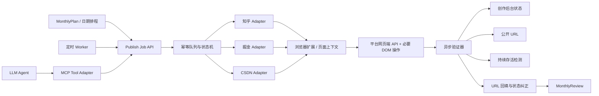

# 全机器多平台自动发布架构与落地方案

## 1. 结论

JOTO GTM 工作台的知乎、掘金、CSDN 正式发布应采用以下目标架构：

`MonthlyPlan -> 日期执行 -> Publish Job API -> 平台执行器 -> 异步验证器 -> URL 回填 -> MonthlyReview`

其中：

- Workbench `PublishSchedule`、`PublishAttempt` 和 `PublishRecord` 是唯一业务事实源。
- REST/Job API 是排程 worker、界面和外部调用方共用的稳定业务接口。
- MCP 只作为同一组高层发布能力的 Tool 适配层，不保存独立发布状态。
- 浏览器扩展持有真实浏览器会话，在页面上下文使用实时 Cookie、CSRF 和客户端参数。
- 平台 Adapter 优先调用网页编辑器自身使用的接口，DOM 操作只用于接口无法完成的步骤。
- 发布动作与发布验证分离；获取文章 ID、接口返回成功或按钮点击完成都不等于稳定发布。
- URL 首次公开后先标记为临时有效，经过持续存活验证后才进入稳定发布状态。
- 全链路不设置人工发布确认节点；遇到认证失效或安全挑战时自动停止、熔断并保留机器可恢复状态，不绕过平台安全机制。

## 2. 核心问题

当前链路已经具备排程、幂等键、平台草稿复用、浏览器正式提交、创作后台验证和 URL 回填能力，但成功语义仍存在三个缺口：

1. 平台返回文章 ID 后可能仍在审核、未公开或随后被删除。
2. `published_pending_url` 被当作终态，worker 不会继续周期性验证。
3. 状态模型没有表达首次公开、稳定发布、平台拒绝和发布后删除。

掘金测试已经证明：正式提交和文章 ID 获取成功，不代表公开 URL 可访问，更不代表文章在后续审核中持续存活。

## 3. 架构



### 3.1 控制面

控制面负责：

- 创建发布任务。
- 生成并校验 `idempotencyKey`。
- 串行领取同一平台、同一账号的任务。
- 记录每次发布和验证证据。
- 控制重试、冷却和熔断。
- 向工作台回填 URL 及其有效性。

建议的高层接口：

- `platform_auth_probe`
- `publish_content_preflight`
- `publish_job_create`
- `publish_job_run`
- `publish_job_get`
- `publish_job_reconcile`
- `publish_url_verify`
- `publish_liveness_check`

定时 worker 直接调用 Job API，不经过 LLM。MCP Server 将上述接口映射为结构化 Tools，供 Agent 发现和调用。

### 3.2 执行面

执行面采用“浏览器扩展 + 本机桥接服务 + 平台 Adapter”：

- 浏览器扩展连接已登录的专用 Chrome Profile。
- 本机桥接服务只绑定 loopback，并使用非空 Token 鉴权。
- Cookie、CSRF、LocalStorage 和页面客户端参数不离开浏览器上下文。
- Adapter 在页面上下文发起平台网页端 API 请求。
- 通过 XHR、fetch、页面 Toast 和创作后台记录多路捕获结果。
- 同一平台账号只允许一个正在执行的写任务。

禁止：

- 把 Cookie、Token 或签名内容写入仓库、日志或 Tool 返回值。
- 把低层浏览器点击直接暴露给 LLM 作为生产发布能力。
- 在发布结果不确定时重新创建草稿或再次点击发布。
- 绕过 CAPTCHA、短信确认或平台安全挑战。

### 3.3 验证面

验证器与发布执行器完全分离，只执行只读操作：

- 查询平台发布接口留下的任务或文章 ID。
- 查询创作后台同标题、同草稿或同文章 ID 的记录。
- 访问公开 URL 并校验最终 URL、标题或文章 ID。
- 在多个时间窗口重复验证存活状态。
- 识别“曾经公开，后来 404/拒绝/后台消失”的反向状态变化。

验证证据至少包含：

- `verifiedAt`
- `source`
- `httpStatus` 或平台业务状态
- `platformArticleId`
- `publicUrl`
- `result`

不得保存响应中的 Cookie、Token、手机号或私有账户链接。

## 4. 状态模型

目标状态流：

```text
scheduled
-> publishing
-> pending_verify
-> published_pending_url
-> public_observed
-> stable_published
```

异常状态：

```text
precheck_failed
pending_config
auth_expired
risk_blocked
platform_rejected
verification_timeout
removed_after_publish
adapter_failed
```

兼容策略：

- 历史 `published_verified` 继续可读，但新任务首次公开后使用 `public_observed`。
- 历史 `published_pending_url` 不再是终态，纳入 worker 验证队列。
- `stable_published` 才是无需继续高频验证的稳定成功状态。
- `removed_after_publish` 保留历史 URL 和首次公开时间，但 URL 状态改为 `removed`。

URL 生命周期：

```text
pending -> provisional -> stable
                     \-> removed
pending -------------> rejected
```

建议验证时间窗：

- 提交后 1 分钟。
- 10 分钟。
- 1 小时。
- 6 小时。
- 24 小时。
- 72 小时。

首次公开即可回填 URL，但 `urlStatus=provisional`；连续存活达到稳定窗口后改为 `stable`。

## 5. 分平台路径

### 5.1 知乎

- 复用现有浏览器正式发布流程。
- 增加发布响应捕获。
- 使用创作后台文章 ID、公开 URL 和页面内容共同验证。
- 首次公开进入 `public_observed`，随后执行存活验证。

### 5.2 CSDN

- 保留浏览器发布和创作后台 URL 提取。
- selector 集中版本化，DOM 仅作为网页 API 不完整时的补充。
- 捕获正式发布请求业务响应。
- 验证公开博客 URL，不使用编辑器 URL 作为成功证据。

### 5.3 掘金

目标路径：

```text
浏览器扩展读取实时会话
-> 页面上下文创建或更新草稿
-> 页面上下文调用 article/publish
-> 捕获完整业务响应
-> 查询 draft detail
-> 查询创作后台记录
-> 探测公开 URL
-> 24h/72h 存活验证
```

掘金还需要机器内容准入：

- 原创性和跨平台相似度检查。
- 技术实践、实现过程和分析思考占比检查。
- 广告词、销售 CTA、二维码和外链密度检查。
- 标题、分类和标签一致性检查。
- 基于同一事实和证据生成掘金专属技术版本，不直接复制其他平台终稿。
- 首次不通过可自动改写一次；仍不通过则进入 `content_blocked`，不提交平台。

内容准入用于满足平台内容规范，不用于规避或欺骗平台风控。

## 6. 机器重试和熔断

允许自动重试：

- 发布动作开始前的浏览器连接失败。
- selector 在写动作前失效。
- 只读验证请求超时。
- 平台仍在审核或公开页尚未同步。

禁止自动重发：

- 最终发布请求已经发出但结果未知。
- 已获得文章 ID。
- 创作后台存在同草稿或同标题记录。
- 平台明确拒绝或出现安全挑战。

机器处理策略：

- 认证失效：`auth_expired`，停止该平台写队列并周期性探测会话恢复。
- 安全挑战：`risk_blocked`，停止该账号全部写任务，按冷却窗口探测。
- 内容拒绝：`platform_rejected`，仅在存在明确内容原因时允许生成一次新版本和新排程。
- 发布后删除：`removed_after_publish`，保留证据，不复用原幂等键重发。

## 7. 落地顺序

### Phase 0：修正成功语义

- 扩展 `PublishSchedule`、`PublishAttempt` 和 `PublishRecord` 状态。
- 增加 URL 生命周期、首次公开和最后验证时间。
- `published_pending_url` 纳入 worker 持续验证。
- 首次公开使用 `public_observed`。
- 检测并记录 `removed_after_publish`。

### Phase 1：浏览器会话执行层

- 建立浏览器扩展与本机桥接的鉴权通信。
- 将掘金服务端 Cookie 重放迁移为页面上下文调用。
- 为三平台统一增加 XHR/fetch/Toast 响应捕获。
- 增加平台账号单实例锁。

### Phase 2：高层 Job API 与 MCP

- 将发布、查询和 reconciliation 固化为高层 Job API。
- MCP Server 只封装 Job API，不直接操作平台。
- Tool 输入优先使用 `draftId`、`scheduleId` 和 `jobId`。
- 长任务返回 durable handle，调用方只轮询状态。

### Phase 3：平台内容准入

- 增加平台表达变体和掘金内容准入。
- 自动改写只生成新草稿版本，不修改已提交内容。
- 记录每次准入规则版本、结果和阻断原因。

### Phase 4：稳定性验收

- 使用原创、平台适配的真实技术稿进行低频连续验证。
- 分别统计知乎、掘金和 CSDN 的提交接受率、公开转换率、URL 回填延迟、24h/72h 存活率、风险阻断率和重复发布率。
- 达到阈值后再扩大自动排程规模。

## 8. 验收标准

- 同一幂等键重复发布数为 0。
- 已提交但未知的任务不会自动重发。
- `published_pending_url` 会被 worker 持续验证。
- 首次公开 URL 自动回填且标记为 `provisional`。
- 达到稳定窗口后自动进入 `stable_published`。
- 公开后删除能够进入 `removed_after_publish`，历史 URL 和证据不丢失。
- 平台拒绝与安全挑战具有独立状态，不混入普通适配器失败。
- MCP Tool 与 REST API 读取同一 Publish Job，不产生第二套状态。
- 日志、状态文件和 Tool 返回值不包含凭证、Cookie、手机号或私有账户链接。

## 9. 对使用者的影响

- 用户不再需要手工点击发布或回填 URL。
- 工作台展示的是可解释的真实状态，而不是“按钮已点击”。
- 掘金被删文后不会继续作为有效发布成果参与复盘。
- 平台异常会自动熔断，避免重复发布扩大账号风险。
- MCP 接入后，任何兼容 Agent 都可以调用相同的高层发布工具，但定时发布仍由确定性 worker 执行。

## 10. 2026-08-02 落地状态

| Phase | 状态 | 已落地能力 | 尚未闭环 |
| --- | --- | --- | --- |
| Phase 0 | 完成 | `public_observed`、`stable_published`、`removed_after_publish` 和 URL 生命周期 | 等待真实 24/72 小时样本 |
| Phase 1 | 完成 | 页面上下文提交、平台串行、Runner 单实例、浏览器冷启动重试、动态节点重取 | 扩展方案保留为可选执行器；当前主链路使用 Runner |
| Phase 2 | 完成 | Publish Job REST API、官方 MCP SDK Server、8 个高层发布 Tool | 生产部署时补远程安全传输和权限模型 |
| Phase 3 | 完成 | 平台变体、版本化 preflight、掘金硬阻断、最多一次不可变改写 | 继续用真实样本校准阈值 |
| Phase 4 | 进行中 | 指标 API、验收脚本、CSDN/知乎公开 URL、掘金不公开证据 | 24/72 小时存活率需要自然时间窗口 |

当前真实判定：CSDN 和知乎达到 `public_observed`；掘金只达到“提交接口接受”，两次核验均未形成公开文章。系统不会把掘金文章 ID 当成成功，也不会自动重新提交同一任务。

MCP 与底层发布的关系已经通过实现验证：MCP 是 Tool 协议和调用入口，Publish Job 是唯一业务状态，Runner 才是浏览器会话执行层。类似浏览器扩展、CLI 或 CDP 项目可作为执行器参考，但无论是否套 MCP，最终都必须经过同一幂等、公开 URL 和存活验证合同。
