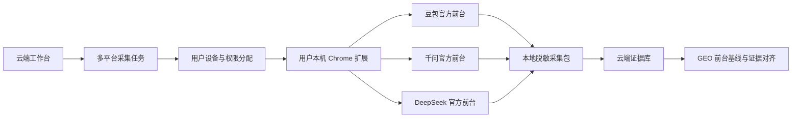

# AI 前台采集多人产品化方案

## 1. 结论

工作台使用真实 AI 前台采集时，不应把用户的豆包、千问、DeepSeek 登录态搬到云端，也不应把各平台 API 的返回值冒充前台观测。推荐产品形态为：

```text
云端工作台
→ 创建并分配采集任务
→ 用户本机 Chrome 扩展使用用户自己的平台登录态执行任务
→ 本地抽取、脱敏和生成不可变工件
→ 回传回答、可见引用、联网证明、脱敏截图和哈希
→ 工作台统一汇总并回灌 GEO
```

“本地 Chrome”只表示每个人在自己设备上执行页面操作，不代表功能只能由开发者使用。

## 2. 产品架构



云端只管理任务、权限、脱敏工件和 GEO 结果。豆包、千问、DeepSeek 的登录会话始终留在用户本机浏览器中。

## 3. 用户流程

### 3.1 首次使用

1. 用户登录工作台。
2. 在“AI 前台采集”页面安装 Chrome 扩展。
3. 工作台生成一次性设备配对码。
4. 用户在扩展中输入配对码，把设备绑定到当前工作区和用户。
5. 用户分别打开豆包、千问和 DeepSeek 官方页面并自行登录。
6. 扩展仅上报“已就绪、需登录、适配器失效”等环境状态，不上传平台账号凭证。

### 3.2 日常使用

1. 用户选择 GEO 项目、问题和目标平台。
2. 工作台创建“问题 × 平台”任务矩阵。
3. 云端把任务分配给指定用户或设备。
4. 扩展找到对应的已登录标签页，开启新会话并执行一次采集。
5. 扩展在本地提取回答、可见引用和联网证明，隐藏账号、历史会话和通知。
6. 服务端对脱敏结果进行二次敏感信息检查和哈希校验。
7. 合格结果进入 GEO 前台基线，不合格结果进入人工复核或重试。

## 4. 设备配对与权限

扩展不应内置工作台 API Key。应使用一次性配对码和可撤销的短期设备凭证：

- 配对码只能使用一次，并在短时间内过期。
- 设备凭证绑定 `workspaceId + userId + deviceId`。
- 扩展只能领取当前用户或设备被授权的任务。
- 扩展只有任务状态和采集工件写入权限，没有 GEO 蓝图审批权限。
- 用户可以在工作台撤销丢失或不再使用的设备。
- 不读取、不上传 Cookie、Token、密码、浏览器存储或私有请求 Header。

## 5. 执行与任务租约

生产版应使用 WebSocket 或 Server-Sent Events 通知扩展有新任务，扩展再调用带权限的 HTTP API 领取。任务必须建立短期 Lease：

- 同一任务同一时刻只能被一台设备领取。
- 设备断线后 Lease 自动过期，任务可重新分配。
- 上传使用幂等键，防止网络重试生成重复 GEO Evidence。
- 重新采集不覆盖原始工件，而是生成新的观测版本。

## 6. 部署形态选择

### 6.1 Chrome 扩展直连云端（正式版推荐）

```text
云端工作台 ↔ Chrome 扩展 ↔ AI 平台前台
```

用户只需安装扩展，无需启动 Node.js 或理解本地端口。需要在扩展中完成设备认证、脱敏、大工件上传和断线恢复。

### 6.2 Chrome 扩展加桌面伴侣（企业强隐私场景）

将现有 Runner 封装为开机自启、自动更新的 Windows/macOS 桌面应用。完整截图可留在本地，云端只保存脱敏文本、摘要和哈希。该方案隐私更强，但安装和版本维护成本更高。

### 6.3 云端托管浏览器（首版不采用）

远程浏览器要求用户把平台会话登录到云端，容易引入账号安全、异地登录、验证码、平台风控、服务条款和运行成本问题。除非企业客户明确接受托管账号模式，否则不应作为默认架构。

## 7. 多人协作

一个 Benchmark 可以由多个成员和设备共同完成。例如：

```text
研究负责人创建 30 个任务
→ 用户 A 执行豆包
→ 用户 B 执行千问
→ 用户 C 执行 DeepSeek
→ 工作台按同一 Benchmark 汇总
```

建议角色：管理员、研究负责人、采集执行人、GEO 分析人员、审核人和只读成员。采集执行人只能执行被授权任务，不能批准 GEO 蓝图。

## 8. 需要增加的服务端能力

建议增加：

```text
capture_device
capture_device_pairing
capture_device_session
capture_task_assignment
capture_device_heartbeat
```

对应 API：

```text
POST /api/v5/capture-devices/pairing
POST /api/v5/capture-devices/activate
POST /api/v5/capture-devices/refresh
POST /api/v5/capture-devices/heartbeat
GET  /api/v5/capture-devices/tasks/next
POST /api/v5/capture-devices/tasks/:id/status
POST /api/v5/capture-devices/tasks/:id/artifact
POST /api/v5/capture-devices/:id/revoke
```

大截图和采集包使用一次性上传地址或分片上传。服务端重新计算 SHA-256，校验一致后才建立 GEO Evidence 引用。

## 9. 分阶段实施

### Phase 1：内部多人验证

- 保留当前本地 Runner。
- 将启动方式封装为双击启动或轻量桌面伴侣。
- 补齐豆包、千问、DeepSeek 适配器。
- 验证多用户任务归属、重试、审计和批次汇总。

### Phase 2：扩展直连云端

- 增加设备配对和撤销。
- 增加云端任务分发和设备 Lease。
- 扩展直接上传脱敏工件。
- 普通用户不再需要安装或启动 Runner。

### Phase 3：对外产品化

- 发布和维护 Chrome 扩展。
- 增加适配器版本检查、失效监控和自动更新。
- 增加组织权限、额度、速率限制、隐私说明和审计页面。
- 建立验证码、登录失效、DOM 改版和联网未验证的处置 SOP。

## 10. 验收标准

- 新用户可在 5 分钟内完成扩展安装和设备配对。
- 普通用户不需要使用命令行。
- 工作台不能读取平台密码、Cookie 和登录 Token。
- 设备只能读取当前工作区分配给它的任务。
- 设备撤销后立即无法领取新任务或上传结果。
- 网络中断可恢复，且不产生重复 GEO Evidence。
- 同一 Benchmark 可由多个用户执行不同平台。
- 客户端脱敏和服务端敏感信息二次检查必须全部通过。
- 所有 GEO 前台结论能追溯到执行人、设备、平台、适配器版本和工件哈希。
- 采集结果只能形成待审核证据，不能自动批准 GEO 蓝图或月度策略。

## 11. 对使用者的影响

用户需要为目标 AI 平台准备自己的合法账号，并在本机完成首次登录。验证码、风控挑战和服务条款限制仍需要人工处理，系统不绕过平台安全措施。

相比云端托管账号，本地执行会增加一次扩展安装和设备配对，但可以显著降低凭证泄露、异地登录和远程自动化风控风险。
