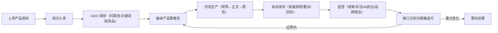
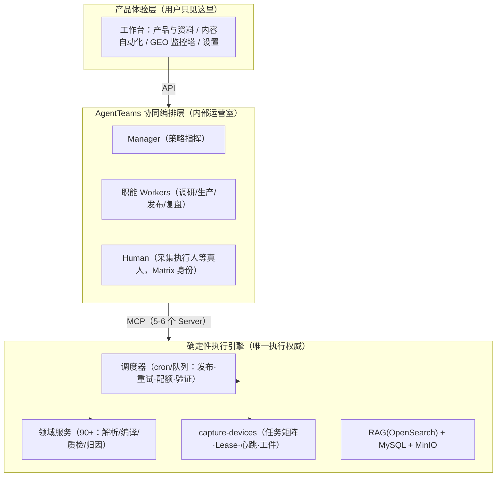

# GEO 全自动闭环产品架构方案

> 文档日期：2026-08-06
> 定位：产品化与稳定性导向的系统架构方案（非参赛材料）
> 关联文档：[页面与功能优化方案](D:/GTM/工作台-main-v5/docs/方案与规划/2026-08-06-页面与功能优化方案.md)、[开发前文档](D:/GTM/工作台-main-v5/docs/方案与规划/2026-08-06-GEO全自动闭环开发前文档.md)、[页面功能改造方案](D:/GTM/工作台-main-v5/docs/方案与规划/2026-08-06-页面功能改造方案.md)

## 一、目标与设计原则

**产品目标**：用户只需上传产品资料并完成一次性授权，系统自动跑完「GEO 调研 → 内容铺设 → 品牌与 AI 回答监控 → 策略迭代」的完整闭环。

三条设计原则：

1. **主链路确定性优先**。上传资料后要能无人值守运行，主流程必须是一条确定性流水线（可重试、可恢复、可观测）；LLM 只出现在"需要判断"的环节。
2. **状态即真相，消息只是记录**。任务状态、Lease、幂等键以数据库为准；Matrix 消息只承担通知与审计，绝不从聊天记录恢复状态。
3. **编排层可旁路**。产品策略包一旦编译，即使编排层整体不可用，确定性执行引擎仍按计划推进。

---

## 二、产品形态：一次上传，自动闭环

### 2.1 用户侧操作

用户只做三件事：

1. 上传产品资料（文档 / 官网 / 已有内容）。
2. 一次性授权（发布账号连接、采集设备配对、通知方式）。
3. 查看结果 + 处理"需你处理"。

### 2.2 系统自动循环

### 2.3 产品状态机

每个产品是一个状态机：`待调研 → 调研中 → 策略就绪 → 生产中 → 铺设中 → 监控中 → 迭代中 → 需介入 / 暂停`。

页面永远向用户回答三个问题：**当前在哪个阶段？下一步系统自动做什么？什么情况下才需要我介入？**

### 2.4 人工介入点清单（全周期仅四类）

- 首次授权（账号连接、设备配对、通知方式）
- 账号失效 / 封禁 / 验证码
- 产品事实冲突、合规、品牌承诺风险
- 重大方向调整（定位变化、进入新渠道、禁用边界）

其余全部自动。

---

## 三、总体架构：三层 + 三条边界

### 3.1 架构分层

### 3.2 各层职责

| 层 | 职责 | 关键组件 |
|---|---|---|
| 产品体验层 | 三类心智页面 + 统一责任模型；用户不接触 Matrix/Element | Next.js 工作台 |
| AgentTeams 协同编排层 | Manager 编排职能 Worker；Human 以 Matrix 身份参与审批/采集执行/异常处置；房间 = 内部作战室 + 审计记录 | Manager、Workers、Human CRD、Matrix、Higress、MinIO |
| 确定性执行引擎 | 所有"每天必须跑、失败要重试、时间敏感"的执行 | 调度器、领域服务、capture-devices、RAG、MySQL |

### 3.3 三条边界（稳定性来源）

1. **热路径确定性，冷路径智能**：发布、重试、配额顺延、存活验证不经过 LLM 与 Matrix；LLM 只出现在调研、生产、缺口分析等判断环节。
2. **编排层可旁路**：策略包编译后，AgentTeams 故障不影响确定性引擎按计划执行。
3. **对外单一入口**："需你处理"只收敛到工作台统一入口 + 通知渠道；Matrix 房间仅作为内部审计，不面向终端用户。

---

## 四、AgentTeams 在逐环节的真实角色

> 依据 AgentTeams（agentscope-ai/AgentTeams）官方架构：Manager-Workers 编排、Matrix 通信、Higress 网关、MinIO 共享存储、Worker/Team/Human/Manager 声明式 CRD、Worker 声明式 MCP。

| 环节 | 执行主体 | AgentTeams 角色 |
|---|---|---|
| 资料解析入库 | 领域服务 | 不介入（纯确定性） |
| GEO 调研 | 调研服务 + LLM | GEO 侦察 Worker 以 Skill 方式调用，输出结构化问题池 |
| 策略包编译 | 编译服务（schema 校验） | Manager 审批入口 + 记录决策原因 |
| 内容生产 | 生产服务 + LLM + 质检门 | 内容生产 Worker 执行，失败自动修复 |
| 自动发布 | 调度器 + 发布服务 | 发布执行 Worker 只做监督与记录，不决策节奏 |
| 前台复测 | capture-devices + 真人扩展 | 数据复盘 Worker 编排任务矩阵；Human 收通知、本机执行 |
| 缺口识别 | 分析服务 | 数据复盘 Worker 分析并生成策略调整建议 |
| 策略迭代 | 规则引擎（边界内自动） | 重大变化才升级 Manager / 人工确认 |
| 异常处理 | 责任判定器 | "需你处理"通过 Matrix 通知 + 工作台统一入口 |

**关键认知**：AgentTeams 的 Worker（OpenClaw 等）本身仍是 LLM 驱动的 Agent，不是确定性脚本。调研/生产/分析可交给它，但发布/重试/配额节奏绝不能由它决定——这正是热路径边界存在的意义。

---

## 五、稳定性设计

1. **阶段质量门**：每阶段产物通过校验才能进入下一阶段——资料完整度 → 调研置信度 → 策略包 schema → 正文证据对齐 → 发布预检 → 存活验证。失败自动修复或顺延，超阈值升级人工。
2. **幂等与恢复**：每个任务携带幂等键 + Lease + 心跳；断线从数据库恢复；发布重试不重复发文，采集重试不重复生成证据。
3. **多产品成本控制**：一套 Agent 班组服务所有产品，按产品快照隔离上下文，不按产品实例化整套 Agent（避免 10 个产品 = 60+ 容器）。
4. **可观测与告警**：每阶段产出结构化事件（阶段、耗时、token 成本、结果、归因链），汇总进首页"系统是否正常"；AgentTeams 的 heartbeat/Phase 并入责任模型，编排层故障归"系统处理中"，不骚扰用户。
5. **逐级降级**：编排层故障 → 确定性引擎继续；引擎故障 → 调度器补跑已排程任务；仅账号失效、事实冲突等进入"需你处理"。

---

## 六、产品化要点

- **用户无感 Matrix**：采集执行人、审核人在工作台里就是普通成员，Matrix 身份由系统自动映射；对外通知走工作台站内 + 企业微信/邮件。
- **"需你处理"是唯一人工入口**：所有人工事项收敛到统一列表 + 通知，每条附"发生了什么、影响什么、系统已尝试什么、你做什么"。
- **采集执行不押注"有人在线"**：自动化渠道系统自采自测；真人采集只在平台需要登录态/验证码时兜底。
- **多产品共享班组**：Worker 池共享，产品上下文按快照隔离，成本与运维随产品数量线性小幅增长而非爆炸。

---

## 七、实施路线

| 阶段      | 内容                                                             | 是否依赖 AgentTeams | 产出             |
| ------- | -------------------------------------------------------------- | --------------- | -------------- |
| Phase 0 | 策略包编译、后台生成、容量排程、发布回传、责任判定器                                     | 否               | 上传→发布→回传无人值守跑通 |
| Phase 1 | MCP 契约化（5-6 个 Server）、capture-devices 落地                       | 否               | 能力可被任意编排层调用    |
| Phase 2 | AgentTeams 叠加：Docker 本地跑通、Manager + Workers、Human 映射、Matrix 通知 | 是               | 编排 + 人机协同 + 审计 |
| Phase 3 | 缺口自动分析、策略边界内自动微调、效果归因、月度报告自动生成                                 | 是               | 真正迭代闭环         |

前两阶段产出的就是可用产品；AgentTeams 是稳定后的增强，不是上线前提。

---

## 八、风险与后续建议

1. **编排层过度介入热路径**：Manager 决策进入每日发布/重试循环会带来抖动与成本，坚持热路径确定性边界。
2. **Matrix 作为状态源**：严禁从聊天记录恢复状态，任务真相只在数据库。
3. **Human CRD 不是现成执行器**：它只提供 Matrix 身份与权限；采集执行协议（Lease/心跳/幂等/工件回传）由 capture-devices 自建。
4. **AgentTeams 自身运维**：容器、Matrix、Higress 均有故障面，需纳入可观测与告警，并预设旁路。
5. **建议沉淀**：质量门清单、责任判定规则、MCP 契约规范沉淀为知识库条目，供新渠道/新页面复用。
