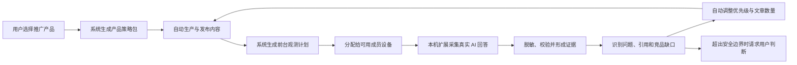

# 页面与功能优化方案：GEO 自动发布闭环

> 文档日期：2026-08-06
> 依据：2026-08-05 会话中最后三轮产品方案讨论（人机责任重划 → 三类心智与统一责任模型 → AI 前台采集融合），结合代码现状核查与《AI 前台采集多人产品化方案》整合完善。

## 一、结论

工作台应从“多个功能页面”重构为**三类用户心智 + 一个系统自动闭环**：

1. **产品与资料**：告诉系统推广什么。
2. **内容自动化**：查看系统正在生产和发布什么。
3. **GEO 监控塔**：查看结果、告警以及系统如何自愈。

最核心的一条规则：**异常不等于需要用户处理。** 用户只决定推广哪些产品并提供一次性授权，其余调研、采集、生产、发布、复测、策略更新由系统自动完成；用户只查看结果、阅读正文、处理系统确认无法自行恢复的事项。

三个关键转变：

| 维度 | 现状 | 目标 |
|---|---|---|
| 页面编排 | 按功能模块平铺（计划、执行、监控、复盘并列） | 按用户旅程组织，执行过程收敛为页面内的区域/抽屉 |
| 责任判定 | 每个页面各自定义“需处理” | 统一责任判定器，全站只认一套分类 |
| 前台采集 | 用户手动创建任务、选择问题与平台 | 系统自动观测能力，由云端决定何时采集、采集什么、由谁执行 |

---

## 二、现状问题（代码核查结论）

### 2.1 责任口径不统一，告警误导用户

- 首页把 `system_recovering`（系统恢复中）、`awaiting_material`（等待资料）计入“需人工处理”（[page.tsx](D:/GTM/工作台-main-v5/src/app/page.tsx:161) 与 [page.tsx](D:/GTM/工作台-main-v5/src/app/page.tsx:206)）。
- 当日执行把 `system_recovering` 直接映射为“失败”（[daily-execution/page.tsx](D:/GTM/工作台-main-v5/src/app/daily-execution/page.tsx:79)）。
- 发布监控把 `precheck_failed`、`platform_rejected`、`removed_after_publish`、`risk_blocked`、`verification_timeout`、`auth_expired` 等全部放入危险状态集合（[publishing/page.tsx](D:/GTM/工作台-main-v5/src/app/publishing/page.tsx:28)），其中多数本可自动重试或顺延。

结果是：用户分不清哪些告警真正需要自己行动，信任度下降。

### 2.2 页面按功能模块排布，而非用户旅程

GEO 监控塔当前是五个并列标签：发布状态 / 数据回传 / 官网监控 / 数据复盘 / AI 前台测试（[geo-monitor/page.tsx](D:/GTM/工作台-main-v5/src/app/geo-monitor/page.tsx:14)）。发布状态与数据回传属于**执行过程**，却被提升为结果监控的一级导航，与“看结果、看告警”的心智冲突。

### 2.3 月度计划仍是用户配置入口

- 用户需要填写月份、月度目标、目标问题、文章总数、渠道配额，与“用户只决定推广什么”的目标冲突。
- 自动策略未直接按已批准的 `GeoBlueprint.monthlyStrategyInput` 编译，实际接近“每个问题生成一篇、取规则包第一个渠道”（[monthly-automation-service.ts](D:/GTM/工作台-main-v5/src/lib/v5/monthly-automation-service.ts)）。

### 2.4 自动化链路未闭环

- “重新运行自动化”只处理策略与排程，不负责正文生成。
- 排程固定每天 10:00 / 15:00 两个时段（[monthly-automation-service.ts](D:/GTM/工作台-main-v5/src/lib/v5/monthly-automation-service.ts:244)），不读取账号日上限、已有占用，无跨日顺延。
- 正文生成依赖浏览器页面循环，用户关闭页面即中断。
- AI 前台采集仍要求用户手动创建任务，未接入策略自动驱动。

---

## 三、目标信息架构

### 3.1 三类用户心智

| 心智 | 用户目的 | 主要页面 |
|---|---|---|
| 产品与资料 | 告诉系统推广什么 | 产品与资料 |
| 内容自动化 | 查看系统正在生产和发布什么 | 内容自动化（原月度计划改造） |
| GEO 监控塔 | 查看结果、告警及系统如何自愈 | GEO 监控塔 |

### 3.2 页面地图（现状 → 目标）

| 现有页面/模块 | 目标去向 |
|---|---|
| 首页 | 保留，改为“系统状态总览”，回答三个问题 |
| 月度计划 | 改造为“内容自动化”单页 |
| 当日执行 / 今日 | 降为内容自动化页面中的“今日”区域，不再承担独立规划职责 |
| GEO 监控塔 | 改为四视角：总览 / 内容表现 / AI 可见性 / 系统记录 |
| 发布监控、数据回传 Ledger | 移入文章详情抽屉，不再是一级导航 |
| AI 前台测试 | 变为监控塔背后的自动观测能力；“AI 可见性”展示结果 |
| 设置 / 配置 | 只保留一次性配置：发布账号、采集设备、通知 |
| 月度复盘 | 变成自动生成的结果报告与复盘基线，不再是用户创建下月 Proposal 的入口 |

---

## 四、页面级优化方案

### 4.1 首页：系统状态总览

首页不展示完整流水线，只回答三个问题：

1. 系统是否正常？
2. 哪些产品正在推广、进展如何？
3. 有没有事情真的需要我处理？

保留四块内容：

- **顶部结论**：“系统正常运行”“3 项告警正在自动处理”“1 项需要你处理”。
- **产品进度行**：`腾讯云 ADP｜生成 18/24｜排程 12｜稳定发布 8`，一行一个产品。
- **系统动态**：最近自动完成了什么。
- **需你处理**：没有事项时直接显示“当前无需介入”。

修正点：`system_recovering`、资料不足等可自动恢复状态从“需人工处理”中拆出，归入“系统处理中”或“等待外部结果”。

### 4.2 产品与资料：产品控制入口

每行展示：

- 产品名称
- 是否推广
- 资料是否充足
- GEO 调研状态
- 当前策略状态
- 自动化状态

用户主要操作只有两个：**开始推广/暂停推广**、**补充资料**。资料更新后系统自动重新调研，不再要求用户手动启动每一轮流程。

### 4.3 内容自动化（原月度计划改造）

删除顶部三段式切换，页面只保留四类关键信息：

1. **推广范围**：顶部展示“正在推广 3 个产品”，唯一主要配置是“选择推广产品”（带搜索与复选框的抽屉）。
2. **自动化总览**：今日待发布 / 正在生成 / 已排程 / 需要处理。
3. **产品运行列表**：每个产品一行，不占大卡片纵向空间：

   `腾讯云 ADP｜策略已就绪｜生成 18/24｜排程 12｜异常 1｜查看策略包`

   点击展开详情或右侧抽屉。

4. **文章与排程队列**：文章标题、产品、渠道、预计发布时间、状态；生成后直接提供“查看正文”。正常任务不显示操作按钮，只有异常任务显示一个明确动作（“补充资料”“重新登录账号”）。

“人工修改策略”改为“查看策略包”：默认只读，展示 GEO 发现的重点用户问题、推荐内容类型、推荐渠道、系统决定的文章数量及原因、使用的资料与 GEO 蓝图版本、最近更新时间。确需人工干预时放入二级入口“高级调整”。

### 4.4 GEO 监控塔：结果、告警与自愈

改为四个结果视角：

1. **总览**：所有产品的 GEO 健康度、趋势、自动优化进度。
2. **内容表现**：收录、引用、阅读、转化及内容缺口。
3. **AI 可见性**：AI 回答、品牌出现、引用来源、竞品对比。
4. **系统记录**：调研、策略调整、生产、发布、复测历史。

默认结构建议：

1. **总体结论**：“GEO 可见度上升 8%”“2 个内容缺口已自动进入策略”“1 个账号需要处理”。
2. **产品表现**：每产品一行，展示 GEO 趋势、问题覆盖、引用覆盖、策略调整数量。
3. **系统告警**：只提供“查看详情”，不提供“重新运行”等操作。例如：

   > CSDN 登录状态检查失败。系统将在 14:20 进行第 2/3 次重试，4 篇文章已自动顺延，不会丢失。

4. **需你处理**：仅包含系统确认无法自行恢复的事项。
5. **自动优化记录**：展示监控结果如何反哺策略：

   > 发现“实施周期”问题引用覆盖下降 → 自动增加 3 篇内容 → 已进入生成队列。

发布明细与 Ledger 放入文章详情抽屉。

### 4.5 设置：一次性配置

- 发布账号连接
- 每个账号的保守日上限
- 可发布时段
- 通知方式
- **采集设备**（管理员与采集执行人可见）：设备是否在线、支持哪些平台、登录状态、当前任务、最近成功采集时间、适配器版本

平台默认值由系统提供，高级参数折叠。多人协作对普通用户完全透明——用户不需要知道任务由设备 A 还是设备 B 执行。

---

## 五、统一责任模型与告警规范

### 5.1 四种责任状态

| 状态 | 含义 | 用户是否操作 |
|---|---|---|
| 系统运行中 | 正常生成、排程、发布、核验 | 否 |
| 系统处理中 | 已发现异常，正在重试、修复或顺延 | 否 |
| 等待外部结果 | 等待平台审核、URL 回传、24h/72h 验证 | 否 |
| 需你处理 | 系统确认无法自行恢复 | 是 |

只有第四种能出现红色、“需你处理”和操作按钮。

### 5.2 数据层字段

每个任务/告警统一携带：

- `responsibility`: `system | external | user`
- `recoveryStatus`: `waiting | retrying | repaired | exhausted`
- `nextAutomaticAction`
- `nextAttemptAt`
- `attemptCount`
- `impactCount`
- `userActionRequired`

### 5.3 自动恢复策略

| 场景 | 系统行为 |
|---|---|
| 网络、超时、Worker 中断 | 自动重试 |
| 当日账号额度用尽 | 自动排到下一天 |
| 正文格式或 CTA 问题 | 自动修复并重新质检 |
| 平台拒绝 | 自动诊断、调整后重发 |
| 文章被删除 | 检查原因，安全时自动生成修订版 |
| GEO 表现下降 | 自动补充调研并更新策略包 |
| 采集设备离线 | 等待 Lease 过期后分配给其他设备 |
| 单个平台登录失效 | 优先切换同平台其他授权设备 |
| 页面 DOM 改版 | 暂停对应适配器、保留任务等待适配器更新 |
| 上传中断 | 续传或重新上传，不重复生成 Evidence |
| 采集结果不完整 / 缺联网证明 | 自动重新采集或更换设备会话 |
| 采集容量不足 | 任务排队，不算人工异常 |
| 多次失败、账号风控 | 升级为用户处理 |

### 5.4 告警展示四要素

每个告警必须展示：**发生了什么、影响什么、系统下一步做什么、预计何时再次检查**。

### 5.5 “需你处理”完整判定清单

- 账号明确被封禁
- 验证码、短信验证或双重认证
- 授权过期且系统无法续期
- 所有可用设备的目标平台账号都已失效
- 工作区没有任何成员授权该平台
- 设备凭证被撤销且没有替代设备
- 涉及产品事实冲突，系统无法判断
- 涉及合规、法律或品牌承诺
- 连续自动修复达到上限

---

## 六、自动化闭环设计

### 6.1 主链路



### 6.2 两层闭环

**快速闭环**（执行优化）：

```text
发布 → 前台复测 → 识别缺口 → 调整已有策略优先级和数量 → 补充生产
```

**治理闭环**（重大变化）：

```text
持续观测 → 发现产品定位或事实变化 → 生成新版 GEO 蓝图候选 → 用户确认 → 更新策略边界
```

### 6.3 分级决策：采集证据如何影响策略

| 变化类型 | 系统行为 |
|---|---|
| 回答排名、引用变化、竞品提及变化 | 自动记录并更新监控结果 |
| 已批准问题的优先级、文章数量、执行顺序变化 | 自动更新策略包 |
| 已批准渠道内增加补充文章 | 自动生产 |
| 新增产品事实、品牌承诺、敏感能力表述 | 用户确认 |
| 改变产品定位、禁用边界或进入新渠道 | 用户确认 |

原始采集证据保持不可变、可追溯；系统自动调整的是执行策略，不是篡改或自动批准原始证据。

### 6.4 GEO 调研链路优化（补充完善）

调研从“一次性人工流程”变为“持续自动循环”，具体补充六点：

1. **输入源统一**：GEO 调研由三类输入驱动——已批准 GEO 蓝图、产品资料快照、AI 前台采集证据与发布效果回传；不再依赖用户每次手动选定问题集合。
2. **调研到策略的自动编译**：调研结果直接编译为产品级策略包（重点问题、内容类型、渠道、数量及原因），中间不插入人工翻译环节；“人工修改策略”降为二级高级调整。
3. **持续复测节奏**：系统自动维护 Benchmark，按设备在线状态、平台登录状态和额度自动选择复测问题与平台，发布后自动创建复测任务。
4. **优先级与数量动态计算**：综合问题优先级、GEO 置信度、内容缺口、渠道匹配度、资料完整度、历史发布效果与账号剩余容量，并加入防重复规则（相同“问题 + 内容类型 + 渠道”在冷却期内不重复生成）。
5. **效果归因闭环**：每条自动调整保留完整原因链——哪个问题表现下降 → 哪个平台发生变化 → 使用了哪些采集证据 → 调整了什么策略 → 创建了哪些文章 → 发布后效果是否恢复。
6. **治理边界**：产品定位、事实、合规等重大变化自动生成新版 GEO 蓝图候选，交用户确认后更新策略边界；日常数量与优先级微调无需逐次审批。

### 6.5 系统逻辑需补齐的能力

- 新增“推广产品范围”：用户唯一需要维护的业务配置。
- 产品级策略包：绑定已批准 GEO 蓝图、资料快照与规则包版本，不再每月重配。
- 正文生成迁移到后台任务，用户关闭页面后仍继续运行。
- 账号容量排程：读取账号日上限、已有占用、发布时间窗与最小间隔；达到上限自动查找下一天，月末溢出任务进入下月执行快照，不丢失。
- 发布成功后自动回传 URL，继续公开校验、24h/72h 存活检查与 GEO 复测。
- 月度业务目标由系统生成（作为结果与复盘基线，不再是用户输入项）。

---

## 七、实施路线图

### 第一阶段：责任模型与页面口径（先行）

- 统一 `system / external / user` 责任状态与数据字段。
- 修正首页、当日执行、发布监控的“需处理”口径（首页拆出 `system_recovering`、当日执行不再把系统恢复映射为失败、发布监控细分可自动恢复状态）。
- 把 AI 前台采集任务改为系统自动规划，增加设备自动分配、Lease 过期与重新分配。
- GEO 监控塔改为四视角，发布状态与 Ledger 移入抽屉。

### 第二阶段：后台闭环

- “推广产品范围 + GEO 策略编译 + 账号容量排程”后台闭环，正文生成迁移到后台。
- 采集证据自动转化为问题缺口、引用缺口与竞品变化。
- 在批准边界内自动调整策略包优先级与数量，发布后自动创建复测任务。

### 第三阶段：效果归因与自学习

- 建立“策略调整 → 文章 → 发布 → AI 表现”的效果归因。
- 系统根据有效性自动调整不同产品与问题的生产投入。
- 月度复盘变为自动生成的结果报告，不再由用户创建下月 Proposal。

> 实施顺序原则：先建立后台闭环，再合并页面。否则只做单页 UI，会得到看起来连贯、实际上仍需用户逐步点击的伪自动化页面。

---

## 八、风险与后续建议

1. **最大的产品风险**：把 Chrome 扩展产品化后仍让用户手动创建大量采集任务。扩展只是安全执行载体，真正的产品能力是云端自动决定“何时采集、采集什么、由谁执行、结果如何影响策略”。
2. **责任口径必须先于页面文案**：不同页面若继续各自定义异常，改 UI 只会让同一任务在不同页面呈现不同结论。
3. **隐私与权限**：扩展不上传平台凭证，只上报环境状态；设备凭证可撤销；所有公开产出物必须脱敏，原始工件不可变、可哈希校验。
4. **建议沉淀**：本次“责任状态模型”“分级决策表”“自动恢复策略”可作为后续新页面/新渠道接入的统一规范，沉淀为知识库条目，避免同类问题重复出现。
