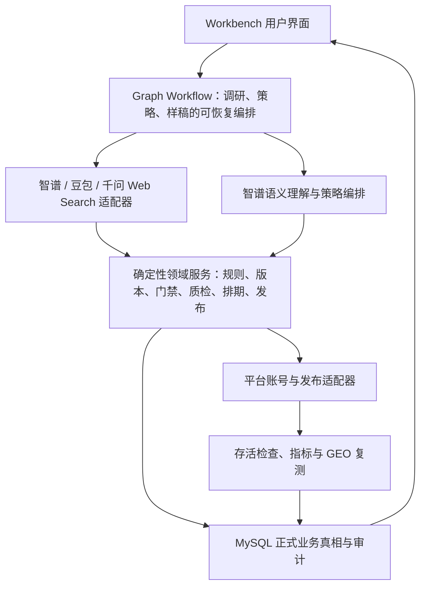
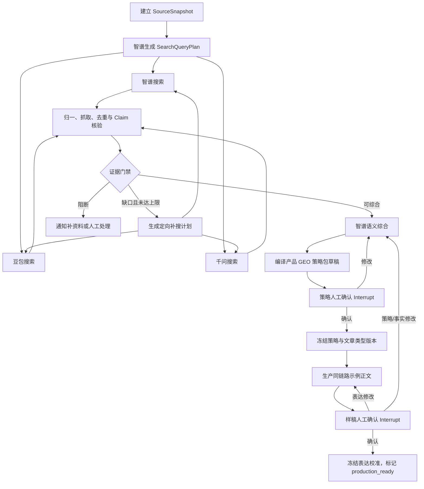

# 不接 AgentTeams 的 GEO 产品闭环多阶段开发方案指南

> 日期：2026-08-10  
> 状态：下一阶段开发实施基线  
> 首个真实试点产品：WorkBuddy  
> 适用范围：JOTO GTM Workbench V5，承接 Phase 0-1 当前成果  
> 本文作用：替换《2026-08-06-GEO全自动闭环开发前文档》中 AgentTeams 作为 Phase 2 的安排；历史文档只作为过程记录，不再作为开发顺序依据。

## 0. 执行结论

下一阶段不接 AgentTeams，也不先接 Graph。最优顺序是：

1. 先修正产品策略包的唯一真相和人工门禁，取消用户对 GeoBlueprint 的认知与审批负担。
2. 用 WorkBuddy 跑通一份真实的“GEO 调研 → 产品 GEO 策略包 → 示例正文”，先验收内容质量。
3. 将智谱、豆包、千问三路联网搜索统一为事实候选来源，由智谱独立承担检索规划、语义归纳和策略编排。
4. 让 AI 在策略包内匹配、改造或生成多种文章类型；用户确认策略包时一次性确认其文章类型组合。
5. 把当前已有但未进入正式生产调用链的 `ProductionContractSnapshot` 接入正文生成，保证不同产品的表达、结构、重点和风格可解释、可冻结、可复现。
6. 上述契约和用户路径稳定后，再用 Graph Workflow 编排“低频、长耗时、可暂停”的智能链路；批量生成、排期、发布、重试和指标回收继续由确定性引擎负责。
7. 最后接真实平台账号，以已确认的 WorkBuddy 样稿为校准基线，进入 `MonthlyPlan → 日期执行 → 发布与指标 → MonthlyReview → 下月提案` 的自动闭环。

用户最终只感知三个必要动作：

```text
确认产品 GEO 策略包 → 确认一篇示例正文 → 确认并绑定发布账号
```

系统内部可以复杂，但不再让用户分别理解 GeoBlueprint、检索任务、证据包、Prompt 组、Graph 节点或 Worker。

## 1. 要解决的核心问题

### 1.1 当前不是“缺一个 Agent 框架”，而是缺稳定的业务真相

当前项目已经具备产品资料、GEO 调研、知识治理、内容类型、月度策略、EvidencePack、正文生成、质检、排期、发布适配和审计等大量能力。真正阻碍闭环的不是 Worker 数量，而是下列契约还没有收敛：

- GEO 调研的最终用户产物到底是 GeoBlueprint，还是产品 GEO 策略包。
- 三家联网搜索的结果如何去重、核验、处理冲突，并进入事实证据链。
- 产品表达方式、文章结构、重点和风格如何从正式版本生成，而不是散落在 Prompt 文本中。
- AI 新生成的文章类型如何成为可治理版本，何时生效。
- 示例正文的人工反馈如何沉淀为后续批量内容可复用的校准版本。
- 哪些步骤允许 AI 自动执行，哪些判断必须由人确认。

如果现在先接 AgentTeams，只会把尚未稳定的业务对象分发给更多 Agent，增加调试面和状态分叉。先收敛契约，再编排，成本最低。

### 1.2 最终目标

为 WorkBuddy 建立一条可重复、可审计、可暂停恢复、可真实发布的产品级 GEO 内容闭环：

```text
产品资料与公开页
  → 多模型联网调研与知识缺口补充
  → 产品 GEO 策略包
  → 人工确认策略
  → 生产同链路示例正文
  → 人工确认内容质量
  → 账号预检与绑定
  → MonthlyPlan 批量生成、排期、发布
  → 24/72 小时存活检查、指标与 GEO 复测
  → MonthlyReview 与下月提案
```

## 2. 当前项目成果与真实缺口

### 2.1 可以直接复用的成果

| 能力 | 当前成果 | 下一阶段处理 |
|---|---|---|
| 产品与资料 | `product_entity`、资料源、来源快照、知识索引已经存在 | 保留，成为所有调研和生成的输入真相 |
| GEO 调研 | 已有正式任务、运行、问题、竞品、前台观测和 Zhipu Web Search 调用 | 拆为检索规划、三家适配、证据核验、智谱整合四层 |
| 产品策略包 | 已能从 GeoBlueprint 和来源快照编译 `product_strategy_packs` | 升级为唯一用户可见的 `ProductGeoStrategyPack V2` |
| 内容类型 | 已有模板、版本、AI 补充、激活/停用和策略匹配 | 增加 AI 匹配、AI 改造、AI 新建三种来源及原子确认 |
| 月度执行 | 已有 `MonthlyPlan`、内容矩阵、任务冻结和溢出到下月能力 | 由已确认产品策略包派生月度实例，不新增其他计划周期 |
| 证据与生产 | 已有 FinalEvidencePack、规则包、Prompt 组、渠道规则、校验器 | 接通统一的 `ProductionContractSnapshot` 编译链路 |
| 正文预览 | V5 已支持正文预览、编辑、保存并自动复检 | 复用为 WorkBuddy 示例正文验收页 |
| 发布与观测 | 已有账号配置、排期、发布适配、存活检查、GEO 观测和审计基础 | 做真实账号 E2E，不再用页面存在或 mock 代替真实闭环 |
| MCP | Phase 1 已有知识、检索、GEO 调研、观测、采集等 MCP 契约 | 保留作为外部适配和契约测试入口，不绑定 AgentTeams |

### 2.2 必须正视的未闭环点

1. `compileProductStrategyPack` 当前创建记录时直接写入 `active`，并立即替换产品上的策略包引用；这会先于用户确认生效。
2. `approveGeoBlueprint` 当前允许 `system_policy`，自动编排器也会自动批准待审蓝图；这与“核心判断权归人”和现有正式域规则不一致。
3. 当前 GEO 调研提供者只有智谱，尚未形成智谱、豆包、千问的统一检索契约。
4. 当前产品策略包还不包含来源覆盖、冲突结论、文章类型组合、生成理由和内容校准信息。
5. `production-contract-compiler.ts` 已具备正确的合并模型，但尚未成为正式正文生成的唯一入口。
6. 文章表达配置虽存在于管理界面，正式生成链路还没有稳定消费对应版本。
7. 当前的结构校验、类型检查和页面冒烟只能证明工程没有明显断裂，不能证明 WorkBuddy 已完成真实内容质量验收和外部发布闭环。

## 3. 产品信息架构：删除一层用户认知，不删除内部证据

### 3.1 用户只看到一个产品级策略对象

用户可见名称统一为“产品 GEO 策略包”。GeoBlueprint 不再作为独立用户页面、审批对象或后续操作前置条件。

内部仍可暂时保留 `geo_blueprint_versions` 表和兼容类型，以降低迁移风险，但其语义改为“GEO 调研内部综合稿”。系统对它做机器校验，不再伪装成人工审批。后续数据稳定后再决定是否合表，不在第一阶段做破坏性迁移。

三个容易混淆的对象需要明确分工：

| 对象 | 层级 | 作用 | 谁确认 |
|---|---|---|---|
| `ProductGeoStrategyPack` | 产品级 | 产品定位、GEO 机会、问题簇、证据策略、文章类型组合、表达方向 | 用户确认 |
| `MonthlyStrategyPackageVersion` | 月度实例 | 将已确认产品策略分配为当月问题、渠道、类型和数量 | 系统编译，按现有月度门禁执行 |
| `ProductionContractSnapshot` | 单篇任务级 | 冻结一次正式生成所需的事实、结构、表达、渠道、推广和校验规则 | 系统确定性编译 |

### 3.2 默认界面与高级信息

产品页默认只展示：

- 系统发现的核心 GEO 机会。
- 建议优先回答的问题。
- 建议文章类型及各自作用。
- 证据是否充足、哪里存在冲突或缺口。
- 一键“确认策略并生成示例”。

搜索渠道、原始网址、独立来源数、冲突声明、模型运行记录和策略版本放进“依据与高级信息”，需要时才展开。这样既不牺牲审计，也不把系统内部结构转嫁给用户。

## 4. 目标架构与责任边界



责任边界如下：

- 三家搜索模型负责发现事实候选和原始来源，不直接写入产品事实。
- 智谱负责理解语义、制定检索计划、合并问题簇、解释冲突、形成策略建议，不拥有审批权。
- 确定性领域服务负责来源门禁、版本、状态转换、Prompt 编译、质检、幂等、审计、排期和发布。
- Graph 负责长流程状态、分支、并行、重试、暂停与恢复，不承载领域规则，不成为业务数据真相。
- MySQL 继续是产品、证据、策略、任务、审批和发布记录的唯一正式真相。
- Workbench 是唯一人工确认入口；本阶段不接 Matrix，也不创建 AgentTeams 的 Manager/Worker 审批房间。

## 5. 完整业务流程

### 流程 A：产品资料进入与可调研性检查

输入包括产品官网、公开文档、人工上传资料、已有知识条目、竞品和目标渠道。系统生成不可变的 `SourceSnapshot`，并检查：

- 产品身份、目标用户、核心能力、适用/不适用边界是否存在。
- 公开事实是否有可访问原始网址。
- 私有资料能否用于内部判断，是否允许进入公开正文。
- 是否包含密钥、个人信息、内部链接等不可外发内容。
- 资料缺口是否会阻止调研或生成。

阻断条件：没有产品身份真相、没有任何可公开引用来源、来源快照不一致。非阻断缺口进入后续调研补充清单。

用户影响：用户只需补资料或修正产品事实，不需要理解索引、切片或 EvidencePack。

### 流程 B：三家联网搜索与证据归一

#### B1. 智谱生成检索计划

智谱先基于产品资料和已有策略生成 `SearchQueryPlan`，至少覆盖：

- 用户问题与购买/采用障碍。
- 同类方案、替代方案和竞品表达。
- 产品类别定义和市场共识。
- 风险、限制、实施条件和常见误解。
- 目标平台中已有内容缺口。
- 时效性事实和需要复核的产品声明。

每条查询必须带 `intent`、`expectedEvidenceRole`、`freshnessRequirement` 和 `stopCondition`，避免三家模型只重复搜同一个宽泛关键词。

#### B2. 三路并行检索

同一检索计划扇出给：

- 智谱 Web Search。
- 豆包联网搜索能力。
- 千问联网搜索能力。

三个提供者不是三票表决器。它们用于扩大召回、降低单一索引偏差和发现冲突；同一个原始网址即使由三家返回，也只算一个来源。

每一条结果必须归一为：

```ts
interface SearchEvidenceCandidate {
  provider: "zhipu" | "doubao" | "qwen";
  queryId: string;
  canonicalUrl: string;
  title: string;
  publisher?: string;
  publishedAt?: string;
  retrievedAt: string;
  snippet?: string;
  sourceType: "official" | "research" | "media" | "community" | "unknown";
  rawResponseRef: string;
  retrievalStatus: "retrieved" | "unreachable" | "source_missing";
}
```

无法返回原始 URL、无法证明执行过联网搜索，或只返回模型自然语言总结的结果，必须标为 `source_missing`，不能进入正式事实链。

#### B3. 来源提取、去重和声明核验

系统对候选来源做确定性处理：

1. URL 规范化，去掉跟踪参数，计算正文指纹。
2. 按 canonical URL、发布者、正文指纹去重。
3. 原页抓取或受控摘录，保留来源时间和内容哈希。
4. 将文本拆为 `ClaimCandidate`，记录支持、反对和条件信息。
5. 按来源权威性、独立性、时效性、直接性评分。
6. 检测同源转载、循环引用和三家搜索共同返回同一篇文章的假多样性。
7. 对有冲突的关键声明标记 `conflicted`，不允许智谱以“多数模型都说”消除冲突。

关键产品能力优先要求官方一手来源；竞争格局和用户问题可由多类来源交叉支持。不同事实类型使用不同门槛，不设置一个虚假的统一“2/3 多数通过”。

#### B4. 知识缺口补搜

当问题簇缺少来源、关键声明冲突或材料过期时，系统最多进行两轮定向补搜。达到上限仍不满足时：

- 不影响策略方向的缺口：进入策略包“待验证假设”。
- 会导致正文失真的缺口：阻止对应文章类型或问题进入生成。
- 产品内部事实缺口：通知用户补资料，不让联网模型猜测。

#### B5. 智谱统一语义综合

智谱只读取归一后的候选、核验结论和明确的来源引用，负责：

- 合并语义相近问题。
- 划分用户意图和决策阶段。
- 判断产品与问题的适配关系。
- 提炼竞争表达空位和差异化机会。
- 解释证据冲突与不足。
- 形成文章类型组合建议和策略草稿。

智谱不能把未通过证据门禁的候选升级为事实；最终结构由 Zod/JSON Schema 校验，失败时只允许有限次数修复。

### 流程 C：生成产品 GEO 策略包

`ProductGeoStrategyPack V2` 至少包含：

```ts
interface ProductGeoStrategyPackV2 {
  id: string;
  productId: string;
  version: number;
  sourceSnapshotId: string;
  researchEvidencePackId: string;
  status:
    | "draft"
    | "pending_strategy_review"
    | "strategy_approved"
    | "pending_sample_review"
    | "production_ready"
    | "rejected"
    | "superseded";
  productPositioning: {
    targetAudience: string[];
    jobs: string[];
    differentiators: string[];
    applicableScenarios: string[];
    excludedScenarios: string[];
  };
  geoOpportunities: Array<{
    questionClusterId: string;
    representativeQuestions: string[];
    intent: string;
    priority: "high" | "medium" | "low";
    productFit: string;
    evidenceReadiness: "ready" | "partial" | "blocked";
    sourceIds: string[];
  }>;
  articleTypePortfolio: ArticleTypePortfolioItem[];
  evidencePolicy: {
    requiredRoles: string[];
    conflictSummaries: string[];
    knowledgeGaps: string[];
    freshnessPolicyVersion: string;
  };
  expressionDirection: {
    keyMessages: string[];
    emphasisOrder: string[];
    tone: string[];
    prohibitedPatterns: string[];
  };
  channelPriorities: Array<{
    channel: string;
    role: string;
    suitableArticleTypeIds: string[];
  }>;
  recommendedMonthlyMix: Array<{
    articleTypeId: string;
    questionClusterIds: string[];
    targetShare: number;
  }>;
  synthesisModel: string;
  synthesisPromptVersion: string;
  contractHash: string;
}
```

策略包创建时只能进入 `draft` 或 `pending_strategy_review`。只有用户确认后才能写入产品当前生效策略引用；编译动作和批准动作必须分开。

### 流程 D：AI 匹配、改造或生成文章类型

AI 对每个问题簇执行三层决策：

1. `matched`：原有文章类型已满足语义、证据和渠道要求，直接引用现有激活版本。
2. `adapted`：原有类型方向合适，但需要为 WorkBuddy 调整结构、证据角色或表达重点，生成一个待确认的新版本。
3. `generated`：现有类型均不适配，AI 生成新的文章类型草稿。

每个 `ArticleTypePortfolioItem` 必须包含：

```ts
interface ArticleTypePortfolioItem {
  portfolioItemId: string;
  origin: "matched" | "adapted" | "generated";
  articleTypeId: string;
  articleTypeVersionId: string;
  name: string;
  definition: string;
  suitableQuestions: string[];
  unsuitableQuestions: string[];
  targetAudience: string[];
  contentGoal: string;
  structureModules: Array<{
    key: string;
    purpose: string;
    required: boolean;
  }>;
  emphasisOrder: string[];
  style: string[];
  lengthRange: { min: number; max: number };
  evidencePreferences: string[];
  ctaIntent: string;
  channelFit: string[];
  questionClusterIds: string[];
  recommendationReason: string;
  confidence: number;
  evidenceReadiness: "ready" | "partial" | "blocked";
  proposedMonthlyShare: number;
}
```

默认只推荐 3-5 种类型，硬上限 6 种，避免“AI 能生成”演变为模板泛滥。AI 生成的是类型定义和版本草稿，不是立即生效的生产规则。

用户确认整个策略包时：

- `matched` 类型冻结引用版本。
- `adapted` 和 `generated` 类型在同一事务中发布对应版本。
- 被用户取消的类型不激活。
- 月度策略只能引用本次确认后冻结的版本。

不再要求用户离开策略包页面，再去“内容类型管理”逐条发布。高级管理页保留给运营人员后续维护。

### 流程 E：策略确认

用户在一个页面完成以下判断：

- 这些问题是否值得 WorkBuddy 回答。
- 系统对产品定位、差异和限制的理解是否正确。
- 推荐的文章类型组合是否覆盖真实用户决策场景。
- 是否存在必须补充的资料或不可公开表达的内容。

用户可以：

- 直接确认。
- 修改结构化字段后确认。
- 对某一问题簇、文章类型或事实提出修改意见并重新生成局部结果。
- 拒绝当前版本。

策略确认事件必须记录 actor、时间、策略哈希、来源快照、修改差异和原因。模型、Worker 或 Graph 均不能写入人工确认事件。

### 流程 F：生成一篇 WorkBuddy 示例正文

策略确认后，系统自动选择一个“高优先级、证据充足、能代表产品表达”的问题簇和文章类型，使用与后续批量生产完全相同的正式链路生成一篇示例，而不是单独的演示 Prompt。

选择规则按顺序为：

1. `priority = high`。
2. `evidenceReadiness = ready`。
3. 能同时体现 WorkBuddy 的目标用户、实际场景、能力边界和人工介入边界。
4. 对首篇试点优先选择“场景解决方案”或“实施指南”，不优先选择信息密度低的品牌软文。

用户在当前 V5 正文预览体验中查看：

- 最终读者看到的正文。
- 标题、摘要、正文和 CTA。
- 可展开的事实来源和质检结论。
- 编辑、保存并自动复检。
- 结构化反馈：事实不准、产品理解偏差、结构不对、重点不对、语气不对、过度宣传、冗长、CTA 不合适、其他。

这里需要修正当前正式 Prompt 的一个内容质量风险：`FactTrace` 和原始摘录应进入内部审计，不应要求正文逐条展示 `originalQuote`。读者正文只保留自然的来源标记、引用或脚注；内部追踪继续保存 `claimId → sourceId → originalQuote`。否则文章会像审计报告，不像可发布内容。

### 流程 G：示例确认与表达校准

示例正文通过后，系统生成不可变的 `ExpressionCalibrationVersion`：

```ts
interface ExpressionCalibrationVersion {
  id: string;
  productId: string;
  strategyPackId: string;
  sampleTaskId: string;
  sampleDraftId: string;
  approvedAt: string;
  approvedBy: string;
  acceptedPatterns: string[];
  rejectedPatterns: string[];
  emphasisAdjustments: string[];
  toneAdjustments: string[];
  structureAdjustments: string[];
  ctaAdjustments: string[];
  factPresentationPolicy: string[];
  sourceDraftHash: string;
}
```

处理规则：

- 只涉及语气、节奏、重点和 CTA 的反馈，更新校准版本，不回滚产品策略。
- 涉及文章结构定义的反馈，生成文章类型新版本并重新跑样稿。
- 涉及产品定位或事实的反馈，生成新的产品策略包版本，重新确认策略。
- 样稿通过后，策略包进入 `production_ready`；后续批量正文必须引用该校准版本。

这使人工审稿结果从“一次性修改”变为可复用资产。

### 流程 H：账号确认、批量生成与发布

样稿通过后才进入账号步骤。系统自动检查：

- 平台账号是否已绑定、授权是否有效。
- 账号允许的内容类型、发布时段、频率和日容量。
- 平台格式规则、CTA 规则和敏感词规则是否存在有效版本。
- 是否存在真实发布或测试发布权限。

用户只确认账号映射和授权，不需要手工为每篇文章分配账号。确定性引擎根据 `MonthlyPlan`、容量、渠道优先级和内容类型配额排期；超出当月容量的任务只能进入下月正式 `MonthlyPlan` 提案，不能创建第二套周期。

每篇内容按下列生产链运行：

```text
冻结任务
  → 编译 FinalEvidencePack
  → 编译 ProductionContractSnapshot
  → 生产预检
  → AI 生成
  → 确定性质检
  → 最多一次受限修复
  → 草稿/待发布
  → 平台发布
  → 保存公共 URL 与平台回执
```

### 流程 I：观测、MonthlyReview 与迭代

发布后执行：

- 24 小时和 72 小时公共 URL 存活检查。
- 平台互动、点击或可获取指标回收。
- GEO 问题复测和提及/引用变化记录。
- 失败原因、人工修改率、证据缺口和渠道差异沉淀。

`MonthlyReview` 基于当月正式数据生成下月提案：

- 调整问题簇优先级和文章类型占比。
- 停用低质量类型或创建新版本。
- 触发过期资料和事实复核。
- 形成下月 `MonthlyPlan` 提案。

产品定位、事实边界或文章类型定义的重大变化仍需用户确认；在已批准边界内的数量和排期优化可以自动执行。

## 6. 系统如何决定不同产品的表达方式、结构、重点和风格

正式生成不得由一个自由文本 Prompt 临时决定。唯一允许进入模型的生成上下文由确定性编译器合成：

```text
GenerationContextSnapshot =
  ProductGeoStrategyPackVersion
  + ProductRulePackageVersion
  + ArticleTypeProfileVersion
  + ChannelRuleVersion
  + ExpressionCalibrationVersion
  + FinalEvidencePack
  + FrozenContentTask
  + PromotionProfileVersion
  + ValidatorPolicyVersion
```

各层责任：

| 决策 | 正式来源 | 人工介入位置 |
|---|---|---|
| 产品对谁说、解决什么、不能说什么 | 产品规则包 + 产品 GEO 策略包 | 资料维护、策略确认 |
| 文章为什么写、重点先后顺序 | 产品 GEO 策略包 + 冻结任务 | 策略确认、月度策略 |
| 文章采用什么结构 | 文章类型版本 | 策略包内确认或高级管理页 |
| 采用什么语气和表达习惯 | 表达规则 + 样稿校准版本 | 示例正文验收 |
| 渠道格式、长度、CTA 和禁用项 | 渠道规则版本 | 设置页维护；正式任务冻结 |
| 可以引用哪些事实 | FinalEvidencePack | 资料治理；事实冲突异常处理 |
| 最终输出是否合法 | ValidatorPolicy | 规则维护；系统自动质检 |

模型只执行冻结后的上下文，不再自行决定产品策略。所有合并冲突均由编译器按显式优先级处理，并把结果、版本和哈希保存到任务快照。

推荐的优先级为：

```text
安全与事实约束
  > 产品禁止/条件表达
  > 渠道硬规则
  > 文章类型结构
  > 产品策略重点
  > 样稿表达校准
  > 通用写作偏好
```

如两个硬规则没有交集，直接预检失败并说明冲突，不让模型“自行权衡”。

## 7. Graph Workflow 的接入方式与时点

### 7.1 是否需要 Graph

需要，但它是第二阶段的可靠性增强，不是内容质量的前置条件，也不是 AgentTeams 的替代 UI。

Graph 主要提升：

- 三家搜索并行、失败重试和部分降级。
- 证据不足后的有界补搜循环。
- 长流程 checkpoint、进程重启后恢复。
- 策略确认和样稿确认的人工暂停/恢复。
- 每个节点输入输出、耗时、失败和版本的可观测性。

Graph 不直接提升事实真伪或文章文笔。内容质量首先取决于资料、证据门禁、策略质量、文章类型、正式 Prompt 编译和样稿反馈。先把这些对象定型，再接 Graph，才能避免反复改图。

### 7.2 Graph 只编排“冷智能链路”

Graph 的范围：



Graph 不接管：

- `MonthlyPlan` 数量分配。
- 批量任务展开。
- 账号容量排期。
- 发布幂等、重试和回执。
- 24/72 小时存活检查。
- 指标回收。

这些是高频、确定性、需要强事务与幂等的热路径，继续使用现有数据库任务和 Worker 更可靠。

### 7.3 Graph 状态和持久化

建议状态只保存引用，不复制大段正文和整个证据库：

```ts
interface ProductGeoWorkflowState {
  workflowId: string;
  productId: string;
  sourceSnapshotId: string;
  sourceSnapshotHash: string;
  searchPlanId?: string;
  providerRunIds: string[];
  researchEvidencePackId?: string;
  researchAttempt: number;
  strategyPackId?: string;
  strategyDecision?: "approved" | "changes_requested" | "rejected";
  sampleTaskId?: string;
  sampleDraftId?: string;
  sampleDecision?: "approved" | "changes_requested";
  calibrationVersionId?: string;
  exceptionCodes: string[];
}
```

建议 `threadId`：

```text
productId:sourceSnapshotHash:researchPolicyVersion(+strategyPackFingerprint)
```

生产环境使用持久化 checkpoint，不使用仅内存保存器。领域 Shadow 的身份版本需要包含当前待审策略包的短指纹，避免“资料快照未变化、但产品身份或策略被人工纠正后”继续复用旧策略 checkpoint。Graph checkpoint 只用于执行恢复；产品策略、审批、证据和正文仍保存到正式领域表。

人工确认节点必须拆为：

```text
持久化待审对象 → 纯 interrupt 节点 → 幂等应用人工决定
```

不要在 `interrupt` 前执行不可幂等副作用，因为恢复时节点可能从头执行。所有写操作必须带幂等键、期望版本、actor、reason、correlationId 和 audit。

### 7.4 MCP 与 Graph 如何共存

- Graph 节点默认调用 TypeScript 领域服务端口，减少本机多进程和 JSON 往返。
- 现有 MCP Server 继续作为外部 Agent、采集端或集成测试的标准适配器。
- 同一领域逻辑只能实现一次；MCP 和 Graph 都调用它，不能各自复制规则。
- Graph 接入验收包含一次通过 MCP 适配器的合同测试，但不要求每个生产节点都启动 MCP 子进程。

### 7.5 为什么现在不需要 AgentTeams

AgentTeams 解决的是多角色 Agent 的任务委派、独立运行时和协作回房间。当前目标是单产品、单策略审批入口、单样稿审批入口和确定性批量执行，并不存在必须由多个自主 Agent 协商的业务价值。

本方案明确不开发：

- Manager + 职能 Workers 的组织结构。
- Human 到 AgentTeams 执行人的映射。
- Matrix “需你处理”通知和回房间审计。
- AgentTeams 旁路和降级演练。

只有以后出现“多个真实运营人员、跨团队任务交接、异构 Agent 长期独立负责不同产品、Workbench 内的异常中心无法承载协作”这类已验证需求，才重新评估 AgentTeams。它不是当前或后续阶段的依赖。

## 8. 可靠性与降级设计

| 故障 | 系统处理 | 是否需要人 |
|---|---|---|
| 一家搜索失败 | 有界重试；其他两家继续；记录降级 | 证据覆盖仍达标则不需要 |
| 两家搜索失败 | 仅允许产生“调研不完整”草稿，不进入策略确认 | 需要决定重试或补资料 |
| 返回结果没有原始 URL | 排除正式事实链 | 不需要，除非导致关键缺口 |
| 多家返回同一 URL | 只计一个独立来源 | 不需要 |
| 关键事实冲突 | 保留支持/反对证据，禁止自动消解 | 需要资料 owner 处理 |
| 智谱综合失败 | 使用同一证据包有限重试；不切换另一模型偷偷改语义 | 达上限后需要处理 |
| Graph 暂停或重启 | 从持久化 checkpoint 恢复 | 不需要 |
| Graph 整体不可用 | 已进入 `production_ready` 的产品仍可由确定性引擎批量生成与发布 | 新策略调研暂缓 |
| 生成预检失败 | 不调用模型，返回具体规则冲突 | 仅规则/资料冲突需要人 |
| 正文质检失败 | 同一契约下最多一次受限修复 | 仍失败进入异常中心 |
| 账号授权失效 | 暂停该账号任务，不改内容状态 | 需要重新授权 |
| 发布超时 | 先查幂等回执，禁止直接重复发布 | 无法确认平台状态时处理 |

“三家搜索”不等于每次必须三家全部成功。正式门槛由来源质量和问题覆盖决定，不由供应商数量决定。建议生产策略：三家默认并行；两家成功且关键问题覆盖达标可以继续；只有一家成功时不能自动进入用户策略确认。

## 9. 安全、隐私与成本控制

- API Key 只通过现有密钥配置和环境变量引用，不写入数据库正文、日志、Graph state、Prompt 或文档。
- 搜索前对查询做隐私检查，禁止向联网搜索发送私有链接、客户名、手机号、Token、未公开产品信息。
- 私有知识只能用于内部策略判断；进入公开正文的事实必须有相应 `visibility` 和使用权限。
- 原始响应只保留必要字段和安全引用；审计日志不打印完整 Provider 请求头。
- 为每次产品调研设置搜索查询数、补搜轮次、页面抓取数和语义综合 token 上限。
- 用 `sourceSnapshotHash + researchPolicyVersion` 做复用键；资料未变化时不重复进行全量调研。
- 三家结果先去重再交给智谱，避免把重复页面作为三份上下文重复付费。

## 10. 最建议的开发顺序

### Phase 2A：策略真相与人工门禁收敛（P0，3-5 个工作日）

目标：让用户只面对产品 GEO 策略包，并保证系统不能越过策略确认。

开发内容：

- 新增 `ProductGeoStrategyPack V2` 正式契约与状态机。
- `compileProductStrategyPack` 创建 `draft/pending_strategy_review`，不得自动 active。
- `product_entity.strategy_pack_id` 只在用户确认事务成功后更新。
- 移除自动编排器中的 `system_policy` 蓝图人工批准语义。
- 隐藏用户端 GeoBlueprint 审批，将其改为内部综合稿/兼容对象。
- 产品页合并策略摘要、证据依据、修改和确认操作。
- `adapted/generated` 文章类型版本与策略包确认同事务生效。
- 为旧 active 策略包提供只读兼容，不做直接删除。

核心改动位置：

- `src/lib/v5/product-strategy-pack-repository.ts`
- `src/lib/v5/product-automation-service.ts`
- `src/lib/v5/geo-research-service.ts`
- `src/lib/v5/geo-research-contracts.ts`
- `src/app/api/v5/products/[productId]/strategy-pack/**`
- `src/app/products/[productId]/**`
- 新增正式 migration 和契约测试

验收：

- 编译策略后产品当前策略不变化。
- 非 Human actor 不能写策略确认。
- 用户一次确认能冻结策略包与选中的文章类型版本。
- GeoBlueprint 不再成为用户流程中的必经页面。
- 所有状态变更都有 actor、reason、版本和 audit。

### Phase 2B：三模型联网调研与证据门禁（P0，5-8 个工作日）

目标：扩大事实召回，但不牺牲可追溯性和事实可靠性。

开发内容：

- 将当前 `geo-research-provider.ts` 拆为 Provider interface、三家适配器、归一器、Claim 核验器和智谱综合器。
- 新增 `SearchQueryPlan`、`SearchProviderRun`、`SearchEvidenceCandidate`、`VerifiedClaim`、`MultiSearchEvidencePack`。
- 接入智谱、豆包、千问的联网搜索；只接受能返回原始来源的信息进入正式链。
- 加入 URL/正文去重、来源质量、时效、独立性和冲突检测。
- 加入最多两轮的定向补搜与明确停止条件。
- 保存 Provider 原始响应引用和模型/搜索参数版本，不把搜索摘要当事实。

建议模块：

```text
src/lib/v5/geo-search-contracts.ts
src/lib/v5/geo-search-provider.ts
src/lib/v5/providers/zhipu-web-search-adapter.ts
src/lib/v5/providers/doubao-web-search-adapter.ts
src/lib/v5/providers/qwen-web-search-adapter.ts
src/lib/v5/geo-evidence-normalizer.ts
src/lib/v5/geo-claim-verifier.ts
src/lib/v5/geo-research-synthesis-provider.ts
```

验收：

- 每条正式声明可追到原始 URL、抓取时间、内容哈希和 Provider run。
- 同一 URL 不因三家共同返回而被算作三个独立来源。
- 关键声明冲突不会被自动写成确定事实。
- 任一 Provider 失败有明确降级结果；只有一家成功时不会自动送审策略。
- WorkBuddy 真实调研生成结构化证据包，不使用 mock 搜索结果。

### Phase 2C：动态文章类型组合与策略包 V2（P0，4-6 个工作日）

目标：让策略包真正决定“写哪些类型、为什么写、怎么写”。

开发内容：

- 基于语义和证据匹配已有文章类型。
- 允许 AI 对已有类型生成新版本，或生成新的类型草稿。
- 为每种类型生成定义、适用/不适用问题、结构模块、表达重点、风格、长度、证据偏好、CTA、渠道适配、原因和置信度。
- 将文章类型组合、问题簇映射和建议占比编入产品策略包。
- 默认推荐 3-5 种，限制重复/过近类型。
- 用户可局部修改后一次确认；策略确认事务失败时文章类型不得部分激活。

验收：

- WorkBuddy 策略包中至少包含两种语义不同且用途明确的文章类型。
- 每种类型都能解释为何适配对应问题和需要什么证据。
- 新类型未经策略确认不能进入正式生成。
- 策略包能派生月度内容类型配额，但不创建新的计划周期。

### Phase 2D：正式 Prompt 编译、WorkBuddy 样稿与校准（P0，5-8 个工作日）

目标：先只验收一篇正文质量，并确保它就是未来批量生产的真实模板，而非演示稿。

开发内容：

- 将 `production-contract-compiler.ts` 接入正式 `single-article` 生产服务。
- 将产品策略、产品规则、文章类型、渠道规则、表达校准、FinalEvidencePack、推广规则和任务快照编译为唯一契约。
- Provider 只接收契约生成的 Prompt，不自行选择策略或补充事实。
- 复用当前 V5 正文预览、编辑、保存和复检交互。
- 新增结构化反馈和 `ExpressionCalibrationVersion`。
- 将 FactTrace 与读者正文解耦，保留内部审计而不污染可读性。
- 失败修复必须在同一契约下执行，最多一次。

WorkBuddy 首篇样稿建议：

```text
问题方向：团队希望引入 AI 协作/执行工具时，如何划分 AI 自动执行与人工判断边界？
文章类型：场景解决方案或实施指南
验收重点：真实场景、边界明确、不过度宣传、事实可追溯、结构可读、能自然体现 WorkBuddy 的价值
```

验收：

- 正文中可核验事实 100% 有内部 FactTrace，未支持强事实为 0。
- 产品名称、目标用户、能力、限制和人工边界无错误。
- 文章结构与策略包选定类型一致。
- 正文不暴露审计 JSON、模型日志或机械的原始摘录。
- 用户能够编辑、复检、提出结构化反馈并重新生成。
- 用户确认后生成不可变校准版本，批量任务能够引用。

### Phase 2E：Graph Workflow 接入与可靠性演练（P1，5-8 个工作日）

前置条件：Phase 2A-2D 的状态、契约和用户确认接口不再频繁变化。

开发内容：

- 引入 Graph 库和生产持久化 checkpointer。
- 只将流程 B-G 编排为图，节点调用现有领域服务。
- 实现三路搜索扇出、证据补搜循环、两个人工 interrupt 和状态恢复。
- 为节点设置 timeout、retry policy、最大补搜次数和幂等键。
- 先用 shadow mode 对比当前编排结果，再切为正式入口。
- 注入 Provider 超时、进程重启、重复 resume、用户长期未处理等故障。

验收：

- Manager/AgentTeams 不存在也能完成全链路。
- 重启后从 checkpoint 恢复，不重复生成策略版本或样稿。
- 重复提交同一个人工确认不会产生重复副作用。
- 单 Provider 故障能按证据门槛降级，Graph 整体故障不影响已 ready 产品的批量发布。
- 每个节点的输入引用、输出引用、耗时、状态和错误可审计。

### Phase 2F：真实账号、批量生成与发布闭环（P1，5-8 个工作日）

目标：将已通过样稿验收的 WorkBuddy 策略进入真实执行。

开发内容：

- 完成目标平台账号绑定和授权预检。
- 从产品策略包派生当月 `MonthlyPlan` 内容组合。
- 按账号容量、平台规则和内容类型配额生成排期。
- 批量任务全部引用相同策略版本和校准版本。
- 执行正式生成、质检、发布、回执和公共 URL 保存。
- 发布失败采用幂等查询和有限重试。

验收：

- 至少一篇 WorkBuddy 内容通过真实账号发布并获得公共 URL。
- 24/72 小时存活检查完成。
- 发布任务可追溯到策略包、文章类型、校准、EvidencePack、渠道规则和账号。
- 账号失效或容量不足不会误发或越权发布。

### Phase 2G：观测、MonthlyReview 与持续优化（P1/P2，至少两个完整月度观察周期）

目标：证明这不是一次内容生成，而是可持续改善的产品闭环。

开发内容：

- GEO 复测与发布内容关联。
- 内容质量、人工修改量、发布成功、存活、平台指标统一归档。
- `MonthlyReview` 输出下月问题、类型、渠道和数量建议。
- 建立策略小改、文章类型换版、产品事实更新三类变更边界。
- 将重复三次以上的人工异常处理沉淀为规则、模板或自动修复策略。

验收：

- `MonthlyReview` 只使用正式发布和观测数据。
- 下月提案能解释每项变化来自哪条证据或指标。
- 重大策略变化仍需人工确认；确定性排期调整可自动执行。

## 11. Now / Next / Later 路线图

| 时间层 | 目标结果 | 包含 Phase | 不做什么 |
|---|---|---|---|
| Now | 用户能确认 WorkBuddy 策略并验收一篇真实生产链样稿 | 2A、2B、2C、2D | 不接 AgentTeams，不先做大规模发布 |
| Next | 智能长流程可暂停恢复，并完成真实账号小批量闭环 | 2E、2F | 不把 Graph 扩张到确定性热路径 |
| Later | MonthlyReview 能依据真实数据持续调整下月方案 | 2G | 不凭少量数据自动改产品定位 |

推荐执行关键路径：

```text
2A 策略门禁
  → 2B 多搜索证据
  → 2C 文章类型组合
  → 2D WorkBuddy 样稿质量
  → 2E Graph 可靠性
  → 2F 真实发布
  → 2G 月度迭代
```

2B 的 Provider 适配器与 2A 的 UI 可在契约冻结后并行开发；2D 必须等待 2A-2C；2E 必须等待 2A-2D；2F 必须等待样稿通过。

## 12. Outcome、假设与衡量指标

| Outcome | 可检验假设 | 指标 |
|---|---|---|
| 策略可用 | 用户看到整合后的策略包，比逐层审批蓝图和模板更容易判断 | 首次确认耗时；需要回退到原始调研的次数；重大修改次数 |
| 调研可信 | 三路发现 + 来源核验比单一搜索提高关键问题覆盖，且不降低追溯性 | 关键问题覆盖率；正式声明原始 URL 率 100%；冲突检出率；独立来源比例 |
| 正文可发布 | 统一生产契约和样稿校准能降低批量文章的人工返工 | 未支持事实数 0；样稿人工评分；后续正文实质修改比例；一次质检通过率 |
| 流程可靠 | Graph 使智能长流程在 Provider 故障和人工暂停后可恢复 | 恢复成功率；重复副作用数 0；人工确认后续跑成功率；节点失败定位时间 |
| 外部闭环真实 | 内容进入真实平台并被观测，才能支持下一月策略 | 真实公共 URL 数；发布成功率；24/72 小时存活率；可归因 GEO 复测数 |

不以“调用了三个模型”“Graph 节点数量”或“生成文章数量”作为成功指标。这些是成本或过程量，不是产品结果。

## 13. WorkBuddy 单篇内容质量验收标准

用户本轮只验收内容质量，因此首篇试点的通过标准必须与工程闭环分开记录。

### 13.1 自动硬门槛

- 产品身份和目标用户正确。
- 强事实全部来自冻结 EvidencePack。
- 事实追踪覆盖率 100%，未支持强事实为 0。
- 条件和限制不得改写为无条件能力。
- 不包含密钥、内部链接、隐私、模型日志、审计结构。
- 满足选定文章类型的必需结构和渠道硬规则。
- 不出现禁用表达、虚假承诺和重复 CTA。

### 13.2 人工质量判断

建议在预览页用五项 1-5 分量表：

1. 产品理解准确度。
2. 用户场景真实度。
3. 结构和重点合理度。
4. 表达自然度与可信度。
5. 发布就绪度。

通过建议：任一项不得低于 4 分；不存在事实错误；用户无需重写文章主结构。分数不直接自动批准，只帮助沉淀可比较的反馈。

### 13.3 样稿不通过后的最短回路

| 问题类型 | 回到哪里 | 不应重跑什么 |
|---|---|---|
| 语气、节奏、措辞 | 表达校准与同契约再生成 | 不重跑 GEO 调研 |
| 结构或重点 | 文章类型版本/策略组合 | 不重抓全部来源 |
| 产品定位错误 | 产品 GEO 策略包 | 保留原始搜索结果供复用 |
| 事实错误或缺证据 | 知识补充和定向搜索 | 不直接靠改 Prompt 掩盖 |

## 14. 测试与验收体系

### 14.1 合同测试

- 三家 Provider 的请求、响应归一和来源缺失测试。
- `ProductGeoStrategyPack V2`、文章类型和校准版本 Schema 测试。
- 策略状态机和 actor 权限测试。
- `ProductionContractSnapshot` 编译冲突测试。

### 14.2 集成测试

- 三路搜索 → 去重 → Claim → EvidencePack → 智谱综合。
- 策略确认与文章类型版本原子发布。
- 样稿确认 → 校准版本 → 批量任务引用。
- Graph interrupt/resume、重复 resume 和进程重启。
- MCP 与领域服务得到一致结果。

### 14.3 真实 E2E

每次宣称“闭环通过”必须留下同一个 correlationId 下的证据：

```text
WorkBuddy SourceSnapshot
→ 三家 Provider runs
→ ResearchEvidencePack
→ 用户确认的 ProductGeoStrategyPack
→ 用户确认的示例正文与 ExpressionCalibrationVersion
→ 账号预检
→ 正式生成任务
→ 平台回执与公共 URL
→ 24/72 小时存活结果
→ GEO 复测记录
```

任何 mock、页面截图、HTTP 200 或结构校验都不能替代这条证据链。

### 14.4 项目固定校验

每个 Phase 交付至少执行：

```powershell
npm.cmd run typecheck
npm.cmd run validate:structure
npm.cmd run validate:monthly-naming
```

当 3027 以 Docker 作为正式验收环境时，所有读取真实产品、调研和策略状态的命令必须在 `content-worker` 容器内执行，避免宿主机 `.env.local` 指向另一套数据库而形成伪验收：

```powershell
npm.cmd run check:product-strategy:docker -- --product=WorkBuddy
npm.cmd run check:geo-pilot:docker -- --product=WorkBuddy
npm.cmd run smoke:browser:geo-pilot:docker
```

不允许用宿主机命令的输出证明 Docker 正式链状态；宿主机命令只用于明确以本地数据库运行的开发场景。

并检索维护范围内的过时计划/复盘命名。涉及数据库、MCP、Provider、Graph 或发布时，再执行对应 migration、合同、集成和浏览器 smoke 测试。

## 15. 数据迁移与兼容策略

1. 新增策略包 V2 字段和状态，不直接删除现有 `product_strategy_packs` 数据。
2. 已存在的 active 记录标记为 `legacy_imported` 或映射为只读兼容版本；产品当前引用保持稳定，直到用户确认新版本。
3. GeoBlueprint 表先保留，移除用户审批入口和 `system_policy` 人工批准语义；新策略只依赖内部综合完成状态和证据门禁。
4. 已激活文章类型继续可匹配；AI 改造和新建产生新版本，不覆盖旧版本。
5. 现有 PromptGroup 先作为兼容输入，正式链改为由统一生产契约编译；确认无调用后再清理重复字段。
6. Graph 首次上线采用 shadow mode，同一输入对比旧编排和 Graph 的领域结果，不双写正式审批。
7. 所有 migration 提供前向兼容和回滚说明，不执行高危清库或覆盖操作。

## 16. Epic 假设、依赖与主要风险

### Epic 1：一体化 GEO 策略确认

假设：把调研、问题簇、证据状态和文章类型组合收敛到一个策略包，会降低用户认知成本，同时保留足够的判断依据。

关键依赖：策略 V2 契约、旧蓝图兼容、文章类型版本事务。  
主要风险：策略包信息过多。  
缓解：默认结论视图 + 可展开依据；只给 3-5 个推荐类型。

### Epic 2：多模型事实调研

假设：三个搜索索引提高召回与冲突发现，智谱单一语义编排保证策略口径一致。

关键依赖：三家 API 的可用凭证和可追溯来源字段。  
主要风险：三家结果高度重复、成本增加、来源字段能力不一致。  
缓解：查询分工、统一归一、先去重后综合、单次预算、无 URL 不入事实链。

### Epic 3：生产同链路样稿校准

假设：先确认一篇代表性文章并沉淀校准版本，比直接批量生成更能控制质量和后续返工。

关键依赖：统一生产契约、预览编辑、结构化反馈。  
主要风险：只用一篇样稿过拟合所有文章类型。  
缓解：样稿校准只定义跨类型表达原则；结构仍由各文章类型版本决定。必要时按类型增加校准样本，但不作为首期阻塞。

### Epic 4：Graph 长流程可靠性

假设：契约稳定后引入 checkpoint、interrupt 和有界循环，可以显著降低长流程中断后的人工重做。

关键依赖：稳定的领域 API、持久化 checkpointer、幂等写。  
主要风险：把业务规则写进节点，形成第二套领域层。  
缓解：节点只持引用、调用领域服务；所有正式写入由现有事务服务完成。

### Epic 5：真实发布与月度迭代

假设：只有公共 URL、存活和 GEO 复测进入正式记录，`MonthlyReview` 才能产生可信的下月建议。

关键依赖：真实账号、平台适配、观测能力。  
主要风险：平台授权、审核或反自动化限制。  
缓解：账号预检、容量和时段规则、幂等回执、人工异常中心，禁止绕过平台规则。

## 17. 阶段总验收（Definition of Done）

整个方案只有同时满足以下条件，才可以宣称 WorkBuddy GEO 自动闭环完成：

- 用户不需要审批或理解 GeoBlueprint。
- 三家搜索的正式事实都有原始来源，智谱综合结果可追溯。
- 产品 GEO 策略包包含问题、证据状态、文章类型组合和表达方向，并由真人确认。
- AI 新建/改造的文章类型有版本、理由和适用边界，未经确认不生效。
- 示例正文使用与批量内容相同的生产契约，且通过用户内容质量验收。
- 样稿反馈被沉淀为正式校准版本，不只是修改一篇文案。
- 用户确认并绑定了真实发布账号。
- 至少一篇真实发布内容具有公共 URL、回执和 24/72 小时存活证据。
- 每篇正文可追溯到资料快照、证据包、策略、文章类型、校准、渠道规则和任务版本。
- Graph 故障不影响已 ready 产品的确定性批量执行；恢复不会产生重复副作用。
- `MonthlyReview` 能使用真实指标和 GEO 复测生成下月提案。
- AgentTeams、Matrix 人员映射和房间回传不是闭环依赖。

## 18. 立即开始的最小开发包

下一次开发不要从 Graph 或三个 Provider 同时开工。建议先提交一个可独立验收的 P0 包：

1. 修正策略包编译即 active 的状态错误。
2. 移除 GeoBlueprint 的系统人工批准语义和用户审批入口。
3. 定义 `ProductGeoStrategyPack V2` 与文章类型组合契约。
4. 在产品页实现一个统一的策略确认界面。
5. 将 `ProductionContractSnapshot` 接入 WorkBuddy 单篇正式生成。
6. 用现有智谱链路先生成一篇 WorkBuddy 生产同链路样稿，供用户验收内容质量。

这一步验证的是“产品理解、策略结构和正文质量”是否成立。通过后，再把同一检索接口扩展到豆包和千问，再接 Graph。这样每次增加复杂度都有明确收益和回归基线。

## 19. 官方技术依据

- LangGraph 持久化、checkpoint、故障恢复与 human-in-the-loop：<https://docs.langchain.com/oss/javascript/langgraph/persistence>
- LangGraph interrupt 与 resume 语义：<https://docs.langchain.com/oss/javascript/langgraph/interrupts>
- 智谱 Web Search API：<https://docs.bigmodel.cn/cn/guide/tools/web-search>
- 千问联网搜索：<https://help.aliyun.com/zh/model-studio/web-search>
- 千问 Responses API 与 Web Search：<https://help.aliyun.com/zh/model-studio/qwen-api-via-openai-responses>
- 豆包/火山方舟 Web Search 能力入口：<https://www.volcengine.com/docs/82379/66619f8df281250274ef4f88?lang=zh>

这些资料只支持技术能力选型；具体 Provider 字段仍需以接入时账号可用的 API 版本做合同测试，不能把文档假设写死到正式领域契约。
