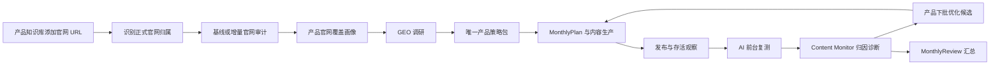

# 产品官网前置审计与 GEO 批次闭环实现

## 1. 结论

本次实现把官网审计前移到产品知识库 URL 解析阶段，并把官网覆盖、GEO 调研、策略包、内容生产、发布存活、AI 复测和下一批优化连接成同一条产品闭环。

用户侧不新增独立“GEO 诊断”页面或第二套策略包。复杂判断由规则链路承担，结果继续在现有 Content Monitor 的官网审计、AI 可见性、Observation Gap 和“产品下批优化方案”中呈现。

正式业务周期仍只有 `MonthlyPlan -> 执行 -> MonthlyReview`。批次优化快照只是可追溯的候选建议，不是新的计划或复盘周期，也不会自动修改 `MonthlyPlan` 配额。

## 2. 第一性原理

“AI 回答服务商有哪些时出现目标品牌”不由文章数量直接决定，而由以下条件共同决定：

1. AI 能抓取并索引正式官网页面。
2. 页面清楚表达“产品—服务商—服务边界”的实体关系。
3. 关系、资质、交付范围与案例存在可追溯证据。
4. 用户真实问题与网站页面、站外内容形成稳定语义匹配。
5. 发布后通过真实 AI 回答验证提及、角色和引用，而不是把发布完成当成 GEO 生效。

因此系统必须先理解官网已经说了什么、缺什么，再决定文章类型；发布后再依据真实结果选择修官网、补证据、刷新旧内容、新建内容或继续观察。

## 3. 完整链路

### 3.1 产品知识库与官网审计

- URL 来源仍走既有产品知识库导入，不增加用户输入项。
- 系统用 `product_entity.official_url` 的主机名判断来源是否属于正式官网，不在代码中写死产品名称或 URL。
- 新 URL、新内容修订或审计规则升级时，自动创建单页增量审计。
- 站点审计 worker 会回填历史正式官网来源；已登记且没有变化的来源不会重复排队。
- 官网正文已进入知识库不等于公开 GEO 可用。系统分别保存知识准备度和公开机器可读准备度。

### 3.2 官网覆盖画像

`product_website_coverage_profile` 是产品级确定性画像，包含：

- 正式官网来源与修订版本；
- 最近一次站点审计和阻断项；
- 核心服务、服务商选择、能力边界、实施交付、案例实践、FAQ 六类主题的覆盖状态；
- 每个主题对应的页面、来源和 Claim；
- 知识准备度、公开 GEO 准备度和证据缺口。

覆盖判断区分 `sufficient`、`partial`、`missing`。案例与实践即使出现相关文字，也只有在存在已治理 Claim 时才可判为充分。

### 3.3 GEO 调研与策略包

- GEO 调研启动前必须存在完成的官网基线画像；审计中的阻断结果可以作为调研输入，但“尚未审计”不能进入正式调研。
- 调研综合产品资料快照、官网覆盖画像和联网研究证据。
- 系统仍只生成一份产品 GEO 策略包，不产生“普通策略包”和“诊断策略包”两套口径。
- 官网已经充分覆盖的主题标记为 `refresh_existing`，不占新增文章配额。
- 缺失或部分覆盖且证据充分的主题标记为 `new_content`。
- 事实、资质、边界或案例证据不足时标记为 `hold` 或证据未就绪，禁止为凑数量生成文章。

### 3.4 发布、存活与 AI 复测

一个产品批次按 `productId + matrixVersionId` 归组。只有同时满足以下条件才关闭批次并形成正式优化快照：

1. 批次内内容矩阵项均进入终态；
2. 已发布内容均完成存活观察；
3. 对应的 `published_content_retest` 采集任务均进入终态；
4. 至少存在正式发布结果和复测任务。

未关闭时只显示“继续监控”，不会根据不完整样本提前改内容组合。

## 4. Content Monitor 诊断规则

### 4.1 AI 提及和引用指标

除原有提及与引用外，新增三个直接对应服务商枚举目标的指标：

| 指标         | 含义                     | 解决的问题           |
| ---------- | ---------------------- | --------------- |
| 服务商枚举进入率   | 枚举类问题中目标服务商被提及的比例      | 是否进入“有哪些服务商”的答案 |
| 服务关系准确率    | 被提及时是否正确表达实施、交付或合作伙伴关系 | 防止出现了品牌却说错身份    |
| 目标解决方案页引用率 | AI 是否引用该产品对应的正式服务页     | 防止只引用首页或无关页面    |

监控问题自动继承目标实体、期望关系和目标解决方案 URL，采集证据按同一口径计算总量与分平台指标。

### 4.2 Observation Gap 根因

| 根因 | 优先处置 | 是否允许直接新增文章 |
| --- | --- | --- |
| 官网抓取、索引或渲染阻断 | `fix_site` | 否 |
| 产品关系证据不足或表达不准确 | `collect_evidence` | 否 |
| 官网或本批内容已覆盖但进入率低 | `refresh_existing_content` | 否 |
| 官网主题缺失且策略类型证据就绪 | `create_content_candidate` | 仅进入候选池 |
| 引用落点不准确或分发弱 | `refresh_existing_content` | 否 |
| 发布存活或 AI 样本未闭环 | `continue_monitoring` | 否 |

### 4.3 优先级

- `P0`：官网公开可见性阻断、发布存活异常、服务商关系证据或角色错误。必须先修复，不允许用更多文章掩盖问题。
- `P1`：服务商枚举进入率、官网引用率或目标页引用率不足。根据覆盖画像选择刷新旧页面或生成内容候选。
- `P2`：证据尚未闭环，继续监控。
- `hold`：指标没有触发整改阈值，保持主题，不重复扩写。

存在 `P0` 动作时，优化快照状态为 `blocked`；问题解决前不会给出可自动执行的内容动作。

## 5. 后续计划边界

- 当前月份关闭的产品批次可以生成 `current_month_candidate_pool` 候选，但仍需通过现有 MonthlyPlan 决策入口确认。
- 历史月份批次进入 `next_month_candidate_pool`。
- 优化动作统一设置 `automaticExecutionAllowed: false`。
- Content Monitor 只展示证据、根因、优先级和候选去向；不直接写入内容矩阵或改变月度配额。
- MonthlyReview 汇总当月已关闭的产品优化快照，不负责等到月末才首次发现问题。

## 6. 数据与运行组件

新增正式表：

- `product_website_source_status`：产品官网来源、修订和审计状态；
- `product_website_coverage_profile`：官网主题覆盖与双准备度画像；
- `product_geo_optimization_snapshot`：批次关闭后的证据、缺口和优化动作快照。

扩展字段：

- `geo_site_audit_run.scope_mode`：区分完整站点审计和知识库 URL 单页审计；
- `geo_monitoring_question`：目标实体、期望关系和目标解决方案 URL；
- `capture_tasks.target_entity_name`：保证采集与指标计算使用同一目标实体。

运行要求：

1. 执行迁移 `database/migrations/20260817_035_v5_website_geo_closed_loop.sql`；
2. 保持 `site-audit-worker` 正常调度，完成新旧官网来源审计；
3. 保持发布存活观察和 AI 前台采集 worker 正常运行；
4. Content Monitor API 在读取时会同步核对产品批次，并只持久化已经关闭的优化快照。

## 7. 验收标准
- 产品知识库新增或更新正式官网 URL 后自动出现审计任务和覆盖画像。
- 官网基线未完成时不能启动正式 GEO 调研。
- 已有服务页不会再被策略包分配同主题新增文章配额。
- 案例没有真实 Claim 时不能生成案例型内容。
- 服务商枚举问题能计算目标品牌进入率、关系准确率和目标页引用率。
- 发布批次未闭环时只继续监控，闭环后立即在 Content Monitor 形成产品下批优化方案。
- 官网阻断、证据缺失、内容缺失和分发不足得到不同处置。
- 任何批次优化都不会自动修改 MonthlyPlan；MonthlyReview 能汇总已形成的快照。
