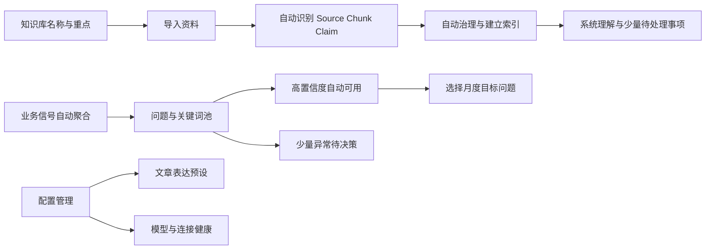

# 分支一：知识、问题与配置管理开发文档

## 1. 分支目标

分支：`codex/v5-foundation-knowledge-questions`

本分支建立后续月度生产所依赖的基础能力：

1. `蒸馏词池`升级为`问题与关键词池`。
2. 知识库创建流程收敛为“名称 + 知识库重点 + 导入资料”。
3. 知识库详情收敛为资料、系统理解和待处理事项，底层治理规则默认隐藏。
4. `AI 配置`更名为`配置管理`，合并现有连接管理。
5. 文章 Prompt 改成表单化`文章表达预设`。
6. 完成导航命名和兼容重定向，为分支二、分支三提供稳定入口。

本分支不实现月度渠道配额、批量正文生成、AI 前台真实采集或官网审计。

## 2. 用户可见结果



用户只需要理解：问题、关键词、资料、系统理解、待处理事项、表达预设。`Source`、`Chunk`、`Claim`和治理规则属于系统内部对象，默认页面不展示。问题和关键词默认由系统持续维护，用户不承担日常逐条审核，只处理少量会影响主体、关系或公开边界的异常。

## 3. 页面和路由

| 页面 | 正式路由 | 兼容入口 | 本分支职责 |
|---|---|---|---|
| 问题与关键词池 | `/questions-keywords` | `/distilled-terms`重定向 | 问题库、关键词库、内容覆盖 |
| 知识库列表 | `/knowledge` | 保留 | 创建、筛选、处理状态 |
| 知识库详情 | `/knowledge/[id]` | 保留 | 资料、系统理解、真正需要用户处理的事项 |
| 内容导入 | `/knowledge/import` | 保留 | 选择目标知识库并导入资料 |
| 配置管理 | `/configuration` | `/ai-config`重定向 | 模型、表达预设、连接、日志 |
| 连接页旧入口 | `/configuration?tab=connections` | `/real-integration`重定向 | 合并现有连接管理 |

## 4. 信息架构低保真

```text
+--------------------------------------------------------------------------------+
| JOTO GTM 工作台                                                               |
+----------------------+---------------------------------------------------------+
| 首页                 | 页面标题                                                |
| 问题与关键词池       | 页面操作                                                |
| 月度内容矩阵         |---------------------------------------------------------|
| 当日执行             | 筛选 / 状态摘要                                         |
| 数据回传             |---------------------------------------------------------|
| AI 前台测试 [待后续] | 主表 / 工作区                                           |
| 官网博客监控         |                                                         |
| 博客候选池           |                                                         |
| 月度复盘             |                                                         |
| 知识库               |                                                         |
| 配置管理             |                                                         |
| 工作台设置           |                                                         |
+----------------------+---------------------------------------------------------+
```

导航使用现有 Ant Design 侧栏，不增加营销式标题、装饰卡片或说明性大段文字。

## 5. 问题与关键词池

### 5.1 页面目标

回答两个问题：

1. 本月希望用户在 AI 前台提出哪些问题？
2. 哪些关键词用于帮助系统覆盖这些问题？

页面不展示“子意图”“内容角色”等内部术语。系统内部可以分析问题分支，但用户只看到问题、文章类型建议和关键词。

### 5.2 最小人工介入规则

人工审核从“逐条准入”改成“异常驱动”：

```text
站内搜索 / 销售问题 / AI 前台采集 / 已发布内容 / 人工补充
-> 系统聚类、去重、规范化问题表达
-> 自动识别产品、实体和关系
-> 自动生成并维护召回关键词
-> 高置信度且无边界冲突：自动进入可用池
-> 低置信度但无风险：自动进入观察池
-> 主体、关系或安全边界冲突：进入待决策队列
-> 用户只选择本月目标问题
```

系统自动完成：

- 同义问题合并、重复检测和问题表述规范化。
- 产品、服务、受众、场景和文章类型建议。
- 关键词提取、去重、扩展、关联、启停和效果降权。
- 高置信度问题入池、低置信度或低价值问题进入观察、失效问题降级。
- 问题版本生成；进入月度计划时自动锁定当时版本。

只有以下情况要求人工决策；低置信度本身不构成人工审核理由：

1. 主体或产品归属不确定，例如无法判断能力属于 JOTO、WorkBuddy 还是腾讯云 ADP。
2. 合作关系、实施范围或公开表达边界发生冲突。
3. 两个已用于生产的问题准备合并，可能影响历史复盘口径。
4. 系统检测到敏感、夸大或禁止表达，且无法自动改写为中性问题。
5. 用户主动纠正系统判断或新增业务暂未覆盖的问题。

“缺少文章证据”不阻止问题入池，只在选择为月度目标或进入生成前提示证据缺口。关键词没有独立人工审核队列；用户只能纠错、排除或恢复，不能承担常规启用工作。

### 5.3 桌面端线框

```text
+--------------------------------------------------------------------------------+
| 问题与关键词池                                       [补充问题] [待决策 3]     |
| 系统自动归纳问题和关键词，人工只处理异常并选择月度目标                         |
+--------------------------------------------------------------------------------+
| [问题库 18] [关键词库 64] [内容覆盖]              [产品 v] [可用/观察 v]      |
+--------------------------------------------------------------------------------+
| 问题库                                                                       |
| [搜索问题................................] [全部] [可用] [观察] [待决策]       |
|------------------------------------------------------------------------------|
| □ 企业应该如何选择腾讯云 ADP 服务商？                         [可用] [自动归纳]|
|   目标：腾讯云 ADP / JOTO  | 文章类型建议：选型与比较、实施指南、FAQ          |
|   关键词：腾讯云 ADP 服务商 / ADP 实施 / ADP 交付                     [查看] |
|------------------------------------------------------------------------------|
| □ WorkBuddy 适合哪些企业知识管理场景？                       [观察]           |
|   目标：WorkBuddy / JOTO    | 文章类型建议：场景方案、服务能力                |
|   关键词：企业知识检索 / WorkBuddy 实施                               [查看]   |
+--------------------------------------------------------------------------------+
| 已选择 1 项                                           [选择为本月目标问题]       |
+--------------------------------------------------------------------------------+
```

### 5.4 问题详情抽屉

```text
+--------------------------------------------------------------+
| 问题详情                                              [关闭] |
+--------------------------------------------------------------+
| 问题文本                                                     |
| 企业应该如何选择腾讯云 ADP 服务商？                          |
|                                                              |
| 系统理解                                                     |
| 产品或服务：腾讯云 ADP                                      |
| 相关主体：JOTO、腾讯云                                      |
| 业务关系：JOTO 提供实施与交付服务                            |
| 适用对象：企业 AI 项目负责人                                |
| 来源：站内搜索 12 / AI 前台问题 3 / 人工补充 1              |
|                                                              |
| 系统建议文章类型                                            |
| 选型与比较、实施指南、FAQ                                   |
|                                                              |
| 当前状态：可用 | 本月被选择时自动锁定当前版本                |
| 这些判断有误？                                 [纠正系统理解] |
|                                      [移入观察] [选择为月度目标]|
+--------------------------------------------------------------+
```

用户不需要手动冻结。系统每次发生实质语义变化时创建新版本；已进入 MonthlyPlan 的问题始终引用被选择时的 `questionVersionId`，不受后续自动优化影响。

待决策队列采用批量处理，不要求打开每条详情：

```text
+--------------------------------------------------------------------------------+
| 待决策 3                                         [全部采用系统建议]            |
|--------------------------------------------------------------------------------|
| □ “JOTO ADP 产品能力”可能混淆产品归属                                           |
|   系统建议：改为“JOTO 的腾讯云 ADP 实施服务能力”        [采用] [纠正] [忽略]   |
| □ 2 个已用于生产的问题可能重复                                                   |
|   系统建议：保留两个历史口径，新问题合并                  [采用] [查看差异]     |
|--------------------------------------------------------------------------------|
| 已选 2 项                                                [批量采用建议]         |
+--------------------------------------------------------------------------------+
```

### 5.5 关键词库线框

```text
+--------------------------------------------------------------------------------+
| 关键词库                                      系统自动维护  [查看排除项]        |
+--------------------------------------------------------------------------------+
| [搜索关键词................] [关联产品 v] [有效/观察/排除 v]                  |
|------------------------------------------------------------------------------|
| 关键词                 关联问题  关联实体        系统状态       操作             |
| 腾讯云 ADP 服务商       2       腾讯云 ADP      有效           [查看]           |
| ADP 实施                3       JOTO / ADP      有效           [查看]           |
| 大模型应用落地新趋势     1       -               观察           [排除]           |
|------------------------------------------------------------------------------|
| 关键词由系统按召回效果自动升降级；无需逐条审核、启用或分配角色。               |
+--------------------------------------------------------------------------------+
```

关键词详情只展示来源、关联问题、覆盖效果和变化记录。用户发现误判时可执行`排除`或`纠正关联`；排除操作要求简短原因，系统据此优化后续提取，但不会自动恢复人工排除项。

### 5.6 内容覆盖线框

```text
+--------------------------------------------------------------------------------+
| 内容覆盖                                             [月份 2026-08 v]          |
+--------------------------------------------------------------------------------+
| 目标问题                                      文章类型             已发布/计划 |
| 企业应该如何选择腾讯云 ADP 服务商？           选型与比较              1 / 4     |
|                                               实施指南                2 / 3     |
|                                               FAQ                     0 / 2     |
| WorkBuddy 适合哪些企业知识管理场景？           场景解决方案            1 / 5     |
|------------------------------------------------------------------------------|
| 缺口：ADP 服务商选型 FAQ 尚无公开案例证据                    [查看证据缺口]   |
+--------------------------------------------------------------------------------+
```

## 6. 知识库

### 6.1 创建知识库弹窗

```text
+----------------------------------------------------------------+
| 创建知识库                                              [关闭] |
+----------------------------------------------------------------+
| 知识库名称 *                                                   |
| [JOTO 腾讯云 ADP 服务能力__________________________________] |
|                                                                |
| 知识库重点 *                                                   |
| [重点理解 JOTO 对腾讯云 ADP 的实施、交付和解决方案能力，     ] |
| [以及双方合作关系。                                        ] |
| 重点只限定理解和检索方向，不会直接成为文章事实。               |
|                                                                |
| 默认公开范围  [内部可检索，公开文章需逐条确认 v]               |
|                                                [取消] [创建并导入]|
+----------------------------------------------------------------+
```

不要求用户选择“品牌库、产品库、案例库”等固定类型。

### 6.2 知识库详情桌面线框

```text
+--------------------------------------------------------------------------------+
| JOTO 腾讯云 ADP 服务能力                              [导入资料] [更多 v]     |
| 重点：JOTO 对腾讯云 ADP 的实施、交付和解决方案能力及合作关系                  |
+--------------------------------------------------------------------------------+
| [资料 24] [系统理解] [待处理 2]                                               |
+--------------------------------------------------------------------------------+
| 状态：可用于内容生产                         最近更新：2026-07-22 10:30       |
|------------------------------------------------------------------------------|
| 最近导入                                                                     |
| JOTO 腾讯云 ADP 项目交付方案.pdf              已完成              [查看]     |
| 腾讯云 ADP 产品页                              已完成              [查看]     |
| 内部培训资料 2025.pptx                         已更新              [查看]     |
|                                                               [查看全部资料] |
+--------------------------------------------------------------------------------+
```

详情页不显示 Source、Chunk、Claim 数量，不要求用户手动生成快照。资料处理完成后系统自动生成新快照；已经批准的月度计划继续绑定原快照，不被静默替换。

### 6.3 系统理解页签线框

```text
+--------------------------------------------------------------------------------+
| 系统理解                                                     最近更新 10:30   |
+--------------------------------------------------------------------------------+
| 系统目前理解为：                                                             |
|                                                                              |
| · JOTO 可在约定项目范围内提供腾讯云 ADP 实施与交付服务。                     |
| · 相关内容可以覆盖实施流程、交付准备和服务边界。                              |
| · 具体能力范围应以项目方案和当前产品版本为准。                                |
|                                                                              |
| 以上理解来自已导入资料，生成内容时系统会自动核对原文。            [查看依据] |
+--------------------------------------------------------------------------------+
```

`系统理解`不是让用户维护的规则包，也不逐条列出“允许、条件、禁止”。页面只用自然语言概括系统当前可以支撑的内容方向和必要边界；完整表达规则在生成前自动应用。

### 6.4 待处理页签线框

```text
+--------------------------------------------------------------------------------+
| 待处理 2                                                     [仅看影响生产]   |
+--------------------------------------------------------------------------------+
| 需要补充资料                                                                 |
| 暂无资料证明“JOTO 是腾讯云 ADP 战略合作伙伴”。                               |
| 系统已自动采用较稳妥表述：“JOTO 提供相关实施与交付服务”。                    |
| 只有需要使用“战略合作伙伴”表述时才补充资料。                    [补充资料]    |
|------------------------------------------------------------------------------|
| 确认公开范围                                                                 |
| 项目交付方案包含客户名称和报价。系统默认不用于公开内容。                      |
|                                                        [保持不公开] [调整范围]|
+--------------------------------------------------------------------------------+
```

默认不出现“处理全部问题”的任务。系统自动处理：

- 重复内容、低质量切片和无效关键词。
- 新旧版本优先级明确的资料替换。
- 能够依据来源权威性自动选择的表述差异。
- 可通过降级措辞规避的证据不足。
- 已明确标记为内部资料的公开限制。

只有三类事项进入`待处理`：

1. 用户明确希望使用但缺少关键资料的事实或关系。
2. 系统无法判断、且会影响公开内容的资料范围。
3. 文件损坏、访问失败等无法自动恢复的资料处理失败。

若待处理事项不影响当前内容生产，知识库仍显示“可用于内容生产”，不制造全库阻断。

### 6.5 依据抽屉

```text
+--------------------------------------------------------------+
| 内容依据                                              [关闭] |
+--------------------------------------------------------------+
| 系统理解                                                     |
| JOTO 可在约定项目范围内提供腾讯云 ADP 实施与交付服务。       |
|--------------------------------------------------------------|
| 原文片段                                                     |
| “……JOTO 提供项目实施、交付培训与后续支持……”                 |
| 章节：服务范围 > 项目交付                                    |
|--------------------------------------------------------------|
| 来自资料                                                     |
| JOTO 腾讯云 ADP 项目交付方案 v2                              |
| 来源主体：JOTO | 内部资料 | 公开范围：条件公开               |
|--------------------------------------------------------------|
| 限制：不得公开客户名、报价和未发布承诺                        |
+--------------------------------------------------------------+
```

只有用户主动点击`查看依据`时才展开原文和资料信息。技术标识、哈希和底层对象关系放入`技术信息`折叠区，默认关闭。

## 7. 配置管理

### 7.1 页面桌面线框

```text
+--------------------------------------------------------------------------------+
| 配置管理                                                       [检查全部配置] |
| 管理模型、文章表达预设、发布连接和前台测试连接                                |
+--------------------------------------------------------------------------------+
| [模型服务] [文章表达预设] [发布连接] [前台测试连接] [版本与调用日志]           |
+--------------------------------------------------------------------------------+
| 模型服务                                                                     |
| 用途             Provider        Model             状态          操作          |
| 正文生成         Qwen            qwen-plus         [可用]        [编辑]        |
| 语义向量         Qwen            text-embedding    [缺配置]      [补充配置]    |
| AI 辅助解析      DeepSeek        deepseek-chat     [可用]        [编辑]        |
+--------------------------------------------------------------------------------+
```

不显示密钥值，只显示已配置、缺配置、验证失败和最后检查时间。

### 7.2 文章表达预设列表

```text
+--------------------------------------------------------------------------------+
| 文章表达预设                                      [新建预设] [导入系统模板]    |
+--------------------------------------------------------------------------------+
| [专业决策型] v3      适用：选型与比较 / 官网、知乎              [默认] [编辑] |
| 结构：问题背景 > 选择标准 > 方案比较 > 风险 > 行动建议                         |
| 语气：专业、克制 | 篇幅：1800-2500 | CTA：实施条件评估                       |
|------------------------------------------------------------------------------|
| [技术解释型] v2      适用：实施指南 / CSDN、公众号                   [编辑]   |
| 结构：背景 > 前置条件 > 步骤 > 验收 > 限制                                    |
+--------------------------------------------------------------------------------+
```

### 7.3 表单化预设编辑线框

```text
+--------------------------------------------------------------------------------+
| 编辑文章表达预设：专业决策型 v4 草稿                                 [关闭]    |
+--------------------------------------------------------------------------------+
| 1 预设          2 读者与目标          3 表达结构          4 输出          5 预览|
|--------------------------------------------------------------------------------|
| 目标读者 *       [企业 AI 项目负责人 v] [+自定义]                            |
| 写作目标 *       (o) 帮助选型 ( ) 解释能力 ( ) 指导实施                     |
| 读者认知         (o) 初步了解 ( ) 正在比较 ( ) 准备实施                     |
|--------------------------------------------------------------------------------|
| 语气             [专业 x] [克制 x] [+添加]                                   |
| 结构模块         [:: 问题背景] [:: 选择标准] [:: 方案比较] [:: 风险] [:: CTA]|
|                  拖动图标调整顺序                                              |
| 必须展开         [x] 实施流程 [x] 前置条件 [x] 验收方式 [ ] 客户案例         |
| 禁止风格         [x] 绝对排名 [x] 泛化承诺 [x] 无证据数据   强制项不可取消   |
|--------------------------------------------------------------------------------|
| 篇幅             [1800] 至 [2500] 字                                           |
| CTA              [联系 JOTO 评估实施条件 v]                                   |
| 补充说明         [本类文章优先解释选型风险，最多 200 字____________________] |
|--------------------------------------------------------------------------------|
| 结构预览                                                                     |
| [问题背景] 重点：__________                                                    |
| [选择标准] 覆盖：实施 / 安全 / 交付 / 运营                                    |
| [方案比较] 维度：__________                                                    |
| [风险] 必须说明：__________                                                    |
|                                                      [保存草稿] [发布新版本]   |
+--------------------------------------------------------------------------------+
```

用户不编辑完整 Prompt。系统根据表单、规则包、渠道配置和 EvidencePack 编译最终指令。若补充说明包含能力、合作、案例或数据承诺，显示`需要证据`警告并禁止将其直接作为事实。

### 7.4 连接管理线框

```text
+--------------------------------------------------------------------------------+
| [发布连接]                                                                    |
| 微信公众号       账号：JOTO AI        [已连接] 最后检查 10:20      [检查] [编辑]|
| 知乎             账号：JOTO           [需登录]                     [重新连接] |
|--------------------------------------------------------------------------------|
| [前台测试连接]                                                                |
| 浏览器伴侣       Chrome 126            [未安装]                     [安装说明] |
| DeepSeek 会话    -                     [待浏览器登录]               [检查]     |
+--------------------------------------------------------------------------------+
```

本分支只完成连接管理聚合和状态契约，不实现 AI 前台采集 Runner。

## 8. 状态、空状态与错误

| 场景 | 页面表现 | 下一步 |
|---|---|---|
| 没有问题 | 空状态显示`尚未识别到问题` | 接入业务信号或补充一个问题 |
| 高置信度问题 | 自动进入可用池，不显示待审核状态 | 选择为月度目标或保持可用 |
| 低价值或证据暂不足 | 自动进入观察，不要求立即处理 | 需要时提升为月度目标 |
| 主体或关系冲突 | 聚合进入待决策队列 | 批量采用建议或纠正 |
| 关键词误判 | 详情中显示来源和关联 | 排除或纠正关联 |
| 知识库无资料 | 显示知识库重点和`导入资料` | 进入导入页 |
| 资料处理失败 | 只显示失败资料和可读原因 | 重试或重新上传 |
| 待处理但不影响生产 | 知识库仍显示可用 | 用户需要时处理 |
| 待处理影响某项表达 | 只限制相关表达，不阻断整个知识库 | 补资料或保持系统降级表述 |
| 模型缺配置 | 页面仍可浏览，不允许触发对应运行 | 去模型服务补配置 |
| 连接失效 | 显示账号别名和最后成功时间 | 重新连接，不显示凭证 |

## 9. 数据和接口建议

核心对象：

```text
QuestionSet
QuestionVersion
QuestionFacet              // 系统内部问题分析
SemanticKeyword
QuestionKeywordLink
QuestionDecisionException  // 仅保存需人工判断的异常
KeywordExclusion           // 人工纠错和排除记录
KnowledgeSnapshot
KnowledgeActionItem        // 用户可见的三类待处理事项
ArticleExpressionProfile
ArticleExpressionProfileVersion
ConnectionHealth
```

建议 API：

```text
GET/POST  /api/v5/questions
GET/PATCH /api/v5/questions/:id
POST      /api/v5/questions/ingest-signals
GET       /api/v5/question-decision-exceptions
POST      /api/v5/question-decision-exceptions/batch-resolve
GET       /api/v5/semantic-keywords
POST      /api/v5/semantic-keywords/:id/exclude
POST      /api/v5/semantic-keywords/:id/correct-link
GET       /api/v5/knowledge-bases/:id/understanding
GET       /api/v5/knowledge-bases/:id/action-items
PATCH     /api/v5/knowledge-action-items/:id
GET/POST  /api/v5/article-expression-profiles
GET/PATCH /api/v5/article-expression-profiles/:id
POST      /api/v5/article-expression-profiles/:id/publish
GET       /api/v5/configuration/status
```

所有写操作必须包含角色检查、版本号和审计原因。系统自动归纳和状态调整记录算法版本、信号来源和置信度，不要求模拟人工审批。资料或待处理事项发生实质变化后自动生成新 `sourceSnapshotHash`，旧 EvidencePack 失效或进入复核。

建议状态模型：

```text
Question: available / observing / decision_required / archived
Keyword: effective / observing / excluded
QuestionDecisionException: open / resolved_by_suggestion / corrected / ignored
```

问题进入 MonthlyPlan 时保存 `questionVersionId`。`available`和`observing`都可被用户直接选择；`decision_required`必须先解决主体、关系或安全边界异常。关键词不设`pending_approval`状态。

## 10. 推荐文件范围

优先新增或修改：

```text
src/app/questions-keywords/page.tsx
src/app/knowledge/page.tsx
src/app/knowledge/[id]/page.tsx
src/app/configuration/page.tsx
src/components/AppShell.tsx
src/lib/permissions.ts
src/lib/v5/question-contracts.ts
src/lib/v5/article-expression-contracts.ts
src/app/api/v5/questions/*
src/app/api/v5/article-expression-profiles/*
scripts/validate-structure.mjs
scripts/smoke-interactions.mjs
scripts/smoke-pages.mjs
```

旧路由仅做兼容重定向，不同时维护两套页面实现。

## 11. 开发顺序

1. 定义问题自动归纳、异常队列、关键词自动维护、知识理解、待处理事项和表达预设契约。
2. 完成导航和新路由壳，增加旧路由重定向。
3. 实现问题与关键词池三个页签、自动入池和批量异常决策。
4. 简化知识库创建，实现资料、系统理解、待处理和按需依据抽屉。
5. 创建配置管理聚合页，迁入模型和连接能力。
6. 实现表单化文章表达预设。
7. 补空状态、错误、权限和审计。
8. 更新结构、交互、路由和浏览器验证。

## 12. 验收标准

1. 用户不再看到`蒸馏词池`和`AI 配置`作为正式名称。
2. 问题与关键词池不出现要求用户理解的“子意图、内容角色”。
3. 高置信度、无边界冲突的问题自动进入可用池，不需要逐条审核或冻结。
4. 关键词由系统自动提取、关联和升降级，不存在逐条待审核、手动启用或角色分配流程。
5. 人工待决策只包含主体归属、关系边界、历史口径合并、敏感表达和主动纠错五类情况。
6. 待决策支持直接采用系统建议和批量采用，不强制逐条打开详情。
7. 选择问题进入 MonthlyPlan 时自动锁定 `questionVersionId`，后续自动优化不修改历史计划。
8. 证据不足不阻止问题入池，只在月度选择或生成准入时提示。
9. 创建知识库只要求名称、重点和可选公开范围。
10. 知识库重点不进入 Claim，也不作为文章事实。
11. 知识库详情只显示资料、系统理解和待处理三个页签，不默认显示 Source、Chunk、Claim 或规则数量。
12. 系统理解使用自然语言摘要，不逐条展示“允许、条件、禁止”规则。
13. 常规重复、切片质量、明确版本替换和可自动降级的证据不足不进入用户待办。
14. 待处理只包括缺关键资料、公开范围无法判断和不可自动恢复的资料失败。
15. 非关键事项不阻断整个知识库；系统只限制受影响的具体表达。
16. 用户可按需从系统理解查看原文依据，技术对象和哈希默认折叠。
17. 用户通过表单和结构模块完成表达预设，不编辑完整 Prompt。
18. 配置管理合并模型、表达预设和连接状态，密钥不回显。
19. `/distilled-terms`、`/ai-config`、`/real-integration`提供兼容重定向。
20. 桌面端线框中的文字、状态和操作入口无重叠或按钮挤压。
21. `npm.cmd run typecheck`和`npm.cmd run validate:structure`通过；导航和路由变更需通过相关 smoke。

## 13. 分支交付说明

完成后先合并本分支到 `main`。分支二、分支三必须基于合并后的最新 `main`继续，不能并行定义另一套问题、知识快照或表达预设契约。

## 14. 实现状态（2026-07-22）

本分支已按本文档完成以下能力：

1. 新增独立 `data/v5-foundation-state.json`、Repository、Service 和类型契约，未修改 `data/workbench-state.json`。
2. 问题信号自动规范化、聚类去重并按置信度进入可用或观察状态；只有主体、关系和安全边界冲突生成待决策事项。
3. 关键词自动提取、关联、升降级，提供排除、恢复和纠正关联，不引入逐条审核、手动启用或角色分配。
4. 月度选择锁定当时的 `questionVersionId`，后续问题新版本不会覆盖既有月度锁。
5. 知识库创建和详情收敛为名称、重点、资料导入，以及“资料、系统理解、待处理”三个页签；技术哈希默认折叠。
6. 待处理限定为缺关键资料、公开范围无法判断、不可自动恢复的资料失败，并按影响范围局部阻断。
7. 配置管理聚合模型、文章表达预设、发布连接和前台测试连接；表达预设采用表单和可排序结构模块。
8. 所有写接口保留角色、版本、幂等和审计边界；自动写入记录来源、算法版本与置信度。
9. `/distilled-terms`、`/ai-config`、`/real-integration` 已改为服务端兼容重定向。
10. 已补充契约、结构、交互、页面和 V5 浏览器 smoke 覆盖；最终验证结果以分支交付报告为准。

本实现不包含月度渠道配额、批量正文生产、AI 前台采集、月度复盘、官网审计、真实发布或凭证管理。
